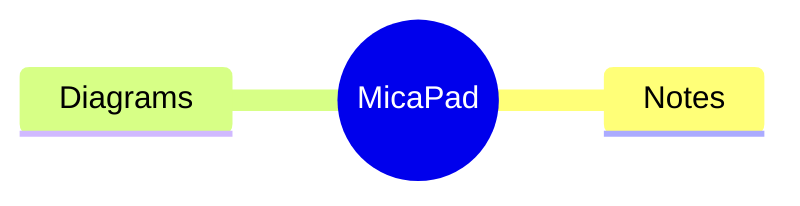

# MicaStats — User Guide

A complete guide to using, customizing, and mastering your hardware telemetry overlay.

---

## 🛠️ Getting Started

### 1. Installation
The app is provided as a unified installer:
- **`MicaStats-vX.Y.Z-Setup.exe`**: A high-performance setup that handles your Start Menu, Desktop shortcuts, and ensures the app is registered correctly for startup.

Download the latest version from [GitHub Releases](https://github.com/manoi-bms/MicaStats/releases) and launch.

---

## 🖥️ The Overlay

The overlay is a slim, elegant pill that sits directly on your **Windows 11 taskbar**. It displays real-time telemetry from your hardware:

### 📈 Included Metrics
- **CPU**: Total processor load percentage.
- **RAM**: Real-time memory pressure.
- **NET**: Combined Upload and Download speeds.
- **GPU**: Raw load and temperatures from your graphics processor.
- **DISK**: Real-time activity and storage usage for multiple drives simultaneously.

### 🍏 iStat-Style Taskbar (default)
The overlay ships in a stacked layout modelled on iStat Menus for macOS: every metric is its own
module with a small dim label above a bold value, and network shows paired **↑ upload / ↓ download**
lines (red up, cyan down). With **Live Graphs** on, each module gains a full-height mini bar chart,
and network gets a mirrored up/down graph around a dashed axis — the iStat signature.

Prefer the classic single-row layout? Turn off **iStat Taskbar (stacked)** in **Appearance**; the
classic mode keeps all per-section colour customisation. The stacked mode uses a fixed palette
(grey labels, white values, cyan graphs) so it always looks cohesive.

### 🚫 Start Menu Avoidance
A centred Windows 11 taskbar moves its Start button **left** as apps open, so a fixed overlay
would eventually sit underneath it. The stacked overlay watches the taskbar's own buttons
(widgets, Start, tray) and stays inside the free corridor between them — **sliding left into
unused space first**, so it keeps every module whenever the corridor has room, and drifting
back to your chosen spot as apps close. When the corridor tightens, the sparklines squeeze
down first (to 40% of their width) so the layout always fills the available space exactly;
below that they disappear, then the chrome itself tightens — slimmer pod padding and column
gaps, whitespace rather than content — and only when even the compact layout cannot fit do
trailing modules hide one by one — temperature yields first (its reading also lives in the
CPU dropdown header), storage stays visible longer, and network and CPU survive longest —
with a small **⋯** marker showing that modules are elided rather than missing. Everything hidden stays one hover or click away in the panels. Turn
this off with **Avoid Start Menu** in **Appearance**.

### 📉 Live Graphs
Turn on **Live Graphs** in **Appearance** to draw a small bar chart of recent history beside each
reading, so you can see a trend rather than just an instant value. Graphs work in stacked, Standard
and Compact label modes, and a sensor that cannot be read shows a flat baseline rather than a
misleading zero.

---

## 📊 The Stats Panel

**Click the overlay** to open the stats panel — an iStat Menus-style dropdown of dark rounded
cards with the detail the taskbar has no room for:

- **CPU card**: stacked User/System history bars, a ● User / ● System legend, one ring gauge per
  logical processor, and uptime.
- **Memory card**: MEMORY and COMMIT ring gauges, a memory-pressure history graph, and a
  Used / Free / Committed / Cached breakdown with top memory consumers.
- **GPU card**: usage and temperature rings above a history graph.
- **Network card**: big upload/download readings and a mirrored ↑/↓ graph around a dashed axis,
  with window peaks.
- **Disks card**: activity history for the busiest drive plus a row per selected drive.
- **Processes card**: top CPU consumers with their memory use.

Everything follows the iStat two-hue rule — cyan for the primary series, red for its counterpart
(System time, Upload) — on near-black cards.

Each card is badged with its own icon — a processor die for CPU, a memory module for Memory, a
display for GPU, paired ↑/↓ arrows for Network, a drive for Disks — drawn from **Segoe Fluent
Icons**, the Windows 11 system icon font (Segoe MDL2 Assets on Windows 10). The same glyph
marks that section everywhere it appears, including the hardware inspector's tabs, so the eye
can find a section without reading the label.

**Or just hover**: pause over any taskbar module and its own compact dropdown opens — CPU (with
top processes), Memory, GPU, Network or Disks — then retargets as you slide along the taskbar,
exactly like iStat Menus. It never steals focus; clicking inside pins it as the full panel. Turn
this off with **Hover Panels** in **Appearance**.

Every card ends with **quick-action buttons** that open the matching Windows tool — Task Manager
and Resource Monitor from CPU and Memory, Display Settings from GPU, Network Settings and
Connections from Network, Disk Management and Storage Settings from Disks.

Panels open with a quick rise-and-fade, and every ring gauge sweeps from zero to its reading
— then eases between values while the panel stays open. All motion runs on WPF's
GPU-composited animation clock and exists only while a panel is on screen, so the idle app
animates nothing; the taskbar overlay keeps its efficient once-per-second GDI+ pipeline.

Press **Esc** or click anywhere else to dismiss it. Process sampling only runs while the panel is
open, so a closed panel costs nothing.

If you would rather clicking never opened the panel, turn off **Panel on Click** in **Appearance**;
the panel stays available from the right-click menu as **Show Stats Panel**.

---

## 📸 Screen Capture

Right-click the overlay (or open **Settings → Capture**) for **Capture Region**, **Capture
Window**, **Capture Screen**, **Capture All Screens** and **Capture Scrolling…**. The
shortcuts work anywhere in Windows:

| Shortcut | Captures |
| --- | --- |
| **Ctrl+Shift+1** | Region — pick a rectangle, window or screen |
| **Ctrl+Shift+2** | The window currently in front |
| **Ctrl+Shift+3** | The screen the pointer is on |
| **Ctrl+Shift+4** | Scrolling — a long page, chat or document as one tall image |

### The region picker

Choosing a region **freezes the screen first** and lets you select on that still image, so
menus and tooltips stay open instead of vanishing when the picker takes focus, and the
selection is exact even across monitors running different scaling.

- **Drag** for a rectangle, or **click** a window or screen the picker highlights for you
- A **magnifier** follows the pointer with a pixel grid, crosshair and the **hex colour**
  under the cursor — it doubles as an eyedropper
- Edges **snap** to window and monitor borders; hold nothing and it just works
- **Arrow keys** nudge (Shift for 10px, Ctrl to resize), **M** magnifier, **S** snapping,
  **A** everything, **Enter** accept, **Esc** or right-click cancel

### Scrolling capture

For a page, chat or document that is taller than the screen, press **Ctrl+Shift+4** or choose
**Capture Scrolling…** in the overlay menu (or the **Capture scrolling** button in **Settings →
Capture**).

- **Drag around the part that scrolls.** A click also works, but it takes the whole window,
  title bar and toolbars included. Areas smaller than 50×50 px are refused with a short notice
- MicaStats moves the pointer there, scrolls to the top, and then scrolls down one wheel notch
  at a time by itself. Keep the picked area visible on screen while it works, and hold no keys:
  Ctrl or Shift would turn the wheel into zoom or sideways scrolling. A small card shows the
  height so far
- The wheel goes only to the window you picked. If Windows sends the wheel to the window in
  front (**Scroll inactive windows when I hover over them** is off), MicaStats brings the picked
  window to the front first. If another window comes over the area, or the picked one closes,
  scrolling stops
- Frames are joined into one tall image. A header or footer that stays put while the rest
  scrolls appears once, not on every frame, and so does something floating near the bottom,
  such as a chat button. Side panels that stay put while the rest scrolls, such as a
  navigation pane or a sticky sidebar, are left out of the scrolled part; a title bar or
  toolbar across the top keeps its full width
- **Esc** stops and keeps what was captured so far. If you press it while MicaStats is still
  scrolling to the top, the capture is cancelled
- It stops by itself at the end of the content, at 20,000 px tall, or after 500 steps
- The result opens in the editor, or is copied and saved, like any other capture. The editor
  title says why it stopped when it was not the end of the content: a limit, nothing
  scrolled, the view changed in a way MicaStats could not follow, or the scrolling could not
  be sent to that window

### The editor

Unless you turn it off, each capture opens in an annotation editor:

- **Arrow, rectangle, ellipse, line, pen, highlighter, text** and **numbered steps** for
  walkthroughs
- **Redact** to hide sensitive content — **pixelate**, **blur** or a **solid block**.
  Redactions are baked into real pixels, so what is hidden on screen is hidden in the file
- **Select (V)** — the tool the editor starts in. Click a mark to select it, **drag to move**
  it, drag its **handles to resize** (an arrow or line gets a handle at each end), **arrow
  keys** to nudge (Shift for 10px), **Delete** to remove it. Each drag is a single undo step,
  and **Esc** clears the selection before it closes the window
- **Crop**, full **undo/redo** (Ctrl+Z / Ctrl+Y), colour swatches and stroke size
- **Zoom** from 1% to 800%: **Ctrl+wheel** zooms around the pointer, and **Ctrl + =** / **+**
  and **Ctrl + −** (the numpad keys too) zoom around the centre of the view, as do the **−** and
  **+** buttons in the bottom bar; these steps stop at 100% on the way past it. **Ctrl+0**, or a
  click on the percent, shows the capture at its actual size — 100% is real screen pixels,
  whatever the display scaling — and **Fit** fits it to the window. From 200% the pixels are
  shown crisp, not smoothed. A capture opens fitted to the window, except a very tall one such
  as a scrolling capture, which opens fitted to its width, at the top
- **Copy** (Ctrl+C), **Save** (Ctrl+S), **Save as…**, or **Pin** the capture on top of every
  window — drag it, scale it with the wheel, Esc to dismiss

Captures are copied to the clipboard as both PNG and DIB so they paste into anything, and are
saved to **Pictures\MicaStats** with a timestamped name. Format, folder, naming, cursor
inclusion, redaction style, a capture **delay** (3/5/10s, for catching menus) and the shortcuts
are all in **Settings → Capture**.

---

## 📝 MicaPad

A notepad built into MicaStats that never loses text and never asks to save. Open it from the
overlay's right-click menu, with **Ctrl+Alt+N** from anywhere, from the Start menu, or with
**Open with → MicaPad** on a text file in Explorer.

### How saving works

* Every note is saved one second after you stop typing, and at least every five seconds while
  you keep typing. The status bar says **Saving…** or **Saved 3s ago**.
* When Windows shuts down or restarts, MicaPad writes everything and lets Windows continue —
  no questions. If MicaPad was open, it reopens with the same windows and tabs after you sign in,
  with **Launch on Startup** on.
* Closing a tab (**Ctrl+W**, middle-click or **×**) never asks either. **Ctrl+Shift+T** reopens
  the last one; the **▾** button lists every closed note, with search, **Reopen** and **Delete**
  (which uses the Recycle Bin). A note that never had any text is simply discarded.

### History

A version is kept each time you pause after at least a minute of changes, and before anything
that replaces the whole text (reload, restore, Replace All, a line-ending change). **Ctrl+Shift+H**
or **History** in the status bar lists them by day. Pick one to preview it, then **Restore**,
**Copy all** or **Back**. Restoring is one step: **Ctrl+Z** undoes it.

**Compare with current** shows the version against the note as it is now: removed lines on red,
added lines on green, with both line numbers and − or + in the margin, and a count such as
`+12 −3 lines`. Click it again (**Show this version**) for the version itself; **Restore** always
restores the version. Notes or versions over 1 MB, or that differ on tens of thousands of lines,
say *Too large to compare*.

Every version from the last day is kept; then one per hour for a week; then one per day up to the
limit in **Settings → MicaPad** (90 days by default). The newest version is always kept.

### Search notes

**Ctrl+Shift+F** or the magnifier in the tab strip opens **Search notes** where History opens (one
closes the other). It searches every note, open or closed, as its text is now — not history
versions, and not other files on the PC. A one-line selection in the editor becomes the query.

* **By words**, always: offline, built in, nothing leaves the PC. Thai, Chinese and Japanese work
  without spaces, and a query can mix them with English (`vpn ไม่ติด`). Results come 300 ms after
  you stop typing, or at once with **Enter**.
* Each result shows the note, a *closed* tag when it is closed, its line and the passage with the
  matching words in bold — at most 3 per note and 20 in all.
* **Enter** (after **↓** into the list) or a click opens the note with the passage selected: shown
  here, brought forward in the window that has it open, or reopened here when it was closed. If
  you edited the note since, the selection follows the text. **Esc** goes back to the editor;
  **Esc** again closes the pane.

**Search by meaning** (**Settings → MicaPad → Search**, off at first) also finds passages that say
the same thing in other words. It needs your own embedding server in the OpenAI `/v1/embeddings`
format — TEI, vLLM, Infinity, LiteLLM or Ollama: enter its base address, such as
`http://gpu:8000/v1` or `http://localhost:11434/v1`, and MicaPad adds `/embeddings`. **Rerank
results** then puts the most relevant first with a reranker in the Cohere/Jina `/rerank` format.
**Test** checks each server.

* What is sent, and only while these are on: passages of your notes and your queries to the
  embedding server, and your query with the best passages to the reranker. Credentials never are:
  each one is sent as `[credential]`.
* API keys are stored encrypted, never in `config.json`, and are not shown again after **Save**.
* The vectors are kept encrypted beside the notes (`MicaPad\search\`). Turning **Search by
  meaning** off deletes them; a new server or model starts them over, and **Rebuild index** does
  it by hand.
* When a server cannot be reached, refuses the key or times out, the status line under the query
  says so and the search falls back to words (or to the order before reranking).

### AI in MicaPad

MicaPad can improve, translate, summarize or explain text, and answer a question from your notes,
through the provider you set in **Settings → AI** (Claude, or any OpenAI-compatible server such as
Ollama). It is off at first: turn on **Settings → MicaPad → AI → Use AI in MicaPad**. The line under
the switch says where text goes, and **AI provider settings…** opens **Settings → AI**. Nothing is
sent while you type, when a note opens or in the background — only when you run an action.

* **On a selection**: right-click → **AI** → **Improve writing**, **Fix spelling and grammar**,
  **Make shorter**, **Translate to English**, **Translate to Thai**, **Summarize**, **Explain**,
  **Draw as diagram** or **Ask AI…** (type your own instruction). **Ctrl+Shift+A** opens the pane on
  **Ask AI…**. Summarize, Explain, Draw as diagram and Ask AI use the whole note when nothing is
  selected; the rewrites need a selection. While AI is off, the menu holds one item, **Set up AI…**.
* **Draw as diagram** sends the selection, or the whole note when nothing is selected, and asks
  for a Mermaid diagram of it. It is offered in Markdown notes, where a diagram is drawn; a note
  shown as plain text or as code does not have it. **Insert below** puts the Mermaid block under
  your text, and MicaPad draws it as a picture there while **Settings → MicaPad → Draw diagrams**
  is on (it is, until you turn it off). **Replace selection** is offered when you selected text.
* **Fix with AI** is on the red error box of a diagram or math block that fails with an error
  about its own source, such as a syntax error: right-click the box. In the **AI** menu the entry
  for the same job is **Fix diagram**, there while the caret is in that block. Neither appears for
  a block that is too large, a missing runtime, a server that cannot be reached or a timeout: a
  rewrite cannot cure those. It sends that block's source and the renderer's message, and
  **Replace selection** replaces only that source, not the fences or any other block. A fix offers
  **Replace selection** and **Copy**; there is no **Insert below** for a fix, which would land
  inside the block. A reply in a code fence is unwrapped; a reply that still holds a line that
  would close the block cannot replace the source, and the status line says so. The block's fence
  is read again when you click, so that holds after you edit the fences too. With AI off it sends
  nothing.
* **The AI pane** opens on the right, where History and Search notes open. It shows the text it
  runs on and where that goes ("Selection, 412 characters · to api.anthropic.com", or "· to this
  PC" for a server on this PC) and the result as it arrives. **Stop**, beside the close button, ends
  it and keeps what came. For a rewrite, **Changes** shows a line diff of your text against the
  result. Size limits: 8,000 characters for a rewrite, 24,000 for the rest; over that, the pane
  says so and nothing is sent.
* **Replace selection** puts the result in place of your text, **Insert below** adds it as a new
  paragraph after the text, **Copy** copies it. Each edit is one **Ctrl+Z**, and undoing a Replace
  brings the button back. The reply takes the note's own line ending. Your note changes only when
  you click one of these two buttons.
* **Replace selection** is offered only when the reply finished (not stopped, cut short or ended
  early by the provider), you selected text, its note is the one shown and not read-only, the text
  is still what it was, and every stored credential came back. Otherwise the status line says why.
  **Copy** works whenever there is text. **Insert below** works for a stopped or cut-short reply and
  when the text changed, but not for a failed reply, on another tab or on a read-only note.
* **Try again** reruns on the text the pane names — the earlier selection, or the whole note — not
  on whatever is selected now, and only while that note is shown. An instruction typed for
  **Ask AI…** works the same way.
* **Ask in Search notes**: type a question and press **Ctrl+Enter**, or click **Ask** (**Enter**
  still only searches). The best 8 passages go to the model and the answer streams above the
  results; the status line says "Answering from 6 passages · api.anthropic.com", then
  "Answered from 6 passages · api.anthropic.com" once it ends well. A citation such as [2] is a
  number matching result row 2, not a link, and the first 8 rows carry their numbers. A new
  search, a new question or closing the pane clears the answer. Holding **Ctrl+Enter**, or asking
  the question that is being answered, does not send it again. With no match, nothing is sent.
  With AI off, **Ask** runs the normal search and the answer area says
  "Turn on Settings → MicaPad → AI to get answers".
* **Links in an answer are never clickable.** They show as text, "label (address)", so text pasted
  into a note cannot steer the model into handing you a link to click.
* **What is sent**: For an action on text, a fixed instruction, the task, and the text it runs on
  (the selection, or the whole note): no title, no other note, no file path. For a question, a
  fixed instruction, the question, and up to 8 passages found by Search notes, which can come from
  any note, open or closed; each passage goes with its note's title (the file name, for a note
  opened from a file), its heading and its line numbers. Note text is wrapped as data the model
  must not obey.
* **Stored credentials are never sent**: in text for an action each one goes as `[[CREDENTIAL_1]]`
  and is put back in the result; in a question and passages it goes as `[credential]`. A selection
  that cuts through a credential takes the whole credential, and a half-typed credential marker in
  a question, an instruction or a search goes as `[credential]` too. Your own words are not
  otherwise altered, so a rewrite does not rename anything in them. Storing selected text as a credential
  closes the AI pane for that note and clears an answer from notes, since both could still hold
  the value.
* **The daily limit** is the one from **Settings → AI**, shared with Ask MicaStats: each action or
  answer counts one, even when it fails or is stopped. When it is reached, or no key is set, the
  pane says so and nothing is sent.
* The diagnostics log records the kind of action, character counts and the outcome, never your
  text, question or answer.

### Real files

Opening a file (Ctrl+O, or Open with) edits a *copy*: your changes are saved continuously, but the
file on disk changes only when you press **Ctrl+S**. A dot on the tab means "edited since the
file was last saved". The file keeps its encoding and line endings; both are shown, and can be
changed, in the status bar. If a character you typed cannot be stored in the file's encoding,
MicaPad offers **Save as UTF-8** instead of saving question marks.

If another program changes the file, MicaPad reloads it — or, when you have edits of your own,
asks **Reload from disk** or **Keep mine** (a reload first keeps your version in history). If the
file is deleted, **Keep as note** turns the tab into an ordinary note.

### Credentials and encryption

Your notes are encrypted for this Windows account on this PC, so another account, or the same
files copied to another PC, cannot read them. A reset Windows password makes them unreadable the
same way, as if they were on another PC; changing your password in the usual way, with the old one,
does not. If you move to a new PC, use **Save As** on each note you want to take along.

To keep a password, token or other secret out of sight, select it (4 or more characters), right-click
and choose **Store as credential**, then give it a label. Every copy of that text in the note is
replaced by a small pill with the label, and older versions of the note are scrubbed too. This cannot
be undone with Ctrl+Z, but **Unmask** on the pill puts the text back.

Right-click a pill (or press the menu key) for its menu: **Reveal** (shows the value for 30 seconds),
**Copy secret** (kept out of the Win+V clipboard history and cleared after 30 seconds),
**Rename label**, **Unmask**, **Delete credential**, **Copy reference** and **Lock now**.

The first time you store something, MicaPad asks you to create a PIN of 6 to 12 digits. Entering it
unlocks the credentials for 5 minutes, and they lock again when Windows locks or goes to sleep.
After 5 wrong PINs you must wait, and the wait doubles each time, up to 15 minutes. Any length from
6 to 12 digits works, but a longer PIN is stronger; the list below says why.

**Settings → MicaPad → Credentials** has **Change PIN**, **Lock now** and **Reset vault**. If you
forget the PIN, **Reset vault** is the way out: it deletes every stored credential, and references
left in your notes show as missing. **Change PIN** is there once you have a PIN.

What this does not protect against:

- A harmful program running as you. While MicaPad is open it can read the screen and MicaPad's
  memory, and open your notes just as you can. It can also copy the credential vault and guess PINs
  offline, where no wait after wrong PINs slows it down: a 6-digit PIN can fall within days, while a
  12-digit one will not. That is why a longer PIN is stronger.
- Keyloggers that catch the PIN as you type it, administrators of this PC, and programs running as
  SYSTEM.
- A value is in memory while it is shown or in the editor, where such a program could read it.
- Plain copies made before this version: notes already in the Recycle Bin, and old copies an SSD
  keeps after a file is overwritten.

### Light or dark

The sun button in MicaPad's tab strip switches MicaPad to a light theme; the moon button switches
it back. Only MicaPad changes — Settings and the rest of MicaStats keep their look. The choice is
remembered, and is also in **Settings → MicaPad → Theme**.

### Right-click menus

Right-click in the text for **Undo**, **Redo**, **Cut**, **Copy**, **Copy as RTF**, **Paste**,
**Delete**, **Select all**, **Find**, **Replace** and **Go to line**. The caret moves to where you clicked,
unless you click inside the selection — then the selection stays, so Cut and Copy act on it.
Right-click a history version for **Copy** and **Select all**.

Right-click a tab for **Rename**, **Close**, **Close other tabs** and **Move to new window** or
**Move to** another window (closed tabs go to Closed notes as usual — nothing is deleted). A tab
that is a real file also has **Copy file path** and **Show in folder**.

### Markdown

Notes and `.md`/`.txt` files are shown the way Wiki.js shows Markdown, as you type. Every
character stays visible and editable — the markers are dimmed, not hidden — and the file never
changes unless you run a command such as Format table. Turn it all off with
**☰ → Markdown formatting** or in **Settings → MicaPad**.

**Reading font**: prose is shown in Segoe UI; fenced code, inline code, tables, front matter and
`<kbd>` keys stay in the editor font, so code and columns line up. Turn it off in
**Settings → MicaPad → Reading font** to see everything in the editor font.

- **Headings**: `# Title` to `###### Title`, or a line of `===` or `---` right under a line of
  text (after a blank line, `---` is a rule).
- **Emphasis**: `**bold**`, `*italic*`, `~~strike~~`, `H~2~O` (subscript) and `x^2^`
  (superscript).
- **Code**: `` `inline code` `` gets its own color. A fenced block (```` ``` ```` or `~~~`) is
  shaded, and when its first word names a language — `cs`, `js`, `ts`, `json`, `xml`, `html`,
  `css`, `powershell`, `bash`, `python`, `sql`, `cpp`, `java`, `kotlin`, `go`, `rust`, `php`,
  `ruby`, `pascal`, `vb`, `diff`, `dockerfile`, `ini`, `yaml`, `bat`, `md`, `log` and their usual
  aliases — its code is colored as a file in that language would be. With the mouse over a
  fenced block (a `$$` math or diagram block too), a **Copy** button appears at its top-right and
  copies the code between the fences, line breaks as they are, without moving the caret.
- **Lists**: `- ` items get bullets and `- [x]` tasks are crossed off.
- **Quotes and callouts**: `>` quotes get a bar, one per level (`>>` is two). A quote followed by
  a line `{.is-info}`, `{.is-success}`, `{.is-warning}` or `{.is-danger}` is a Wiki.js callout: a
  tinted box with a blue, green, amber or red bar.
- **Tables**: a header line with `|`, then a line of dashes such as `|---|:-:|--:|`, then rows.
  The header is bold and the pipes are dimmed. Right-click → **Format** → **Format table** (with
  the caret in the table) lines the columns up: each as wide as its widest cell, padded as its
  `:--`, `:-:` or `--:` says, with Thai and Chinese text measured by how wide it shows. A single
  **Ctrl+Z** undoes it.
- **Front matter**: a `---` block on the note's first line (closed within 200 lines) is dimmed.
- **Footnotes and reference links**: `[^1]` shows as a raised mark and `[^1]: text` defines it;
  `[text][id]` with `[id]: https://…` is a link.
- **Abbreviations**: after `*[HTML]: Hyper Text Markup Language`, every `HTML` gets a dotted
  underline.
- **Emoji**: `:smile:` shows 😄 (in one color), as long as the code is not glued to a letter or
  digit — `Done :rocket:` works, `user:id:42` stays text. The caret steps over it, Backspace
  removes the whole code, and copying copies `:smile:`.
- **Keys and HTML**: `<kbd>Ctrl</kbd>` looks like a key; other tags (`<br>`, `<sup>`,
  `<!-- … -->`) are dimmed, and so are `{.class}` or `{#id}` at a line's end and the `\` of `\*`.
- **Math**: `$x^2$` gets the math color, and a block between two `$$` lines is drawn as a formula
  (see Diagrams below). `$5 and $10` stays plain text.

**Images**: `` anywhere on a line shows the picture under that line — several
side by side when they fit. Wiki.js's size goes after the address: `=200x` (width), `=x120`
(height) or `=200x120`, in pixels; without it a picture keeps its own size, made smaller to fit
the width. The address can be a full path or a `file:` address; a path relative to the file's
folder (a note has no folder, so it says "A relative path needs a saved file"); a
`data:image/png;base64,…` address; or an `http`/`https` address, downloaded only while
**Settings → MicaPad → Load images from the web** is on — it is off at first, because a web
picture tells its server that you opened the note. An image on a network share
(`\\server\share\…`) counts as a web image too and needs **Load images from the web** as well,
unless the note's own file is on that share. Write spaces as `%20` or put the address in
`<…>`. PNG, JPEG, GIF, BMP, TIFF, ICO, WebP and SVG are shown; files over 20 MB and downloads
over 10 MB are not. Previews have no right-click menu. **Settings → MicaPad → Draw diagrams**
turns them off together with diagrams.

Right-click → **Format** wraps the selection in bold, italic, strikethrough, code or a link, or
turns the selected lines into headings, lists, tasks, quotes or a code block — choose bold, italic,
strikethrough, code, a list, a task or a quote again to take it off; a heading item switches the level,
and choosing the level a line already has removes the heading. Each is a single **Ctrl+Z**.

### Diagrams

A fenced block whose first word names a diagram type — or a math block between two `$$` lines —
gets a picture right under it in Markdown notes. The code stays above the picture and stays
editable; the picture follows a moment after you stop typing.



| Drawn on this PC | Fence words |
|---|---|
| Mermaid — flowchart, sequence, class, state, ER, Gantt, pie, mindmap, timeline and more | `mermaid`, `mmd` |
| Graphviz | `dot`, `graphviz`, `gv` |
| Markmap — a mindmap from a Markdown outline | `markmap` |
| Math — TeX formulas and `\ce{}` chemistry, by MathJax | `math`, `latex`, `tex`, or a block between two `$$` lines |

Every other type is drawn by a **Kroki** server, which stays off until you turn on
**Settings → MicaPad → Draw other types with Kroki**: `plantuml`, `puml`, `c4plantuml`, `d2`,
`bpmn`, `excalidraw`, `vega`, `vegalite`, `vega-lite`, `wavedrom`, `ditaa`, `structurizr`,
`nomnoml`, `pikchr`, `svgbob`, `dbml`, `erd`, `bytefield`, `blockdiag`, `seqdiag`, `actdiag`,
`nwdiag`, `packetdiag`, `rackdiag`, `tikz`, `umlet`, `symbolator`, `wireviz`. Only that block's
text is sent, with every stored credential in it as `[credential]`, to `https://kroki.io` unless
you enter your own server. For private notes run Kroki
yourself (`docker run -d -p 8000:8000 yuzutech/kroki`) and enter `http://localhost:8000`. Kroki
pictures sit on a white card in both themes.

Wiki.js's `kroki` form works too: in a ```` ```kroki ```` block the first line names the type
(`plantuml`, `d2`, …) and the rest is the diagram. A type MicaPad draws itself (`mermaid`, `dot`)
is drawn on this PC; any other type needs Kroki, as above.

Hover a picture for **Hide code** (folds the block's lines away; **Show code** brings them back).
Right-click it for **Copy picture**, **Save as PNG…** and **Save as SVG…** — these always give the
light version, which reads well on white paper. A mistake in a diagram shows the engine's message
in a red box instead of the picture. **Settings → MicaPad → Draw diagrams** turns pictures off.
Pictures need the Microsoft Edge WebView2 Runtime, which Windows 11 includes.

### Colors for code, logs and settings files

JSON, XML, HTML, C#, JavaScript, TypeScript, CSS, PowerShell, shell scripts (`.sh`, `.bashrc`),
Python, SQL, C/C++, Java, Kotlin, Go, Rust, PHP, Ruby, Pascal/Delphi (`.pas`, `.dpr`), VB, diff,
Dockerfile (also files named `Dockerfile` or `Containerfile`), INI, YAML, batch and log files open
colored, in both themes. The language shows in the status bar; click it to pick another for that
tab (or **Auto** to go back to the file type). Notes and `.md`/`.txt` files are Markdown. Text over
2 MB is shown plain, so huge files stay fast.

JSON, C#, JavaScript, TypeScript, CSS, C/C++, Java, Kotlin, Go, Rust, PHP and PowerShell fold at
braces, XML and HTML at tags, and Markdown at headings and code blocks: click the ⊟ box in the
margin to fold, ⊞ to open again.
Moving to text inside a fold (Find, Go to line) opens it.

### Editing helpers

**Auto-close**: typing `(`, `[`, `{` or a quote adds the closing one after the caret; typing it
again steps over it, and Backspace right after the opening one removes both. With text selected,
an opening bracket or quote wraps the selection. It stays out of the way in prose — `don't` and
`คำว่า"ใช่"` type normally, and nothing is added in front of a word. Turn it off in **☰** or **Settings → MicaPad**.

**Lines**: **Ctrl+D** duplicates the line (or the selection; with a rectangular **Alt**+drag
selection, every line it touches), **Ctrl+Shift+↑/↓** moves the selected lines, **Ctrl+J** joins
them with one space. Right-click → **Lines** also sorts
(ascending or descending, ignoring case), removes duplicate lines (keeping the first; blank lines
stay) and trims trailing spaces — on the selected lines, or the whole note when nothing is
selected. Line endings are kept, and each is a single **Ctrl+Z**.

**Bookmarks**: **Ctrl+F2** marks the caret line with a dot in the margin (again to remove it);
**F2** / **Shift+F2** jump to the next / previous one, wrapping around. They move with the text as
you edit — moved lines take theirs along, and trimming or **Replace all** leaves them on their
lines — and each tab keeps its own across restarts. **☰ → Clear bookmarks** removes them.

**Occurrences**: select a whole word and every other place it appears (same case, whole words
only) gets a soft box; the status bar counts them (`5 matches`, up to `10,000+`). Words are letters, digits and
underscores, so a word inside unspaced Thai text is only marked where it stands alone (between
spaces or punctuation).

### Links, tabs and view

**Links**: `http://`, `https://` and `mailto:` addresses are underlined; **Ctrl+Click** opens them
in your browser or mail program. Nothing else in a note is ever opened — not files, paths or other
protocols. A link ends at a space, a quote, a brace or a square bracket, and before closing
punctuation; parentheses stay in it only as a pair, as in Wikipedia addresses.

**Tabs**: drag a tab to move it; the order is kept after a restart.

**Full screen**: **F11** hides the title bar and fills the screen; **F11** again (or **Win+↓**) brings the window back. MicaPad always reopens windowed.

**Copy as RTF** (right-click or **☰**): copies the selection — or the whole note — with its colors, bold, italic and heading sizes, ready to paste into Word or Outlook. It always uses light-theme colors, for white pages. A rectangular (**Alt**+drag) selection copies just the box, without colors; while a history version is shown, the ☰ item is off.

### Tools

Right-click → **Tools** (also in **☰**):

* **Base64 encode** / **Base64 decode** — UTF-8, so Thai text comes back exactly.
* **Convert number** to decimal, hex, binary or octal — `255` ↔ `0xFF` ↔ `0b11111111` ↔ `0o377`,
  any 64-bit number, with `_` allowed between digits (`1_000`).
* **Insert GUID** and **Insert timestamp** — `2026-09-30T18:05:12+07:00`, `2026-09-30` or Unix
  seconds, always in the Western calendar.
* **Evaluate** — select a sum such as `(1500 + 230) * 1.07` and ` = 1851.1` is added after it.
  It knows `+ - * / % ^`, brackets and `0x` numbers, and nothing else: text in a note is never run.

The selection tools work on the selected text; when one cannot (not a number, not Base64,
division by zero), the text is left alone and the status bar says why. Each is a single **Ctrl+Z**.

### More than one window

**Ctrl+Shift+N** (or **☰ → New window**) opens another MicaPad window with a new note. Each window
has its own tabs, size and place, zoom, **Always on top** and full screen; the theme, the font and
the other switches are shared. Closing a window while another one is open moves its tabs into the
window you used last — no note is closed. Closing the last window only hides it, as before: its
tabs wait for the next time you open MicaPad, and a hidden MicaPad does not reopen when you sign in.

Right-click a tab → **Move to new window**, or **Move to** one of the other windows (listed by the
tab each is showing); moving a window's last tab closes that window into the other. A moved tab
starts a fresh **Ctrl+Z** history in its new window; closing a window keeps its tabs' history. The
hotkey and the overlay bring back the window you used last. Opening a file — **Open with** or
**Ctrl+O** — that is already open in another window brings that window forward on its tab.

### Where notes live

`%APPDATA%\MicaStats\MicaPad\notes\` — one folder per note, with `current.txt` and a `history`
folder, encrypted for your Windows account (see **Credentials and encryption** above). **Settings → MicaPad → Open notes folder** takes you there.

---

## 🤖 AI assistant and MCP

MicaStats measures a lot and used to leave the reading to you. **Ask MicaStats** answers
questions about this PC from MicaStats' own data, and **MCP** lets Claude Desktop or Claude Code
read the same data. Everything is **off until you turn it on** in **Settings → AI**, and nothing
is sent anywhere until you press **Send**, **Explain** or **Test connection**.

### Setting it up

1. **Settings → AI → Ask MicaStats**: turn it on.
2. **Provider**:
   - **Claude** — paste an API key from [console.anthropic.com](https://console.anthropic.com/)
     and press **Save**. The default model, `claude-haiku-4-5`, is quick and cheap;
     `claude-sonnet-5-5` and `claude-opus-5-5` think harder, and any model name works.
     MicaStats talks to Claude only at `api.anthropic.com`, with the key saved here. It ignores
     `ANTHROPIC_BASE_URL`, `ANTHROPIC_AUTH_TOKEN` and `ANTHROPIC_CUSTOM_HEADERS`, which belong to
     Claude Code gateways.
   - **OpenAI-compatible** — a base URL, a model and, if the server needs one, a key. For a model
     on this PC with [Ollama](https://ollama.com/): run `ollama pull llama3.2`, then use base URL
     `http://localhost:11434/v1` and model `llama3.2`, with no key. LM Studio's server is
     `http://localhost:1234/v1`. OpenAI, Azure and OpenRouter work the same way with their URL
     and key.
3. **Test connection** sends one tiny request and shows the reply. It does not count toward the
   daily limit.

A key is stored encrypted for your Windows account (DPAPI) in `%APPDATA%\MicaStats\secrets.bin`,
never in `config.json`, and is never shown again: the box turns into **Saved** and **Remove**.
Settings checks that a save worked: if the key cannot be stored, it says so and keeps the key in
the box so you can try again.
The line under the provider says where questions go — *Everything stays on this PC* for a local
server, otherwise the host name.

### Asking

Open it from **Ask MicaStats…** in the overlay's right-click menu or with **Ctrl+Alt+A** (change
the shortcut in **Settings → AI**). Type a question and press **Enter** (**Shift+Enter** adds a
line):

- "Why was the PC slow ten minutes ago?"
- "What is using my memory right now?"
- "Did the CPU run hotter today than yesterday?" (needs the 7-day history, below)
- "ทำไมเครื่องช้าเมื่อเช้านี้?" — a question in Thai is answered in Thai

The window works like a chat app: your question appears on the right, the answer on the left,
formatted (headings, lists, bold, code blocks, links). Above the answer, a chip for each lookup
says what MicaStats checked (*Read live status*, *Checked top processes*…); hover a chip to see
the exact call, such as `get_top_processes {"by":"cpu","count":5}`. Three dots show while the
answer is on its way. Under a finished answer, **Copy** copies it as Markdown, next to the time it
arrived. The line under the title names the model in use.

The send button turns into **Stop** while an answer streams (**Esc** stops too); the **+** at
the top right starts a new chat; the sun or moon button beside it switches the window between
dark and light at once (its own setting, also in **Settings → AI → Theme**, and separate from
MicaPad's theme). An empty chat offers a few starter questions to click. Links in
an answer open in your browser, and only `http`, `https` and `mailto` links work. The exception
is a conversation in which Ask has read from your notes: there links are shown as plain text (see
[Notes in Ask MicaStats and MCP](#notes-in-ask-micastats-and-mcp)). If something
fails, the question stays in the box and **Retry** sends it again; a missing key or model offers
**Open Settings > AI**.

**Explain buttons** ask for you, in your Windows display language:

- **Diagnostics → Slowdowns**: **Explain** beside each saved slowdown report
- **Alert cards**: **Explain** beside **Show me**
- **Processes**: select one process and press **Explain**

They appear only while the assistant is on.

### Suggestions, never actions

An answer can end with buttons such as **End chrome.exe (PID 1234)**, **Record a slowdown now**,
**Open Diagnostics** or **Open the process list**. An end-process button always names the process
and its PID, whatever the AI suggested calling it. Nothing happens until you click. Ending a
process goes through the same checks as the process window: the PID must still belong to the same
program with the same start time, core Windows processes are refused, and MicaStats never ends
itself. A process that needs administrator rights is left to the process window's **Retry as
administrator**. Buttons from a cleared conversation do nothing. In a conversation in which Ask
has read from your notes, no button to end a process is offered; the other buttons still are.

### Limits and cost

- One **Send** or **Explain** counts as one question, however many lookups it takes. The default
  limit is **100 a day**, reset at local midnight; **Settings → AI** shows today's count
- At most eight rounds of lookups per question and 2,000 output tokens per answer
- A request that receives no data for 60 seconds ends with a timeout message; the provider is
  retried twice before that
- A local model that cannot use tools still answers, in **limited mode**, from a short summary of
  the PC's current state

### Privacy

Sent: readings, hardware model names, process names and their paths. Removed first: your profile
folder (shown as `%USERPROFILE%`), other users' folder names, the computer name and your user name
(when 3 or more characters long), IP and MAC addresses. Never collected by any tool: window titles, command lines, environment
variables. Text from your notes is the exception: what the two note tools return is not redacted,
so a name or an address written in a note comes back as written, and only stored credentials are
replaced (see [Notes in Ask MicaStats and MCP](#notes-in-ask-micastats-and-mcp)). A credential
marker pasted into a question goes as `[credential]`. The diagnostics log records failures, and
one line for every note-tool call with the tool's name and counts — never questions, answers or
data.

### 7-day history

**Keep 7 days of history** records one row a minute — CPU, temperatures, memory, GPU, network,
disk, battery, and the busiest process by CPU and by memory — to `%APPDATA%\MicaStats\history\`,
one CSV file per day. After a day the rows are thinned to one every five minutes; after seven
days the file is deleted, about 10 MB at most. **Delete history** removes it all. The assistant
and MCP use it to answer questions about the past.

### MCP for Claude Desktop and Claude Code

MCP lets an AI app you already use read MicaStats' data directly — no key or cost inside
MicaStats, and **read-only**: the same lookups as the assistant, without suggestions. Choose the
connection in **Settings → AI → MCP**.

**Stdio bridge (recommended).** The AI app starts `MicaStats.exe --mcp`, which reads from the
running MicaStats over a private pipe open to your Windows account only. Nothing listens on the
network.

- **Claude Desktop**: press **Copy Claude Desktop config**, then in Claude Desktop open
  **Settings → Developer → Edit Config** and merge it into `claude_desktop_config.json`:

  ```json
  {
    "mcpServers": {
      "micastats": {
        "command": "C:\\Program Files\\MicaStats\\MicaStats.exe",
        "args": ["--mcp"]
      }
    }
  }
  ```

  Restart Claude Desktop and ask, for example, "Use MicaStats: what slowed my PC down today?"
- **Claude Code**: press **Copy Claude Code command** and run it in a terminal:

  ```powershell
  claude mcp add --scope user micastats -- "C:\Program Files\MicaStats\MicaStats.exe" --mcp
  ```

When MicaStats is not running, the bridge still answers from the files on disk (history and
slowdown reports) and says "MicaStats is not running" for live readings.

> **Pick the mode that matches your client's config.** The private pipe runs only while MCP is
> set to **Stdio bridge**. A Claude Desktop or Claude Code config that starts `MicaStats.exe --mcp`
> while MCP is set to **Local HTTP** gets the files on disk only, and every live reading says
> "MicaStats is not running".

**Local HTTP.** While MicaStats runs it serves MCP at `http://127.0.0.1:47831/mcp` (the port can
be changed) — this PC only, and every request needs the token. **Copy Claude Code command** gives
the complete command with your token:

```powershell
claude mcp add --transport http --scope user micastats http://127.0.0.1:47831/mcp --header "Authorization: Bearer <token>"
```

Copying the token or this command keeps it out of Windows clipboard history. **Regenerate**
makes a new token; a client still using the old one is refused until you copy the command again.
If the port is taken, **Settings → AI** says so and the diagnostics log records it.

> The snippets above use the default install folder and port. The **Copy** buttons always produce
> the exact text for your installation — prefer them.

Setting MCP to **Off** stops the pipe and the HTTP server; an AI app that still calls MicaStats is
told "MCP is turned off in MicaStats Settings".

### Notes in Ask MicaStats and MCP

Besides its nine lookups about this PC, Ask MicaStats and MCP can search and read your MicaPad
notes through two **read-only** tools. Each surface has its own switch in **Settings → MicaPad →
AI**, both off until you turn them on:

* **Let Ask MicaStats search your notes** — Ask MicaStats can look up passages and read notes to
  answer a question. The line under it says where they go: to the provider's host, or "stay on
  this PC" for a local server.
* **Let MCP clients search your notes** — programs such as Claude Code, connected through MCP, get
  `search_notes` and `get_note`. It only matters while MCP is on in **Settings → AI**. What a
  program does with the text is up to it.

The two switches are independent of **Use AI in MicaPad** and of each other. While a switch is
off, its tools are not offered or listed, and a call that arrives anyway is refused ("Notes
access is off in Settings → MicaPad → AI").

Turning the Ask switch off, or changing the AI provider in **Settings → AI**, takes back what was
already read and the answers that used it. Before the next question of that conversation goes
out, the earlier note results are replaced with the refusal, and every answer given after a note
was read with "(Removed: this answer used your notes, and notes access has changed.)". So notes
read through a server on this PC do not follow the conversation to another provider. Changing the
AI provider takes them back when the host changes; another model, port or path on the same host
does not.

* **`search_notes`** takes `query` and `limit` (1 to 20; 8 if you leave it out) and returns the
  best passages, each with its note id, title, heading and line numbers. The query is cut at 500
  characters. `searchedBy` in the result is "words" or "words and meaning".
* **`get_note`** takes `noteId`, `firstLine` (1 if you leave it out) and `lineCount` (200 if you
  leave it out, up to 400) and returns that part of the note, at most 16,000 characters per call.
  It says `truncated` when more remains, so ask again from a later line. A line longer than that
  cap is cut, with `cutInLine`; the rest of such a line cannot be read.
* **Notes are every note MicaPad has**: open tabs, closed notes, and files open in MicaPad tabs.
* **Nothing they do changes a note.**
* **Credentials come back as `[credential]`**, in text, titles and headings, and a query is
  cleaned the same way. Names and IP addresses in notes are not removed: the tools return the note
  text as it is.
* **Links are plain text.** Once Ask has read from the notes, links in its answers are shown as
  plain text for the rest of that conversation, until **New conversation**. An answer in a
  conversation that did not read notes keeps its links.
* **MicaStats must be running**, but not a MicaPad window: the first call starts the notes in the
  background, and that first call can take a moment. If MicaStats is not running, an MCP client is
  told "MicaStats is not running". If MicaPad's saved session is missing or cannot be read, the
  tools answer "Notes are not ready: open MicaPad once" and start nothing; opening MicaPad puts
  that right.

To use it from Claude Code, connect it as described in [MCP for Claude Desktop and Claude
Code](#mcp-for-claude-desktop-and-claude-code), turn on **Let MCP clients search your notes**,
and ask, for example, "Use MicaStats: search my notes for the VPN setup steps". The diagnostics
log records one line for every note-tool call, with the tool's name and counts, never a query or
note text.

---

## 🔩 Hardware Inspector

The **Hardware** button at the top of the stats panel opens a CPU-Z-style inspector with six tabs:

- **CPU** — name, vendor, socket, family/model/stepping, core topology (with the P/E split on
  hybrid processors), every cache level, base/boost/bus clocks, and the supported instruction
  sets (SSE…AVX-512, AES-NI, VT-x / AMD-V).
- **MAINBOARD** — system, board and BIOS identity, including the SMBIOS version.
- **MEMORY** — total, slots used and configured speed, then one card per module: size, type
  (DDR4/DDR5/LPDDR5…), manufacturer, part number, rated vs configured MT/s, and voltage.
- **GRAPHICS** — every adapter with driver version/date and full video memory (read from the
  driver registry, which is immune to the well-known 4 GB WMI truncation), plus the primary
  display mode.
- **STORAGE** — each physical disk with capacity, bus (NVMe/SATA/USB), kind (SSD/HDD),
  firmware and health.
- **SYSTEM** — Windows edition/version/build, architecture, hypervisor presence, uptime and
  the MicaStats data folder.

The strip on top shows the **live effective core clock** (base clock scaled by the processor
performance counter, so turbo reads above base) and memory load, once per second while the
window is open.

The data comes from the same sources CPU-Z reads where user mode allows: the **CPUID
instruction** executed directly, the **raw SMBIOS/DMI firmware tables**, and the kernel's
processor-topology API. What genuinely requires CPU-Z's kernel driver (MSR core voltage, SPD
timing tables over SMBus) is omitted rather than guessed.

**Save Report** writes the whole inspection to a timestamped text file under
`%APPDATA%\MicaStats\reports\` and reveals it in Explorer — handy for support threads or
comparing machines. **Data Folder** opens `%APPDATA%\MicaStats`, which also holds the
diagnostics log below.

---

## 🎨 Taskbar Colours

The overlay paints directly onto the taskbar rather than onto a plate of its own, so its
colours only work against whatever the taskbar actually is. On a light taskbar the original
white readings measured **1.10:1** contrast — a ratio of 1.0 means the text and the background
are the same colour — so they were effectively invisible.

**Appearance → Taskbar colours** controls this:

- **Match Windows** (default) follows the system light/dark setting and repaints the moment you
  switch it
- **Always light** / **Always dark** pin it regardless

On a light taskbar the readings become dark ink (measured **16:1**) and the cyan graph hue
deepens to a teal that carries on white. A dark taskbar is unchanged, pixel for pixel.

> Any colour you have customised yourself is never overridden — only values still at their
> shipped default follow the theme. MicaStats reads `SystemUsesLightTheme`, which is the
> taskbar's setting; `AppsUseLightTheme` is a separate one and the two frequently disagree.

---

## 🩺 Diagnostics

Windows measures how long your boot took, which app delayed it, and how worn your battery is —
and shows you almost none of it. **Diagnostics** turns those measurements into numbers.

Open it from the **Diagnostics** button on the stats panel, from **Diagnostics…** in the
overlay's right-click menu, or from **Settings → Diagnostics**.

### ⏱️ Slowdowns

Task Manager only ever shows the present instant. By the time a four-second freeze is over, the
process responsible has finished and left nothing behind, which is why these are so rarely
diagnosed. MicaStats keeps a rolling window — five minutes by default — of per-process **CPU,
memory and disk activity**, so the question can still be answered afterwards.

- **Record what just happened** saves the retained window as a timeline report. The same command
  sits in the overlay's right-click menu as **Record Slowdown Now**, which is where your hand
  already is the moment after a stall
- With **Save a report automatically** on, a report is written by itself when the CPU, disk or
  memory stays past its threshold for long enough. A ten-minute cooldown stops one bad afternoon
  producing fifty files, and the thirty newest reports are kept
- Reports land in `%APPDATA%\MicaStats\reports\` as plain text and are listed in the tab

Each report carries a second-by-second timeline and a **worst offenders** summary, so the
culprit is named rather than merely present.

> **Note on cost.** A sample is one kernel snapshot that already carries CPU time, working set
> and disk bytes for every process, so recording adds a single system call every two seconds
> rather than a per-process performance counter read.

> **Note on network.** Per-process network traffic is deliberately missing. Windows exposes
> per-process byte counts only to an administrator, and MicaStats runs unelevated — which is
> exactly why tools that do show it install a service or a driver.

### 🔌 Boot

- **Time to desktop** for the last start, split into core startup and the part after sign-in
- **Trend** across recent boots, so you can tell whether last week's change actually helped
- **What held the last boot up** — every application, driver and service Windows measured as
  delaying startup, with its real duration in seconds
- **Starts with Windows** lists every registered program *and whether it is already switched
  off*, which `Win32_StartupCommand` alone cannot tell you

Clearing a box stops that program launching at sign-in, using the same switch Task Manager
operates. Entries registered for **all users** need administrator rights, so they are shown but
left read-only rather than failing silently — the status line says so if you try.

All of this is read **without administrator rights**.

### 🔋 Battery

Only appears on a portable; on a desktop the tab and the taskbar module hide themselves rather
than showing a row of dashes.

- **Health** against design capacity, with a plain verdict and the cycle count. Windows has no
  battery health readout at all and never warns that a pack is wearing out
- **Right now**: charge, power source, and the actual charge or discharge in **watts**
- **Time remaining** computed from the power being drawn. Windows' own estimate is shown beside
  it for comparison, and frequently reads *Not available* — it returns a placeholder of roughly
  136 years when it does not know, which is why MicaStats does not forward it

Turn on the taskbar module in **Settings → Diagnostics**; its label reads `CHG` while charging.

### 🔔 Alerts

MicaStats has always watched temperature, disk space, memory and GPU load — and never said
anything about them. A drive fills overnight, a cooler clogs and the processor throttles for
weeks, and all of it is visible only in a panel nobody had open at the time.

Alerts appear as a quiet amber card in the corner. They never take focus, up to three stack at
once, and every firing is written to the diagnostics log.

| Rule | Default |
| :--- | :--- |
| CPU temperature | Above 95 °C for 30 s — **on** |
| Free space on a drive | Below 10 GB for 60 s — **on** |
| Memory in use | Above 92 % for 120 s — off |
| Battery health | Below 80 % — **on** |

Two rules keep them trustworthy: a reading must **hold** for the whole sustain window before
anything fires, and a fired rule only re-arms once the reading has recovered past a margin — so
a value hovering on the threshold cannot flicker on and off. A sensor that cannot be read never
fires at all, because a missing temperature probe must not look like a cold processor.

---

## ⬆️ Updates

MicaStats checks GitHub for a newer release **once a day**, a short while after startup, and
tells you with a small card in the corner of the screen. It never opens a modal dialog and never
takes focus — you can ignore it and carry on.

- **Install** from the notification, from **Settings → Updates**, or from **Update to vX.Y.Z…**
  in the overlay's right-click menu
- **Skip this version** stops that particular release being announced again
- Turn the whole thing off with **Check automatically** in **Settings → Updates**; the
  **Check now** button still works whenever you want it

**Every download is verified before it runs.** MicaStats fetches the SHA-256 checksum published
alongside the installer and compares it against the file it downloaded. If the checksum is
missing, unreadable, or does not match, the download is deleted and the update refused — an
updater that runs whatever arrives would be a way into your machine. Downloads are only accepted
from `github.com`.

Installing needs administrator rights, so **Windows will ask for permission**. Declining simply
leaves your current version in place. Setup closes MicaStats and starts it again as part of the
upgrade.

### 🧾 Diagnostics Log

MicaStats appends informative events — startup identity, a one-line hardware summary, sensor
sources that failed, report saves, unexpected errors — to
`%APPDATA%\MicaStats\logs\micastats.log` (plain text, rotated at 512 KB). If something looks
wrong, this file is the first place to look. The MCP stdio bridge (`MicaStats.exe --mcp`) runs as
a separate process and keeps its own `mcp-bridge.log` in the same folder.

---

### 🖱️ Overlay Controls
- **Click**: Opens the stats panel.
- **Drag & Move**: Press and drag the overlay to reposition it. A click that does not move opens
  the panel instead, so both gestures share the same button. *(Dragging requires **Lock Position**
  OFF.)*
- **Snap to Taskbar**: When enabled, the overlay snaps to the taskbar area. Disable this to **free-float** the overlay anywhere on your screen.
- **Toggle Lock**: Right-click the overlay and select **Lock Position** to prevent any accidental movement.
- **Settings**: Right-click to quickly jump into the dashboard.
- **Show Desktop**: Right-click and choose **Show Desktop** to minimise every window; choose it
  again to bring them all back — the same toggle as the corner of the Windows taskbar.
- **Capture**: The right-click menu also carries Capture Region / Window / Screen / All Screens / Scrolling.
  Choosing one waits for the menu to leave the screen before any pixels are taken — a menu is
  logically closed the moment you click it, but the area underneath takes about a quarter of a
  second to be redrawn, and capturing sooner puts the menu in your screenshot.
- **Diagnostics…**: Opens the Diagnostics window — slowdowns, boot, battery and alerts.
- **Record Slowdown Now**: Saves the last few minutes of per-process activity to a report. Use
  it immediately after the machine stutters, while the rolling window still holds what happened.
- **Ask MicaStats…**: Opens the AI assistant. Shown only while it is on in **Settings → AI**.

---

## 🏠 Home Dashboard

The Home dashboard is your high-level control center. It features four primary quick-links:
1. **General**: Configure startup behavior and app lifecycle.
2. **Monitoring**: Select which hardware sensors to track.
3. **Appearance**: Customize font, colors, and styling.
4. **About**: View version history and developer links.

---

## ⚙️ Core Configuration

Open the **Settings Window** to customize your experience:

### 🚀 General Settings
- **Hardware Overlay**: Toggle the entire overlay on or off.
- **Snap to Taskbar**: Enable to snap to the taskbar; disable to **unlock** it so you can position the overlay anywhere on your desktop.
- **Launch on Startup**: Enable this to start monitoring automatically when you log in to Windows.
- **Lock Position**: Lock the overlay in its current location.
- **Hide in Full Screen**: Automatically hides the overlay when a full-screen application or game is active to prevent distractions.
- **Keep on Top**: Forces the overlay to stay above all other windows.
- **Refresh Rate**: Customize how often the sensors update (from 500ms for high precision to 5s for ultra-low overhead).

### 📊 Monitoring & Sensors
- **Sensor Selection**: Choose which metrics you want to see (CPU, RAM, NET, GPU, DISK).
- **Network Adapter**: If you have multiple network cards (Wi-Fi, Ethernet, VPN), pick the one you want to track.
- **Multi-Disk Selection**: In v3.0, you can select multiple drives simultaneously. The overlay will dynamically adjust to show activity (C:DK, D:DK, etc.) for each drive you select. Pick up to 9 drives for a balanced 3x3 layout.

### 🎨 Appearance & Design
- **Accent Color**: Pick a color that matches your Windows theme.
- **Font Selection**: Choose from high-legibility fonts (Segoe UI, Outfit, Inter). On
  Windows 11 the default renders with **Segoe UI Variable** — Text for values, Small for the
  tiny labels — the face designed for exactly these sizes.
- **Design Mode**: Toggle between **Standard** and **Compact** modes for different levels of detail.

---

## ❓ Troubleshooting

**Q: The overlay is missing!**  
A: Go to **Monitoring** settings and ensure at least one sensor is toggled **ON**. On a
multi-monitor setup the overlay can also end up off-screen if its saved position falls in the
gap between mismatched displays — MicaStats now detects this and snaps the overlay back onto
the taskbar automatically at startup (and whenever your displays change); the recovery is
recorded in the diagnostics log.

**Q: Why doesn't the app start with Windows?**  
A: Ensure "Launch on Windows Startup" is enabled in **General** settings. This registers the app in your user registry for a seamless boot experience.

**Q: Windows says "Unknown Publisher" or "SmartScreen" prevents it from running.**  
A: This happens because the app is a local, independent release. Click **"More Info"** and then **"Run Anyway"**. v3.0 is a lightweight, zero-bloat build with no telemetry or external tracking.

**Q: My network speed shows 0 KB/s.**  
A: In **Monitoring** settings, select the correct active Network Adapter from the dropdown menu.

**Q: The CPU temperature shows a dash.**  
A: That means no source can supply it, and it is the expected state on a clean machine. The
CPU die sensors (AMD Tctl, Intel DTS) are reachable only from kernel mode, so every tool that
shows them installs a kernel driver. MicaStats does not — it runs unelevated and installs
nothing — so it reads what another tool has already published.

Run any one of **Core Temp**, **HWiNFO**, **MSI Afterburner**, **AIDA64**,
**LibreHardwareMonitor** or **OpenHardwareMonitor** and the reading fills in on its own within
a few seconds; there is nothing to configure in MicaStats. Two of them need a setting of their
own: HWiNFO requires *Shared Memory Support* to be enabled, and on current free builds that is
time-limited per session, so the reading can stop after a while and return when HWiNFO is
restarted. AIDA64 requires shared memory to be switched on in its preferences.

A **SENSORS** block inside the CPU card shows everything that *is* readable without any of
that — the ACPI thermal zone and whether the firmware is limiting the processor. The GPU card
carries its own, listing every adapter's temperature and power draw. Each reading sits beside
the load that produced it; hover any row for its source.

**Q: End task says access denied.**  
A: MicaStats runs without administrator rights, so it cannot end a process that has more of
them. When that happens a **Retry as administrator** button appears: it asks for consent once,
ends that single process, and exits. MicaStats itself never keeps those rights — the consent
covers one termination, not the session.

If it still fails when elevated, Windows is protecting the process. Anti-malware services and
some system components are marked protected and cannot be ended by anything at all.

**Q: Why will it not end csrss.exe?**  
A: Because that stops Windows. `csrss.exe`, `wininit.exe`, `services.exe`, `smss.exe`,
`lsass.exe` and `winlogon.exe` are load-bearing — terminating any of them produces an immediate
stop error, not a recoverable failure. Windows Task Manager asks you to confirm; MicaStats
refuses outright, because a confirmation dialog is one mis-click away from a blue screen and
this list is re-sorting itself while you read it.

**Q: The CPU column shows dashes when I first open the process list.**  
A: CPU share is the difference between two samples, so it does not exist until the second one
arrives — about two seconds. A dash is shown rather than 0.0%, because a screen full of zeroes
would be indistinguishable from the frozen list this window exists to replace. If the stats
panel is already open the list is fully populated the moment it appears.

**Q: Why is the "System" temperature different from my CPU temperature?**  
A: Because it is not the CPU. It is the ACPI thermal zone, which sits downstream of the fan
control loop and reports how the cooling system is responding. Under a sustained load it can
even fall while the processor heats up, as the fans ramp. It is shown because it is real and
it is what the cooling system reacts to — not as a stand-in for the die.

---

## 🌐 Community & Support

Built with ❤️ by **Chaiyaporn Suratemeekul (manoi-bms)**, with Claude Code. MicaStats is a
fork of [kil0bit System Monitor](https://github.com/kil0bit-kb/kil0bit-system-monitor) (MIT)
by KB - kil0bit; the UX/UI is modeled on iStat Menus for macOS.
For feedback, bug reports, or feature requests, visit the [GitHub Repository](https://github.com/manoi-bms/MicaStats).
