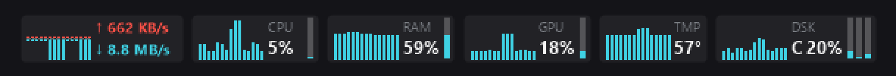
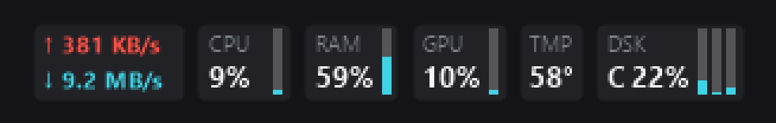
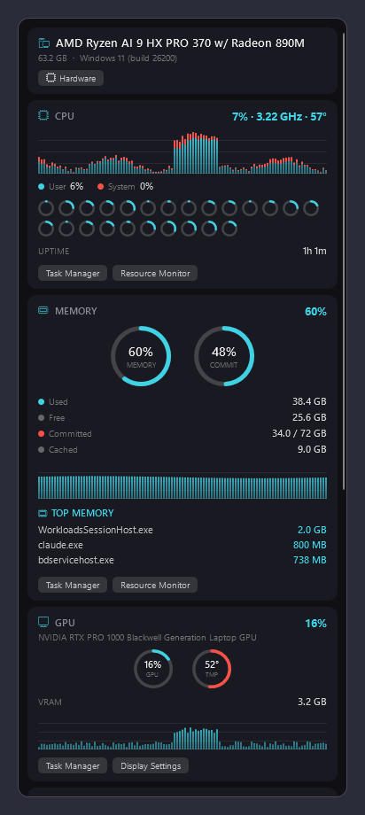
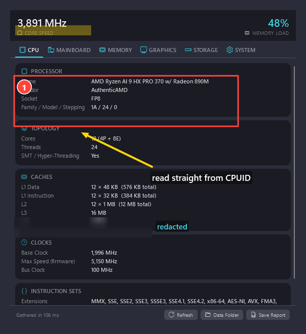
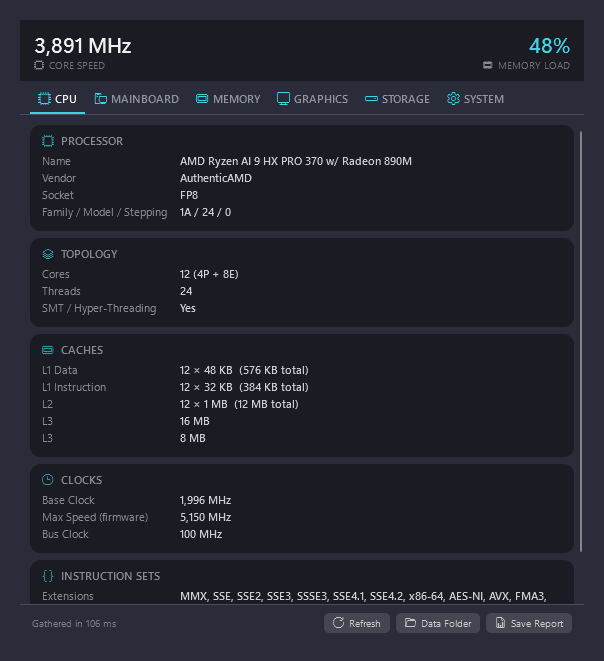
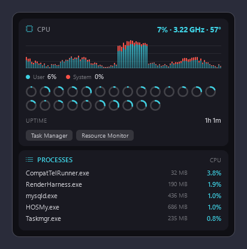
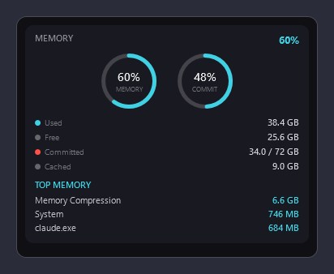
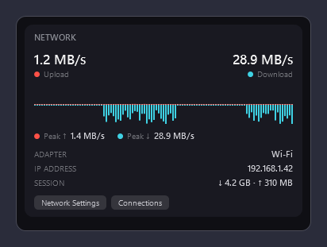

<div align="center">

# MicaStats

**A compact, modern system monitor designed for Windows 11.**

Monitor CPU, memory, GPU, network, and disk activity through a clean taskbar overlay and a menu-style Windows 11 dashboard — with a CPU-Z-style hardware inspector and a full screen-capture and annotation suite built in.

**English** · [ภาษาไทย](#thai)

[Features](#features) · [Screenshots](#screenshots) · [Installation](#installation) · [Build from source](#build-from-source) · [Contributing](#contributing) · [Credits](#credits-and-attribution)


[](LICENSE)


</div>

---

## About MicaStats

MicaStats is an open-source system-monitoring application for Windows 11. It provides real-time hardware and performance information in a compact interface that remains visible without occupying a full application window.

This project is based on [kil0bit System Monitor](https://github.com/kil0bit-kb/kil0bit-system-monitor) and introduces a redesigned, menu-style interface inspired by the compact presentation of modern desktop monitoring utilities.

The visual design has been adapted specifically for Windows 11, with Fluent-style typography, spacing, rounded surfaces, transparency, and Mica-inspired presentation.

> [!NOTE]
> MicaStats is maintained independently from the upstream project. Problems specific to this fork should be reported in this repository rather than to the upstream maintainer.

---

## Why MicaStats Exists

I recently got a new notebook that came preinstalled with Windows 11. Once I finished migrating everything over from Windows 10, one thing was clearly missing from my daily setup: a robust, real-time system monitor living right in the taskbar.

I also have a MacBook, and on macOS [iStat Menus](https://bjango.com/mac/istatmenus/) has long been my favorite utility — compact metric modules in the menu bar, each with its own beautifully dense dropdown. Nothing on Windows felt quite like it.

So I used [Claude Code](https://claude.com/claude-code) to recreate that UX/UI on Windows: the stacked label-over-value taskbar modules, the per-section hover dropdowns, the ring gauges, the mirrored up/down network graphs, and the two-tone cyan/red data palette are all modeled on the iStat Menus experience, rebuilt natively for the Windows 11 taskbar.

---

## Features

### Real-time monitoring

* **CPU** — Current total processor utilization, with a User/System split and one ring gauge per logical processor
* **Memory** — RAM usage, commit charge, and a Used / Free / Committed / Cached breakdown
* **GPU** — Graphics processor load, VRAM, and available temperature information
* **Network** — Real-time upload and download throughput, with adapter, IP address, and session totals
* **Disk** — Activity monitoring for one or more storage devices
* **Temperature** — CPU package temperature, read from Core Temp's shared memory or LibreHardwareMonitor/OpenHardwareMonitor when available

Sensor availability may vary depending on the installed hardware, device drivers, Windows performance counters, and system configuration. Anything that cannot be read honestly shows a dash or a flat baseline rather than a misleading zero.

### Hardware inspector

A **Hardware** button on the stats panel opens a CPU-Z-style inspector with six tabs — CPU, Mainboard, Memory, Graphics, Storage and System — under a live core-speed strip.

* CPU identity read directly from the **CPUID instruction**: vendor, family/model/stepping, instruction sets, hybrid P/E core split, and every cache level
* Mainboard, BIOS and per-module RAM detail parsed from the **raw SMBIOS firmware tables**, including the extended fields DDR5 speeds live in
* Graphics adapters with driver version/date and full video memory, read from the driver registry so it is immune to the well-known 4 GB WMI truncation
* Storage with capacity, bus (NVMe/SATA/USB), kind (SSD/HDD), firmware and health
* **Save Report** writes the whole inspection to a timestamped text file

### Screen capture and annotation

* **Region, window, screen and all-screens** capture, from the overlay's right-click menu, **Settings → Capture**, or global shortcuts
* The region picker **freezes the screen** before you select, so menus and tooltips stay open instead of closing when the picker takes focus, and the selection stays pixel-exact across monitors running different scaling
* Windows and screens are highlighted for **one-click capture**; selection edges **snap** to their borders
* A **magnifier** follows the pointer with a pixel grid, crosshair and the **hex colour** under the cursor — it doubles as an eyedropper
* **Annotation editor**: arrow, rectangle, ellipse, line, pen, highlighter, text and numbered step badges
* **Select tool** to move, resize, nudge or delete any mark after drawing it — each drag is a single undo step
* **Redaction** (pixelate, blur or solid) baked into real pixels, so content hidden on screen is hidden in the saved file
* Crop, undo/redo, copy as PNG **and** DIB so it pastes anywhere, save to PNG/JPEG, or **pin** a capture on top of every window

### Windows 11 interface

* Compact, menu-style monitoring panels
* Fluent Design–inspired visual hierarchy
* Mica-style surfaces and transparency
* Rounded Windows 11–style controls
* Segoe UI Variable typography, and a Segoe Fluent Icons badge on every section
* Ring gauges that sweep from zero when a panel opens, and panels that rise and fade in
* Detailed and compact display modes
* High-DPI and multi-resolution support

### Taskbar and desktop overlay

* Display selected metrics near the Windows taskbar
* Snap the overlay to the taskbar
* Use the overlay as a free-floating desktop panel
* Drag the overlay to a preferred position
* Lock the overlay position
* Keep the overlay above other windows
* Automatically hide it during full-screen applications
* Auto-avoid the Start button: the stacked overlay slides into free taskbar space, squeezes its sparklines to fill the remaining corridor exactly, and only then sheds content (graphs, then trailing modules behind a ⋯ marker) so the centred Windows 11 Start button, widgets button and tray never end up underneath it
* Recovers automatically if a saved position ends up off-screen — for example in the gap between mismatched monitors, or on a display that has since been unplugged
* Right-click for settings, capture commands, and **Show Desktop** — the same minimise-everything toggle as the taskbar's own corner

### Automatic updates

* Checks GitHub for a new release once a day, shortly after startup, and tells you quietly in the corner — never a modal dialog
* **Download and install** from **Settings → Updates**, or straight from the notification
* Every download is **verified against the SHA-256 checksum published with the release** before it is allowed to run; a file that does not match is deleted and the update refused
* Nothing installs by itself: Windows asks for permission, and you can skip a version or turn automatic checking off entirely

### Diagnostics: answering questions Windows will not

Windows measures how long your boot took, which app delayed it, and how worn your battery is — and shows you almost none of it. **Diagnostics** turns those measurements into numbers you can act on. Open it from the stats panel, from the overlay's right-click menu, or from **Settings → Diagnostics**.

**Slowdowns — "why did it just hang?"**

* Keeps a rolling window of the last few minutes of **per-process CPU, memory and disk activity**, so a stall can still be explained after it has passed. Task Manager only ever shows the present instant; by the time a freeze is over, the process responsible has finished and left nothing behind
* Writes a **timeline report naming the culprit** when the machine struggles — or on demand from **Record Slowdown Now** in the overlay menu, reached the moment after you feel a stall
* Costs a single system call per sample: CPU, working set and disk bytes all come from one kernel snapshot, not from per-process performance counters
* Per-process **network** traffic is deliberately absent — Windows exposes it only to an administrator, and MicaStats runs unelevated

**Boot — in milliseconds, not "High/Medium/Low"**

* The **real boot time** and its trend across recent starts, read from the log Windows has been writing all along
* **What held it up**: each application, driver and service Windows measured as delaying startup, with its actual duration
* Every program that **starts with Windows**, showing which ones are already switched off — state `Win32_StartupCommand` does not report — and a box to switch off any per-user entry
* All of it read **without administrator rights**

**Battery — the readout Windows does not have**

* **Health** against design capacity with a plain verdict, plus cycle count — Windows never warns that a pack is wearing out
* Live charge or discharge in **watts**, and a **time remaining computed from the power actually being drawn**, because Windows' own estimate is frequently a placeholder rather than a number
* An optional **battery module in the taskbar overlay**, labelled `CHG` while it fills
* Hidden entirely on a desktop rather than shown as a row of dashes

**Alerts — monitoring that speaks up**

* A quiet corner notice when the processor runs hot, a drive fills up, memory is exhausted, or the battery wears past a threshold
* Each rule waits for the reading to **hold** before firing, and re-arms only after it has recovered, so nothing flickers
* An unreadable sensor never fires — a missing temperature probe must not look like a cold processor

### Works on a light taskbar

* The overlay paints **directly onto the taskbar**, so its colours have to work against whatever the taskbar is. On a light theme the shipped white readings measured **1.10:1 contrast** — effectively invisible. They now switch to dark ink with darkened accents, measured at **16:1**
* **Appearance → Taskbar colours** offers *Match Windows* (the default), *Always light* or *Always dark*, and the overlay repaints the moment you switch Windows between light and dark
* A dark taskbar is unchanged, pixel for pixel, and any colour you customised yourself is never overridden

### Customization and diagnostics

* Select which metrics are displayed
* Choose the active network adapter
* Select multiple disks for monitoring
* Configure the monitoring refresh interval
* Customize fonts and accent colors
* Enable automatic startup with Windows
* Switch between compact and detailed layouts
* Capture folder, file-name template, image format, redaction style and shortcuts
* A plain-text **diagnostics log** at `%APPDATA%\MicaStats\logs\micastats.log` records startup, a hardware summary, sensor sources that failed, and any error — the first place to look when something behaves unexpectedly

---

## Keyboard Shortcuts

| Shortcut | Action |
| --- | --- |
| **Ctrl+Shift+1** | Capture a region (or click a window / screen) |
| **Ctrl+Shift+2** | Capture the window currently in front |
| **Ctrl+Shift+3** | Capture the screen the pointer is on |

While the region picker is open:

| Key | Action |
| --- | --- |
| **Drag / Click** | Select a rectangle, or capture the highlighted window or screen |
| **M** · **S** · **A** | Toggle magnifier · toggle snapping · select everything |
| **Arrows** (Shift ×10, Ctrl resize) | Nudge the selection |
| **Enter** · **Esc** | Accept · cancel |

Inside the annotation editor:

| Key | Action |
| --- | --- |
| **V** | Select tool — move, resize or delete a mark |
| **A R E L P H T N B C** | Arrow, Rectangle, Ellipse, Line, Pen, Highlighter, Text, Numbered step, Redact, Crop |
| **Arrows** / **Delete** | Nudge / remove the selected mark |
| **Ctrl+Z** · **Ctrl+Y** | Undo · redo |
| **Ctrl+C** · **Ctrl+S** | Copy to clipboard · save |

---

## What This Fork Changes

Compared with the original kil0bit System Monitor, MicaStats focuses on a different presentation and interaction model:

* Redesigned monitoring panels with a compact menu-style appearance
* Updated spacing, typography, and information hierarchy
* Windows 11–oriented Fluent and Mica visual treatment
* Faster access to individual monitoring categories
* Cleaner separation between summary information and detailed metrics
* A more consistent appearance across the taskbar overlay and settings dashboard
* Additional tooling that the upstream project does not include: the hardware inspector, the screen-capture suite, and the diagnostics log

The underlying monitoring functionality remains derived from the original project, while the interface and user experience are being developed independently.

---

Curious where MicaStats is heading? The researched feature roadmap lives in [ROADMAP.md](ROADMAP.md). Full usage documentation is in [GUIDE.md](GUIDE.md).

## Screenshots

All images below are rendered by the actual application code with representative data.

### Taskbar Overlay — iStat-style stacked modules

Each metric is its own module: a dim label over a bold value, dense history bars, mini level bars on CPU / RAM / GPU, one combined storage zone with a bar per drive, and paired ↑/↓ network lines around a mirrored graph.

<p align="center">
  
</p>

With **Live Graphs** switched off, the same layout in its most compact form:

<p align="center">
  
</p>

### Stats Panel

Click the overlay for the full dropdown: stacked User/System CPU history, one ring gauge per logical processor, MEMORY and COMMIT rings with a memory history graph and a Used / Free / Committed / Cached breakdown, GPU rings with VRAM, a mirrored network graph with session totals, per-drive storage rows, and top processes.

<p align="center">
  
</p>

### Screen Capture

Region, window and screen capture with global shortcuts (**Ctrl+Shift+1/2/3**). The region picker freezes the screen so menus stay open while you select, highlights windows for one-click capture, snaps to edges, and carries a magnifier with a pixel grid and hex-colour eyedropper. Every capture opens in an annotation editor: arrows, shapes, pen, highlighter, text, numbered steps, crop, undo/redo — and **redaction** (pixelate / blur / solid) baked into real pixels, so what is hidden on screen is hidden in the file.

<p align="center">
  
</p>

### Hardware Inspector

The **Hardware** button on the stats panel opens a CPU-Z-style inspector. CPU identity comes straight from the CPUID instruction (vendor, family/model/stepping, instruction sets, hybrid P/E core split, per-level caches); mainboard, BIOS and per-module RAM detail come from the raw SMBIOS firmware tables; graphics adapters report driver and full VRAM; disks show bus (NVMe/SATA), kind (SSD/HDD) and health — under a live core-speed strip. **Save Report** writes it all to a text file.

<p align="center">
  
</p>

### Per-Section Hover Dropdowns

Pause over any taskbar module and its own compact dropdown opens, retargeting as you slide between modules — the iStat Menus interaction, on Windows.

<p align="center">
  
  
  
</p>

---

## System Requirements

### Running MicaStats

* Windows 11 is the primary supported platform
* Windows 10 build 19041 or later may work, but is not the primary visual target
* .NET 8 Desktop Runtime when using a framework-dependent release
* Compatible Windows performance counters and hardware drivers

### Building MicaStats

* Windows 10 or Windows 11
* [.NET 8 SDK](https://dotnet.microsoft.com/download/dotnet/8.0)
* Visual Studio 2022 with the **.NET desktop development** workload, or another compatible .NET development environment
* Git

---

## Installation

### Download a Release

1. Open the [Releases](https://github.com/manoi-bms/MicaStats/releases) page.
2. Download the latest installer or portable package.
3. Extract the package when necessary.
4. Run MicaStats.
5. Select the metrics you want to display from the Monitoring settings.

> [!IMPORTANT]
> Uninstall or close an older build before installing a new version, particularly when switching from the original kil0bit System Monitor to MicaStats.

> [!NOTE]
> Community builds may display a Microsoft Defender SmartScreen warning when the executable has not been code-signed. Review the release source and checksums before running downloaded software. Every release publishes a SHA-256 checksum alongside the installer.

When no packaged release is available, build the application directly from source.

---

## Build from Source

### Clone the Repository

```powershell
git clone https://github.com/manoi-bms/MicaStats.git
cd MicaStats
```

### Restore Dependencies

```powershell
dotnet restore
```

### Build a Release Version

```powershell
dotnet build --configuration Release
```

The compiled files will normally be created under:

```text
bin/Release/net8.0-windows/
```

### Run from Source

```powershell
dotnet run
```

### Run the Test Suite

```powershell
dotnet test tests/Kil0bitSystemMonitor.Tests/Kil0bitSystemMonitor.Tests.csproj
```

### Publish a Framework-Dependent Windows Build

```powershell
dotnet publish `
  --configuration Release `
  --runtime win-x64 `
  --self-contained false `
  --output ./publish
```

The published application will be created in the `publish` directory.

---

## Technology

| Component           | Technology                                   |
| ------------------- | -------------------------------------------- |
| Language            | C#                                           |
| Runtime             | .NET 8                                       |
| Desktop framework   | Windows Presentation Foundation              |
| UI library          | ModernWpfUI                                  |
| Windows integration | Win32 APIs                                   |
| Performance data    | Windows performance counters and system APIs |
| Hardware identity   | CPUID instruction and raw SMBIOS tables      |
| Graphics            | GDI+ for the taskbar overlay, WPF for panels |
| Configuration       | Local application settings                   |

MicaStats uses a native Windows desktop stack rather than a browser-based desktop runtime.

---

## Basic Usage

After launching MicaStats:

1. Open the settings dashboard.
2. Go to **Monitoring**.
3. Enable CPU, memory, GPU, network, or disk modules.
4. Select the correct network adapter when network traffic shows zero.
5. Configure the refresh interval.
6. Choose compact or detailed presentation.
7. Enable **Snap to Taskbar** for a taskbar-integrated layout.
8. Disable **Snap to Taskbar** to position the overlay freely on the desktop.
9. Enable **Lock Position** after placing the overlay.
10. Enable **Launch on Startup** when MicaStats should start automatically with Windows.

Click the overlay for the full stats panel, hover a module for its own dropdown, and right-click for settings, capture commands and common overlay actions.

---

## Troubleshooting

### The overlay is not visible

Confirm that at least one monitoring module is enabled. On a multi-monitor setup a saved position can fall in the gap between mismatched displays; MicaStats now detects this and snaps the overlay back onto the taskbar automatically, and records the recovery in the diagnostics log.

### Network speed remains at zero

Open the Monitoring settings and select the active Ethernet, Wi-Fi, VPN, or virtual network adapter.

### GPU information is unavailable

GPU metrics depend on the graphics hardware, driver implementation, and Windows performance-counter support. Update the GPU driver and restart MicaStats.

### A capture shortcut does nothing

Another application may already own that combination — Windows reserves several itself. The diagnostics log records which shortcut failed to register. Change or disable the shortcuts under **Settings → Capture**.

### The application does not start with Windows

Disable and re-enable the startup option. Also verify that Windows has not disabled the application under **Settings → Apps → Startup**.

### Windows displays a SmartScreen warning

Unsigned community applications can trigger SmartScreen. Download builds only from this repository's official Releases page or build the source yourself.

### The overlay moves unexpectedly

Place the overlay in the desired location and enable **Lock Position**.

### Something else looks wrong

Open `%APPDATA%\MicaStats\logs\micastats.log`. It records startup, a one-line hardware summary, any sensor source that could not be read, and every error, with timestamps.

---

## Contributing

Contributions are welcome.

Before beginning a substantial change, open an issue to describe the proposal and confirm that it fits the project direction.

### Development Workflow

1. Fork this repository.
2. Create a feature branch:

```bash
git checkout -b feature/your-feature-name
```

3. Make and test your changes.
4. Commit with a clear description:

```bash
git commit -m "Add: description of the change"
```

5. Push the branch:

```bash
git push origin feature/your-feature-name
```

6. Open a pull request.

Please keep pull requests focused, run the test suite, and include screenshots for visible interface changes.

---

## Reporting Bugs

Use the [GitHub issue tracker](https://github.com/manoi-bms/MicaStats/issues) to report defects.

Include:

* Windows version and build number
* MicaStats version or commit hash
* CPU and GPU model
* Display scale and resolution
* Steps required to reproduce the problem
* Expected and actual behavior
* Relevant screenshots or logs

> [!TIP]
> The hardware inspector's **Save Report** button and the diagnostics log contain most of the above. Review both for anything private before attaching them to a public issue.

For security-sensitive reports, do not publish exploit details in a public issue. Contact the maintainer privately using the contact method listed in the repository profile.

---

## Credits and Attribution

MicaStats is a derivative work based on:

**[kil0bit System Monitor](https://github.com/kil0bit-kb/kil0bit-system-monitor)**
Created by **KB – kil0bit**

Original portions:

```text
Copyright (c) 2026 KB - kil0bit
```

MicaStats modifications:

```text
Copyright (c) 2026 Chaiyaporn Suratemeekul (manoi-bms)
```

MicaStats is created and maintained by **Chaiyaporn Suratemeekul** ([@manoi-bms](https://github.com/manoi-bms)), with the iStat Menus-style UX/UI developed with the help of [Claude Code](https://claude.com/claude-code).

The original project is distributed under the MIT License. MicaStats retains the original copyright and license notice as required by that license.

The upstream author is not responsible for modifications, releases, support, or defects introduced by this fork.

---

## Independent Project Notice

MicaStats is an independent open-source project.

It is not affiliated with or endorsed by Bjango, iStat Menus, Apple, Microsoft, or the maintainer of the original kil0bit System Monitor project. Product and company names are used only to identify the platforms or applications being discussed.

MicaStats uses its own name, icons, screenshots, visual assets, and branding.

---

## License

This project is available under the [MIT License](LICENSE).

The `LICENSE` file must retain the original kil0bit System Monitor copyright notice. A separate copyright notice for MicaStats modifications may be added without removing the upstream notice.

---

<a id="thai"></a>

<div align="center">

# MicaStats — ภาษาไทย

**โปรแกรมมอนิเตอร์ระบบขนาดกะทัดรัด ออกแบบมาสำหรับ Windows 11 โดยเฉพาะ**

ดูการทำงานของ CPU, หน่วยความจำ, GPU, เครือข่าย และดิสก์ ได้จากโอเวอร์เลย์บนทาสก์บาร์และแดชบอร์ดสไตล์เมนูของ Windows 11 — พร้อมเครื่องมือตรวจสอบฮาร์ดแวร์แบบ CPU-Z และชุดจับภาพหน้าจอพร้อมเครื่องมือมาร์กอัปในตัว

[English](#micastats) · **ภาษาไทย**

[คุณสมบัติ](#คุณสมบัติ) · [ภาพตัวอย่าง](#ภาพตัวอย่าง) · [การติดตั้ง](#การติดตั้ง) · [คอมไพล์จากซอร์สโค้ด](#การคอมไพล์จากซอร์สโค้ด) · [ร่วมพัฒนา](#การร่วมพัฒนา) · [เครดิต](#เครดิตและการอ้างอิง)

</div>

---

## เกี่ยวกับ MicaStats

MicaStats เป็นโปรแกรมมอนิเตอร์ระบบแบบโอเพนซอร์สสำหรับ Windows 11 แสดงข้อมูลฮาร์ดแวร์และประสิทธิภาพแบบเรียลไทม์ในหน้าตาที่กะทัดรัด มองเห็นได้ตลอดเวลาโดยไม่ต้องเปิดหน้าต่างโปรแกรมเต็มจอ

โปรเจกต์นี้พัฒนาต่อยอดจาก [kil0bit System Monitor](https://github.com/kil0bit-kb/kil0bit-system-monitor) โดยออกแบบหน้าตาใหม่ให้เป็นสไตล์เมนู ได้แรงบันดาลใจจากโปรแกรมมอนิเตอร์ระบบสมัยใหม่ที่นำเสนอข้อมูลอย่างกระชับ

งานออกแบบปรับให้เข้ากับ Windows 11 โดยเฉพาะ ทั้งรูปแบบตัวอักษรและระยะห่างตามแนวทาง Fluent, พื้นผิวมุมโค้ง, ความโปร่งแสง และการนำเสนอแบบ Mica

> [!NOTE]
> MicaStats ดูแลรักษาแยกจากโปรเจกต์ต้นทาง หากพบปัญหาที่เกิดเฉพาะกับฟอร์กนี้ กรุณาแจ้งในรีโพนี้ ไม่ใช่กับผู้ดูแลโปรเจกต์ต้นทาง

---

## ทำไมถึงมี MicaStats

ผมเพิ่งได้โน้ตบุ๊กเครื่องใหม่ที่ติดตั้ง Windows 11 มาให้ หลังย้ายข้อมูลจาก Windows 10 เสร็จ สิ่งที่ขาดหายไปอย่างชัดเจนจากการใช้งานประจำวันคือโปรแกรมมอนิเตอร์ระบบแบบเรียลไทม์ที่อยู่บนทาสก์บาร์

ผมใช้ MacBook ด้วย และบน macOS โปรแกรมโปรดของผมคือ [iStat Menus](https://bjango.com/mac/istatmenus/) — โมดูลข้อมูลกะทัดรัดบนเมนูบาร์ แต่ละอันมีดรอปดาวน์ของตัวเองที่อัดแน่นและสวยงาม แต่บน Windows ยังไม่มีอะไรให้ความรู้สึกแบบนั้น

ผมจึงใช้ [Claude Code](https://claude.com/claude-code) สร้าง UX/UI แบบนั้นขึ้นมาใหม่บน Windows ทั้งโมดูลบนทาสก์บาร์ที่วางป้ายกำกับซ้อนบนค่าตัวเลข, ดรอปดาวน์แยกตามหมวดเมื่อชี้เมาส์ค้าง, เกจวงแหวน, กราฟเครือข่ายขึ้น/ลงแบบสะท้อนกัน และชุดสีข้อมูลสองโทน (ฟ้า/แดง) ทั้งหมดถอดแบบจาก iStat Menus แล้วสร้างขึ้นใหม่ให้เป็นของ Windows 11 โดยแท้

---

## คุณสมบัติ

### การมอนิเตอร์แบบเรียลไทม์

* **CPU** — เปอร์เซ็นต์การใช้งานรวม แยกสัดส่วน User/System พร้อมเกจวงแหวนของทุกคอร์เชิงตรรกะ
* **หน่วยความจำ** — การใช้ RAM, commit charge และรายละเอียด Used / Free / Committed / Cached
* **GPU** — โหลดการ์ดจอ, VRAM และอุณหภูมิ (ถ้าอ่านได้)
* **เครือข่าย** — ความเร็วอัปโหลด/ดาวน์โหลดแบบเรียลไทม์ พร้อมชื่ออะแดปเตอร์ หมายเลข IP และยอดรวมของเซสชัน
* **ดิสก์** — ดูกิจกรรมของไดรฟ์ได้พร้อมกันหลายตัว
* **อุณหภูมิ** — อุณหภูมิ CPU อ่านจากหน่วยความจำร่วมของ Core Temp หรือจาก LibreHardwareMonitor/OpenHardwareMonitor เมื่อมีให้ใช้

เซ็นเซอร์ที่อ่านได้ขึ้นอยู่กับฮาร์ดแวร์ ไดรเวอร์ ตัวนับประสิทธิภาพของ Windows และการตั้งค่าของเครื่อง ค่าใดที่อ่านไม่ได้จะแสดงเป็นขีด (—) หรือเส้นฐานราบตามจริง ไม่แสดงเลขศูนย์ที่ทำให้เข้าใจผิด

### เครื่องมือตรวจสอบฮาร์ดแวร์

ปุ่ม **Hardware** บนแผงข้อมูลจะเปิดหน้าต่างตรวจสอบฮาร์ดแวร์สไตล์ CPU-Z มี 6 แท็บ — CPU, Mainboard, Memory, Graphics, Storage และ System — พร้อมแถบแสดงความเร็วสัญญาณนาฬิกาแบบสด

* ข้อมูล CPU อ่านตรงจากคำสั่ง **CPUID**: ผู้ผลิต, family/model/stepping, ชุดคำสั่งที่รองรับ, การแบ่งคอร์แบบไฮบริด (P/E) และแคชทุกระดับ
* ข้อมูลเมนบอร์ด, BIOS และแรมรายแถว อ่านจาก **ตาราง SMBIOS ของเฟิร์มแวร์โดยตรง** รวมถึงฟิลด์ส่วนขยายที่เก็บความเร็วของ DDR5
* การ์ดจอพร้อมเวอร์ชัน/วันที่ของไดรเวอร์ และขนาด VRAM เต็มจำนวน อ่านจากรีจิสทรีของไดรเวอร์ จึงไม่ติดปัญหา WMI ที่รายงานได้ไม่เกิน 4 GB
* ที่เก็บข้อมูลพร้อมความจุ, บัส (NVMe/SATA/USB), ชนิด (SSD/HDD), เฟิร์มแวร์ และสถานะสุขภาพ
* ปุ่ม **Save Report** บันทึกข้อมูลทั้งหมดเป็นไฟล์ข้อความพร้อมวันเวลา

### จับภาพหน้าจอและใส่คำอธิบาย

* จับภาพได้ทั้งแบบ **เลือกพื้นที่, เฉพาะหน้าต่าง, ทั้งจอ และทุกจอรวมกัน** สั่งได้จากเมนูคลิกขวาบนโอเวอร์เลย์, **Settings → Capture** หรือคีย์ลัดที่ใช้ได้ทั้งระบบ
* ตัวเลือกพื้นที่จะ **หยุดภาพหน้าจอไว้ก่อน** แล้วให้เลือกบนภาพนิ่งนั้น เมนูและทูลทิปจึงยังค้างอยู่ ไม่หายไปตอนที่ตัวเลือกได้โฟกัส และพื้นที่ที่เลือกแม่นยำระดับพิกเซลแม้จอแต่ละตัวจะตั้งสเกลไม่เท่ากัน
* ไฮไลต์หน้าต่างและหน้าจอให้ **จับภาพได้ด้วยคลิกเดียว** พร้อมการ **สแนป** ขอบให้ตรงกับกรอบหน้าต่าง
* **แว่นขยาย** ติดตามเมาส์ แสดงตารางพิกเซล เส้นเล็ง และ **ค่าสีแบบ hex** ใต้เคอร์เซอร์ ใช้เป็นเครื่องมือดูดสีได้ในตัว
* **เครื่องมือมาร์กอัป**: ลูกศร, สี่เหลี่ยม, วงรี, เส้นตรง, ปากกา, ปากกาเน้นข้อความ, ข้อความ และป้ายหมายเลขลำดับขั้น
* **เครื่องมือเลือก (Select)** สำหรับย้าย ปรับขนาด เลื่อนทีละพิกเซล หรือลบมาร์กที่วาดไปแล้ว โดยการลากหนึ่งครั้งนับเป็นการย้อนกลับหนึ่งขั้น
* **การปิดบังข้อมูล** (โมเสก, เบลอ หรือทึบ) ถูกฝังลงในพิกเซลจริง สิ่งที่ถูกปิดบังบนจอจึงถูกปิดบังในไฟล์ที่บันทึกด้วย
* ตัดภาพ (crop), ย้อนกลับ/ทำซ้ำ, คัดลอกเป็นทั้ง PNG **และ** DIB เพื่อให้วางได้ทุกโปรแกรม, บันทึกเป็น PNG/JPEG หรือ **ปักหมุด** ภาพให้ลอยอยู่เหนือทุกหน้าต่าง

### หน้าตาแบบ Windows 11

* แผงข้อมูลกะทัดรัดสไตล์เมนู
* ลำดับชั้นการมองเห็นตามแนวทาง Fluent Design
* พื้นผิวและความโปร่งแสงสไตล์ Mica
* คอนโทรลมุมโค้งตามสไตล์ Windows 11
* ตัวอักษร Segoe UI Variable และไอคอน Segoe Fluent Icons กำกับทุกหมวด
* เกจวงแหวนกวาดจากศูนย์เมื่อเปิดแผง และแผงข้อมูลค่อย ๆ เลื่อนขึ้นพร้อมจางเข้า
* เลือกได้ทั้งโหมดแสดงผลแบบละเอียดและแบบกะทัดรัด
* รองรับ High-DPI และความละเอียดหน้าจอหลากหลาย

### โอเวอร์เลย์บนทาสก์บาร์และเดสก์ท็อป

* แสดงค่าที่เลือกไว้บริเวณทาสก์บาร์ของ Windows
* ยึดโอเวอร์เลย์ติดกับทาสก์บาร์
* หรือใช้เป็นแผงลอยอิสระบนเดสก์ท็อป
* ลากย้ายไปยังตำแหน่งที่ต้องการได้
* ล็อกตำแหน่งไม่ให้ขยับ
* ให้อยู่เหนือหน้าต่างอื่นเสมอ
* ซ่อนอัตโนมัติเมื่อมีโปรแกรมทำงานแบบเต็มจอ
* หลบปุ่ม Start อัตโนมัติ: โอเวอร์เลย์จะเลื่อนไปยังพื้นที่ว่างบนทาสก์บาร์ก่อน แล้วบีบกราฟเส้นให้พอดีกับช่องว่างที่เหลือ จากนั้นจึงค่อยลดเนื้อหา (ซ่อนกราฟก่อน แล้วจึงซ่อนโมดูลท้าย ๆ ไว้หลังเครื่องหมาย ⋯) เพื่อไม่ให้ทับปุ่ม Start ที่อยู่กึ่งกลาง ปุ่มวิดเจ็ต และถาดระบบ
* กู้ตำแหน่งอัตโนมัติเมื่อตำแหน่งที่บันทึกไว้ตกไปอยู่นอกจอ เช่น ช่องว่างระหว่างจอที่ขนาดไม่เท่ากัน หรือจอที่ถอดออกไปแล้ว
* คลิกขวาเพื่อเข้าถึงการตั้งค่า คำสั่งจับภาพหน้าจอ และ **Show Desktop** ซึ่งย่อหน้าต่างทั้งหมดเพื่อดูเดสก์ท็อป (กดซ้ำเพื่อเรียกคืน) เหมือนปุ่มมุมขวาของทาสก์บาร์

### การอัปเดตอัตโนมัติ

* ตรวจสอบรีลีสใหม่บน GitHub วันละครั้งหลังเปิดโปรแกรม แล้วแจ้งเตือนแบบเงียบ ๆ ที่มุมจอ ไม่ใช่หน้าต่างที่บังการทำงาน
* สั่ง **ดาวน์โหลดและติดตั้ง** ได้จาก **Settings → Updates** หรือจากการแจ้งเตือนโดยตรง
* ทุกไฟล์ที่ดาวน์โหลดจะถูก **ตรวจสอบกับค่า SHA-256 ที่เผยแพร่มาพร้อมรีลีส** ก่อนเรียกใช้งานเสมอ หากค่าไม่ตรงกันไฟล์จะถูกลบและยกเลิกการอัปเดตทันที
* ไม่มีการติดตั้งเองโดยพลการ: Windows จะขออนุญาตก่อน และคุณเลือกข้ามเวอร์ชันนั้น หรือปิดการตรวจสอบอัตโนมัติทั้งหมดได้

### การวินิจฉัย: คำตอบที่ Windows ไม่ยอมบอก

Windows วัดเวลาบูต วัดว่าโปรแกรมใดถ่วงการเริ่มระบบ และรู้ว่าแบตเตอรี่เสื่อมไปเท่าไร แต่แทบไม่แสดงให้เห็นเลย หน้าต่าง **Diagnostics** เปลี่ยนค่าเหล่านั้นให้เป็นตัวเลขที่ใช้งานได้จริง เปิดได้จากแผงสถิติ จากเมนูคลิกขวาบนแถบงาน หรือจาก **Settings → Diagnostics**

**Slowdowns — "เมื่อกี้เครื่องค้างเพราะอะไร?"**

* เก็บ **กิจกรรมของแต่ละโปรเซส (CPU, หน่วยความจำ, ดิสก์)** ย้อนหลังไม่กี่นาทีแบบต่อเนื่อง เพื่อให้อธิบายอาการหน่วงได้แม้เหตุการณ์จะผ่านไปแล้ว — Task Manager แสดงเฉพาะขณะปัจจุบัน พอเครื่องหายค้าง โปรเซสต้นเหตุก็จบไปแล้วโดยไม่เหลือร่องรอย
* เขียน **รายงานไทม์ไลน์ที่ระบุชื่อโปรเซสต้นเหตุ** เมื่อเครื่องเริ่มทำงานหนักผิดปกติ หรือสั่งเองได้จาก **Record Slowdown Now** ในเมนูคลิกขวา ซึ่งเป็นจุดที่มือไปถึงทันทีหลังรู้สึกว่าเครื่องหน่วง
* ใช้ system call เพียงครั้งเดียวต่อการเก็บตัวอย่าง เพราะค่า CPU, หน่วยความจำ และไบต์ดิสก์มาจาก kernel snapshot ชุดเดียวกัน ไม่ใช่ performance counter รายโปรเซส
* **ไม่มี** ปริมาณเครือข่ายรายโปรเซสโดยตั้งใจ เพราะ Windows เปิดให้อ่านเฉพาะสิทธิ์ผู้ดูแลระบบ ขณะที่ MicaStats ทำงานด้วยสิทธิ์ผู้ใช้ปกติ

**Boot — เป็นมิลลิวินาที ไม่ใช่แค่ "สูง/กลาง/ต่ำ"**

* **เวลาบูตจริง** พร้อมแนวโน้มเทียบกับการเปิดเครื่องครั้งก่อน ๆ อ่านจากบันทึกที่ Windows เขียนไว้อยู่แล้ว
* **อะไรถ่วงการบูต**: แอป ไดรเวอร์ และบริการที่ Windows วัดว่าทำให้การเริ่มระบบช้า พร้อมระยะเวลาจริงของแต่ละตัว
* รายการโปรแกรมที่ **เริ่มพร้อม Windows** ทั้งหมด พร้อมบอกว่าตัวใดถูกปิดไว้แล้ว — ข้อมูลที่ `Win32_StartupCommand` ไม่ได้บอก — และมีช่องให้ปิดรายการของผู้ใช้ปัจจุบันได้ทันที
* ทั้งหมดนี้อ่านได้ **โดยไม่ต้องใช้สิทธิ์ผู้ดูแลระบบ**

**Battery — ค่าที่ Windows ไม่มีให้ดู**

* **สุขภาพแบตเตอรี่** เทียบกับความจุตามการออกแบบ พร้อมคำอธิบายตรงไปตรงมาและจำนวนรอบการชาร์จ — Windows ไม่เคยเตือนว่าแบตเตอรี่กำลังเสื่อม
* อัตราการชาร์จหรือคายประจุเป็น **วัตต์** และ **เวลาที่เหลือซึ่งคำนวณจากกำลังไฟที่ใช้จริง** เพราะค่าประมาณของ Windows เองมักเป็นค่าสำรองที่ใช้ไม่ได้
* เพิ่ม **โมดูลแบตเตอรี่บนแถบงาน** ได้ตามต้องการ โดยแสดงป้าย `CHG` ขณะกำลังชาร์จ
* บนเครื่องเดสก์ท็อปจะซ่อนทั้งหมด แทนที่จะแสดงเป็นขีดว่าง ๆ

**Alerts — การเฝ้าระวังที่ส่งเสียงเอง**

* แจ้งเตือนเงียบ ๆ ที่มุมจอเมื่อซีพียูร้อนเกินกำหนด ไดรฟ์ใกล้เต็ม หน่วยความจำถูกใช้จนหมด หรือแบตเตอรี่เสื่อมเกินเกณฑ์
* แต่ละกฎจะรอให้ค่านั้น **คงอยู่นานพอ** ก่อนแจ้งเตือน และจะกลับมาพร้อมเตือนอีกครั้งก็ต่อเมื่อค่ากลับสู่ปกติแล้วเท่านั้น จึงไม่มีการแจ้งเตือนกะพริบไปมา
* เซ็นเซอร์ที่อ่านค่าไม่ได้จะไม่ทำให้เกิดการแจ้งเตือน เพราะเซ็นเซอร์อุณหภูมิที่หายไปต้องไม่ถูกตีความว่าซีพียูเย็น

### รองรับแถบงานธีมสว่าง

* โอเวอร์เลย์วาดลงบน **แถบงานโดยตรง** สีที่ใช้จึงต้องอ่านออกบนพื้นหลังของแถบงานจริง ๆ บนธีมสว่าง ค่าตัวเลขสีขาวเดิมวัดค่าคอนทราสต์ได้เพียง **1.10:1** ซึ่งแทบมองไม่เห็น ตอนนี้เปลี่ยนเป็นหมึกสีเข้มพร้อมสีเน้นที่เข้มขึ้น วัดได้ **16:1**
* **Appearance → Taskbar colours** เลือกได้ระหว่าง *Match Windows* (ค่าเริ่มต้น), *Always light* หรือ *Always dark* และโอเวอร์เลย์จะวาดใหม่ทันทีเมื่อสลับธีมของ Windows
* แถบงานธีมมืดยังคงเหมือนเดิมทุกพิกเซล และสีที่คุณตั้งเองจะไม่ถูกเขียนทับ

### การปรับแต่งและการตรวจสอบปัญหา

* เลือกว่าจะแสดงค่าใดบ้าง
* เลือกอะแดปเตอร์เครือข่ายที่ใช้งานอยู่
* เลือกมอนิเตอร์ดิสก์ได้หลายไดรฟ์
* ตั้งค่าความถี่ในการรีเฟรชข้อมูล
* ปรับแบบอักษรและสีเน้น
* ตั้งให้เปิดอัตโนมัติพร้อม Windows
* สลับระหว่างเลย์เอาต์แบบกะทัดรัดและแบบละเอียด
* ตั้งค่าโฟลเดอร์เก็บภาพ, รูปแบบชื่อไฟล์, ชนิดไฟล์ภาพ, รูปแบบการปิดบังข้อมูล และคีย์ลัด
* **ไฟล์บันทึกการทำงาน** แบบข้อความที่ `%APPDATA%\MicaStats\logs\micastats.log` บันทึกการเริ่มโปรแกรม สรุปฮาร์ดแวร์หนึ่งบรรทัด เซ็นเซอร์ที่อ่านไม่สำเร็จ และข้อผิดพลาดทั้งหมด — เป็นที่แรกที่ควรดูเมื่อโปรแกรมทำงานผิดปกติ

---

## คีย์ลัด

| คีย์ลัด | การทำงาน |
| --- | --- |
| **Ctrl+Shift+1** | จับภาพเฉพาะพื้นที่ (หรือคลิกเลือกหน้าต่าง/หน้าจอ) |
| **Ctrl+Shift+2** | จับภาพหน้าต่างที่อยู่ด้านหน้าสุด |
| **Ctrl+Shift+3** | จับภาพหน้าจอที่เมาส์อยู่ |

ขณะเปิดตัวเลือกพื้นที่:

| คีย์ | การทำงาน |
| --- | --- |
| **ลาก / คลิก** | เลือกกรอบสี่เหลี่ยม หรือจับภาพหน้าต่าง/หน้าจอที่ถูกไฮไลต์ |
| **M** · **S** · **A** | เปิด-ปิดแว่นขยาย · เปิด-ปิดการสแนป · เลือกทั้งหมด |
| **ลูกศร** (Shift ×10, Ctrl ปรับขนาด) | ขยับกรอบที่เลือกทีละน้อย |
| **Enter** · **Esc** | ยืนยัน · ยกเลิก |

ในหน้าต่างมาร์กอัป:

| คีย์ | การทำงาน |
| --- | --- |
| **V** | เครื่องมือเลือก — ย้าย ปรับขนาด หรือลบมาร์ก |
| **A R E L P H T N B C** | ลูกศร, สี่เหลี่ยม, วงรี, เส้น, ปากกา, ปากกาเน้นข้อความ, ข้อความ, ป้ายหมายเลข, ปิดบังข้อมูล, ตัดภาพ |
| **ลูกศร** / **Delete** | ขยับ / ลบมาร์กที่เลือกอยู่ |
| **Ctrl+Z** · **Ctrl+Y** | ย้อนกลับ · ทำซ้ำ |
| **Ctrl+C** · **Ctrl+S** | คัดลอกไปคลิปบอร์ด · บันทึก |

---

## ฟอร์กนี้เปลี่ยนอะไรบ้าง

เมื่อเทียบกับ kil0bit System Monitor ต้นฉบับ MicaStats เน้นรูปแบบการนำเสนอและการโต้ตอบที่ต่างออกไป:

* ออกแบบแผงข้อมูลใหม่ให้เป็นสไตล์เมนูที่กะทัดรัด
* ปรับระยะห่าง แบบอักษร และลำดับความสำคัญของข้อมูล
* ใช้แนวทาง Fluent และ Mica ของ Windows 11
* เข้าถึงข้อมูลแต่ละหมวดได้เร็วขึ้น
* แยกข้อมูลสรุปกับข้อมูลละเอียดออกจากกันชัดเจนขึ้น
* หน้าตาสอดคล้องกันมากขึ้นระหว่างโอเวอร์เลย์บนทาสก์บาร์กับแดชบอร์ดตั้งค่า
* เพิ่มเครื่องมือที่โปรเจกต์ต้นทางไม่มี ได้แก่ ตัวตรวจสอบฮาร์ดแวร์ ชุดจับภาพหน้าจอ และไฟล์บันทึกการทำงาน

ส่วนกลไกการอ่านค่าต่าง ๆ ยังคงพัฒนาต่อจากโปรเจกต์ต้นฉบับ ขณะที่หน้าตาและประสบการณ์ใช้งานพัฒนาแยกเป็นอิสระ

---

อยากรู้ทิศทางต่อไปของ MicaStats? แผนพัฒนาอยู่ใน [ROADMAP.md](ROADMAP.md) และคู่มือการใช้งานฉบับเต็มอยู่ใน [GUIDE.md](GUIDE.md)

## ภาพตัวอย่าง

ภาพทั้งหมดด้านล่างเรนเดอร์จากโค้ดของโปรแกรมจริง พร้อมข้อมูลตัวอย่าง

### โอเวอร์เลย์บนทาสก์บาร์ — โมดูลซ้อนสไตล์ iStat

แต่ละค่าคือหนึ่งโมดูล: ป้ายกำกับสีจางอยู่เหนือค่าตัวหนา พร้อมกราฟแท่งย้อนหลังแบบถี่ แถบระดับขนาดเล็กบน CPU / RAM / GPU โซนเก็บข้อมูลรวมที่มีแถบแยกตามไดรฟ์ และบรรทัดเครือข่าย ↑/↓ คู่กันรอบกราฟแบบสะท้อน

<p align="center">
  
</p>

เมื่อปิด **Live Graphs** เลย์เอาต์เดิมจะกะทัดรัดที่สุดแบบนี้:

<p align="center">
  
</p>

### แผงข้อมูล

คลิกที่โอเวอร์เลย์เพื่อเปิดดรอปดาวน์เต็มรูปแบบ: กราฟย้อนหลังของ CPU แบบซ้อน User/System, เกจวงแหวนของทุกคอร์เชิงตรรกะ, วงแหวน MEMORY และ COMMIT พร้อมกราฟย้อนหลังและรายละเอียด Used / Free / Committed / Cached, วงแหวน GPU พร้อม VRAM, กราฟเครือข่ายแบบสะท้อนพร้อมยอดรวมเซสชัน, แถวข้อมูลแยกตามไดรฟ์ และโปรเซสที่ใช้ทรัพยากรสูงสุด

<p align="center">
  
</p>

### การจับภาพหน้าจอ

จับภาพได้ทั้งแบบเลือกพื้นที่ เฉพาะหน้าต่าง และทั้งจอ ด้วยคีย์ลัดที่ใช้ได้ทั้งระบบ (**Ctrl+Shift+1/2/3**) ตัวเลือกพื้นที่จะหยุดภาพหน้าจอไว้ก่อน เมนูจึงยังค้างอยู่ระหว่างที่เลือก พร้อมไฮไลต์หน้าต่างให้จับภาพด้วยคลิกเดียว สแนปเข้าขอบ และมีแว่นขยายที่แสดงตารางพิกเซลและค่าสี hex ทุกภาพที่จับจะเปิดในหน้าต่างมาร์กอัป: ลูกศร รูปทรง ปากกา ปากกาเน้นข้อความ ข้อความ ป้ายหมายเลข ตัดภาพ ย้อนกลับ/ทำซ้ำ และ **การปิดบังข้อมูล** (โมเสก / เบลอ / ทึบ) ที่ฝังลงในพิกเซลจริง สิ่งที่ถูกปิดบังบนจอจึงถูกปิดบังในไฟล์ด้วย

<p align="center">
  
</p>

### ตัวตรวจสอบฮาร์ดแวร์

ปุ่ม **Hardware** บนแผงข้อมูลเปิดหน้าต่างตรวจสอบสไตล์ CPU-Z ข้อมูล CPU มาจากคำสั่ง CPUID โดยตรง (ผู้ผลิต, family/model/stepping, ชุดคำสั่ง, การแบ่งคอร์ P/E, แคชทุกระดับ) ส่วนเมนบอร์ด BIOS และแรมรายแถวมาจากตาราง SMBIOS ของเฟิร์มแวร์ การ์ดจอรายงานไดรเวอร์และ VRAM เต็มจำนวน ดิสก์แสดงบัส (NVMe/SATA) ชนิด (SSD/HDD) และสถานะสุขภาพ ทั้งหมดอยู่ใต้แถบความเร็วสัญญาณนาฬิกาแบบสด ปุ่ม **Save Report** บันทึกทุกอย่างเป็นไฟล์ข้อความ

<p align="center">
  
</p>

### ดรอปดาวน์แยกตามหมวดเมื่อชี้เมาส์ค้าง

ชี้เมาส์ค้างบนโมดูลใดบนทาสก์บาร์ ดรอปดาวน์ของหมวดนั้นจะเปิดขึ้น และเปลี่ยนตามเมื่อเลื่อนเมาส์ไปโมดูลอื่น — เป็นการโต้ตอบแบบ iStat Menus บน Windows

<p align="center">
  
  
  
</p>

---

## ความต้องการของระบบ

### สำหรับการใช้งาน

* รองรับ Windows 11 เป็นหลัก
* Windows 10 build 19041 ขึ้นไปอาจใช้งานได้ แต่ไม่ใช่เป้าหมายหลักด้านการแสดงผล
* ต้องมี .NET 8 Desktop Runtime หากใช้รีลีสแบบ framework-dependent
* ต้องมีตัวนับประสิทธิภาพของ Windows และไดรเวอร์ฮาร์ดแวร์ที่รองรับ

### สำหรับการคอมไพล์

* Windows 10 หรือ Windows 11
* [.NET 8 SDK](https://dotnet.microsoft.com/download/dotnet/8.0)
* Visual Studio 2022 พร้อมเวิร์กโหลด **.NET desktop development** หรือเครื่องมือพัฒนา .NET อื่นที่รองรับ
* Git

---

## การติดตั้ง

### ดาวน์โหลดรีลีส

1. เปิดหน้า [Releases](https://github.com/manoi-bms/MicaStats/releases)
2. ดาวน์โหลดตัวติดตั้งหรือแพ็กเกจแบบพกพาเวอร์ชันล่าสุด
3. แตกไฟล์หากจำเป็น
4. เปิดโปรแกรม MicaStats
5. เลือกค่าที่ต้องการแสดงจากการตั้งค่า Monitoring

> [!IMPORTANT]
> ควรถอนการติดตั้งหรือปิดเวอร์ชันเก่าก่อนติดตั้งเวอร์ชันใหม่ โดยเฉพาะเมื่อย้ายจาก kil0bit System Monitor ตัวเดิมมาเป็น MicaStats

> [!NOTE]
> โปรแกรมจากชุมชนที่ยังไม่ได้เซ็นรับรองโค้ดอาจทำให้ Microsoft Defender SmartScreen แจ้งเตือน ควรตรวจสอบแหล่งที่มาและค่าตรวจสอบไฟล์ก่อนเปิดใช้งาน ทุกรีลีสจะแนบค่า SHA-256 มาพร้อมตัวติดตั้ง

หากยังไม่มีรีลีสสำเร็จรูป สามารถคอมไพล์จากซอร์สโค้ดได้โดยตรง

---

## การคอมไพล์จากซอร์สโค้ด

### โคลนรีโพซิทอรี

```powershell
git clone https://github.com/manoi-bms/MicaStats.git
cd MicaStats
```

### ติดตั้งแพ็กเกจที่ต้องใช้

```powershell
dotnet restore
```

### คอมไพล์เวอร์ชัน Release

```powershell
dotnet build --configuration Release
```

ไฟล์ที่คอมไพล์แล้วจะอยู่ที่:

```text
bin/Release/net8.0-windows/
```

### รันจากซอร์สโค้ด

```powershell
dotnet run
```

### รันชุดทดสอบ

```powershell
dotnet test tests/Kil0bitSystemMonitor.Tests/Kil0bitSystemMonitor.Tests.csproj
```

### สร้างไฟล์เผยแพร่แบบ framework-dependent

```powershell
dotnet publish `
  --configuration Release `
  --runtime win-x64 `
  --self-contained false `
  --output ./publish
```

ผลลัพธ์จะอยู่ในโฟลเดอร์ `publish`

---

## เทคโนโลยีที่ใช้

| ส่วนประกอบ | เทคโนโลยี |
| --- | --- |
| ภาษา | C# |
| รันไทม์ | .NET 8 |
| เฟรมเวิร์กเดสก์ท็อป | Windows Presentation Foundation |
| ไลบรารี UI | ModernWpfUI |
| การเชื่อมต่อกับ Windows | Win32 API |
| ข้อมูลประสิทธิภาพ | ตัวนับประสิทธิภาพและ API ของ Windows |
| ข้อมูลฮาร์ดแวร์ | คำสั่ง CPUID และตาราง SMBIOS โดยตรง |
| การเรนเดอร์ | GDI+ สำหรับโอเวอร์เลย์บนทาสก์บาร์ และ WPF สำหรับแผงข้อมูล |
| การตั้งค่า | เก็บไว้ในเครื่องผู้ใช้ |

MicaStats ใช้เทคโนโลยีเดสก์ท็อปของ Windows โดยตรง ไม่ได้ใช้รันไทม์ที่ทำงานบนเบราว์เซอร์

---

## การใช้งานเบื้องต้น

หลังเปิดโปรแกรม MicaStats:

1. เปิดแดชบอร์ดการตั้งค่า
2. ไปที่ **Monitoring**
3. เปิดใช้โมดูล CPU, หน่วยความจำ, GPU, เครือข่าย หรือดิสก์ ตามต้องการ
4. หากค่าเครือข่ายเป็นศูนย์ ให้เลือกอะแดปเตอร์เครือข่ายให้ถูกต้อง
5. ตั้งค่าความถี่ในการรีเฟรช
6. เลือกการแสดงผลแบบกะทัดรัดหรือแบบละเอียด
7. เปิด **Snap to Taskbar** หากต้องการให้ยึดติดกับทาสก์บาร์
8. ปิด **Snap to Taskbar** หากต้องการวางโอเวอร์เลย์อิสระบนเดสก์ท็อป
9. เปิด **Lock Position** หลังจัดตำแหน่งเรียบร้อยแล้ว
10. เปิด **Launch on Startup** หากต้องการให้เริ่มพร้อม Windows

คลิกที่โอเวอร์เลย์เพื่อเปิดแผงข้อมูลเต็ม ชี้เมาส์ค้างบนโมดูลเพื่อดูดรอปดาวน์เฉพาะหมวด และคลิกขวาเพื่อเข้าถึงการตั้งค่า คำสั่งจับภาพหน้าจอ และคำสั่งอื่น ๆ

---

## การแก้ปัญหา

### มองไม่เห็นโอเวอร์เลย์

ตรวจสอบว่าเปิดใช้งานโมดูลอย่างน้อยหนึ่งรายการแล้ว ในเครื่องที่ใช้หลายจอ ตำแหน่งที่บันทึกไว้อาจตกไปอยู่ในช่องว่างระหว่างจอที่ขนาดไม่เท่ากัน ปัจจุบัน MicaStats จะตรวจพบและดึงโอเวอร์เลย์กลับมาบนทาสก์บาร์ให้อัตโนมัติ พร้อมบันทึกไว้ในไฟล์บันทึกการทำงาน

### ความเร็วเครือข่ายเป็นศูนย์ตลอด

เปิดการตั้งค่า Monitoring แล้วเลือกอะแดปเตอร์ Ethernet, Wi-Fi, VPN หรือเครือข่ายเสมือนที่ใช้งานอยู่จริง

### ไม่มีข้อมูล GPU

ข้อมูล GPU ขึ้นอยู่กับฮาร์ดแวร์ ไดรเวอร์ และการรองรับตัวนับประสิทธิภาพของ Windows ลองอัปเดตไดรเวอร์การ์ดจอแล้วเปิด MicaStats ใหม่

### กดคีย์ลัดจับภาพแล้วไม่มีอะไรเกิดขึ้น

คีย์ลัดนั้นอาจถูกโปรแกรมอื่นจองไว้แล้ว (Windows เองก็จองไว้หลายชุด) ไฟล์บันทึกการทำงานจะระบุว่าคีย์ลัดใดลงทะเบียนไม่สำเร็จ สามารถเปลี่ยนหรือปิดคีย์ลัดได้ที่ **Settings → Capture**

### โปรแกรมไม่เปิดพร้อม Windows

ลองปิดแล้วเปิดตัวเลือกเริ่มพร้อมระบบใหม่ และตรวจสอบว่า Windows ไม่ได้ปิดโปรแกรมไว้ที่ **การตั้งค่า → แอป → แอปเริ่มต้น**

### Windows ขึ้นเตือน SmartScreen

โปรแกรมจากชุมชนที่ไม่ได้เซ็นรับรองโค้ดมักทำให้ SmartScreen แจ้งเตือน ควรดาวน์โหลดจากหน้า Releases ของรีโพนี้เท่านั้น หรือคอมไพล์เองจากซอร์สโค้ด

### โอเวอร์เลย์ขยับเองโดยไม่ตั้งใจ

จัดวางโอเวอร์เลย์ให้อยู่ในตำแหน่งที่ต้องการ แล้วเปิด **Lock Position**

### มีอาการผิดปกติอื่น ๆ

เปิดไฟล์ `%APPDATA%\MicaStats\logs\micastats.log` ซึ่งบันทึกการเริ่มโปรแกรม สรุปฮาร์ดแวร์หนึ่งบรรทัด เซ็นเซอร์ที่อ่านไม่ได้ และข้อผิดพลาดทั้งหมดพร้อมเวลากำกับ

---

## การร่วมพัฒนา

ยินดีรับการร่วมพัฒนาจากทุกคน

ก่อนเริ่มแก้ไขที่มีขอบเขตกว้าง กรุณาเปิด issue เพื่ออธิบายแนวคิดและยืนยันว่าสอดคล้องกับทิศทางของโปรเจกต์

### ขั้นตอนการพัฒนา

1. ฟอร์กรีโพนี้
2. สร้างเบรนช์สำหรับฟีเจอร์:

```bash
git checkout -b feature/your-feature-name
```

3. แก้ไขและทดสอบการเปลี่ยนแปลง
4. คอมมิตพร้อมคำอธิบายที่ชัดเจน:

```bash
git commit -m "Add: description of the change"
```

5. พุชเบรนช์:

```bash
git push origin feature/your-feature-name
```

6. เปิด pull request

กรุณาทำ pull request ให้มีขอบเขตชัดเจน รันชุดทดสอบก่อนส่ง และแนบภาพหน้าจอหากมีการเปลี่ยนแปลงที่เห็นได้บนหน้าตาโปรแกรม

---

## การรายงานข้อบกพร่อง

แจ้งข้อบกพร่องได้ที่ [GitHub issue tracker](https://github.com/manoi-bms/MicaStats/issues)

กรุณาระบุ:

* เวอร์ชันและหมายเลขบิลด์ของ Windows
* เวอร์ชันหรือ commit hash ของ MicaStats
* รุ่นของ CPU และ GPU
* สเกลการแสดงผลและความละเอียดหน้าจอ
* ขั้นตอนที่ทำให้เกิดปัญหาซ้ำได้
* ผลลัพธ์ที่คาดหวังและผลลัพธ์ที่เกิดขึ้นจริง
* ภาพหน้าจอหรือไฟล์บันทึกที่เกี่ยวข้อง

> [!TIP]
> ปุ่ม **Save Report** ในตัวตรวจสอบฮาร์ดแวร์ และไฟล์บันทึกการทำงาน มีข้อมูลข้างต้นเกือบทั้งหมดอยู่แล้ว กรุณาตรวจดูว่าไม่มีข้อมูลส่วนตัวก่อนแนบไปกับ issue สาธารณะ

สำหรับปัญหาด้านความปลอดภัย กรุณาอย่าเปิดเผยรายละเอียดการโจมตีใน issue สาธารณะ ให้ติดต่อผู้ดูแลเป็นการส่วนตัวตามช่องทางที่ระบุไว้ในโปรไฟล์ของรีโพ

---

## เครดิตและการอ้างอิง

MicaStats เป็นงานที่พัฒนาต่อยอดจาก:

**[kil0bit System Monitor](https://github.com/kil0bit-kb/kil0bit-system-monitor)**
สร้างโดย **KB – kil0bit**

ส่วนของต้นฉบับ:

```text
Copyright (c) 2026 KB - kil0bit
```

ส่วนที่แก้ไขเพิ่มเติมโดย MicaStats:

```text
Copyright (c) 2026 Chaiyaporn Suratemeekul (manoi-bms)
```

MicaStats สร้างและดูแลโดย **Chaiyaporn Suratemeekul** ([@manoi-bms](https://github.com/manoi-bms)) โดย UX/UI สไตล์ iStat Menus พัฒนาร่วมกับ [Claude Code](https://claude.com/claude-code)

โปรเจกต์ต้นฉบับเผยแพร่ภายใต้สัญญาอนุญาต MIT และ MicaStats ยังคงประกาศลิขสิทธิ์และสัญญาอนุญาตเดิมไว้ตามที่สัญญาอนุญาตกำหนด

ผู้พัฒนาต้นทางไม่มีส่วนรับผิดชอบต่อการแก้ไข การเผยแพร่ การสนับสนุน หรือข้อบกพร่องที่เกิดจากฟอร์กนี้

---

## ประกาศความเป็นอิสระของโปรเจกต์

MicaStats เป็นโปรเจกต์โอเพนซอร์สอิสระ

ไม่มีความเกี่ยวข้องกับหรือได้รับการรับรองจาก Bjango, iStat Menus, Apple, Microsoft หรือผู้ดูแลโปรเจกต์ kil0bit System Monitor ต้นฉบับ ชื่อผลิตภัณฑ์และชื่อบริษัทที่กล่าวถึงใช้เพื่อระบุแพลตฟอร์มหรือโปรแกรมที่กำลังพูดถึงเท่านั้น

MicaStats ใช้ชื่อ ไอคอน ภาพหน้าจอ ทรัพยากรภาพ และแบรนด์ของตนเอง

---

## สัญญาอนุญาต

โปรเจกต์นี้เผยแพร่ภายใต้ [สัญญาอนุญาต MIT](LICENSE)

ไฟล์ `LICENSE` ต้องคงประกาศลิขสิทธิ์ของ kil0bit System Monitor ต้นฉบับไว้ และสามารถเพิ่มประกาศลิขสิทธิ์ของ MicaStats แยกต่างหากได้โดยไม่ลบประกาศเดิม

---

<div align="center">

**MicaStats — Your system, at a glance. · ดูสถานะเครื่องได้ในพริบตา**

[Releases](https://github.com/manoi-bms/MicaStats/releases) ·
[Issues](https://github.com/manoi-bms/MicaStats/issues) ·
[Upstream Project](https://github.com/kil0bit-kb/kil0bit-system-monitor)

</div>
