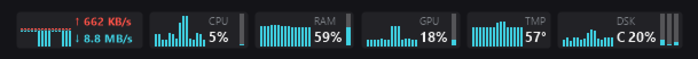
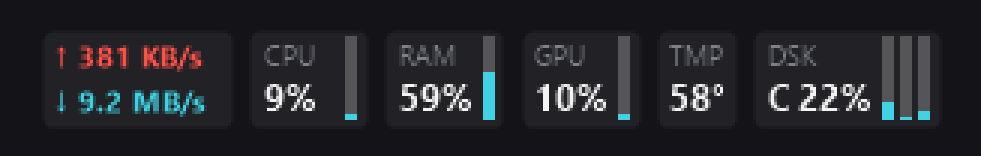
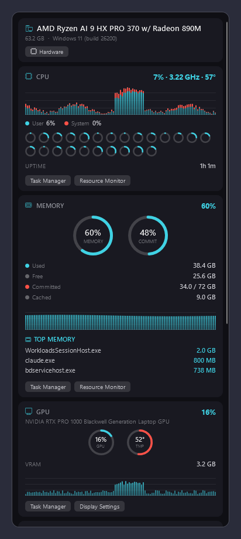
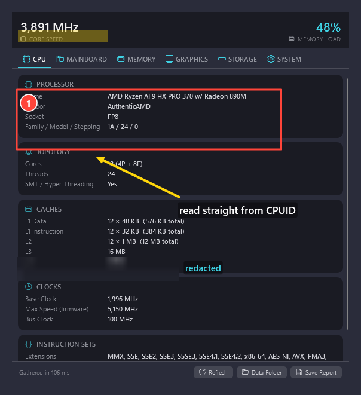
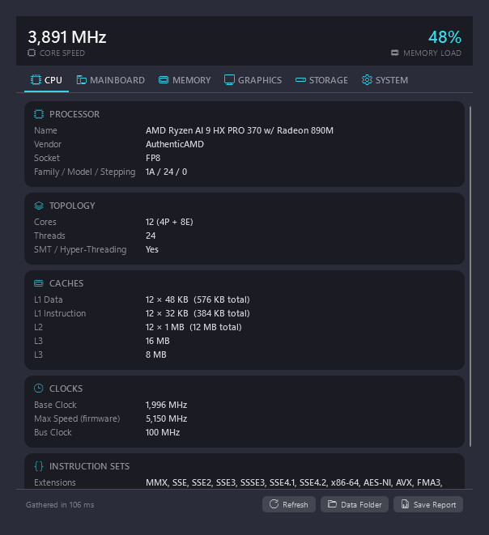
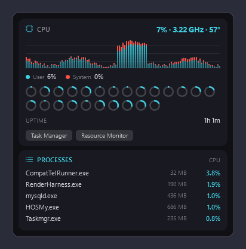
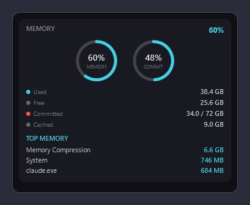
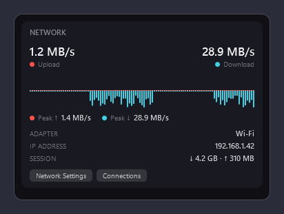

<div align="center">

# MicaStats

**A compact, modern system monitor designed for Windows 11.**

Monitor CPU, memory, GPU, network, disk and battery through a clean taskbar overlay and a menu-style Windows 11 dashboard — with **MicaPad**, an encrypted notepad that saves itself and searches every note by words or by meaning, **Ask MicaStats** for plain-language answers about your PC, diagnostics for slowdowns, boot and battery, a CPU-Z-style hardware inspector and a full screen-capture and annotation suite built in.

**English** · [ภาษาไทย](#thai)

[What's new](#whats-new) · [Features](#features) · [MicaPad](#micapad-a-notepad-that-never-asks-to-save) · [Screenshots](#screenshots) · [Installation](#installation) · [Build from source](#build-from-source) · [Contributing](#contributing) · [Credits](#credits-and-attribution)


[](LICENSE)


</div>

---

## About MicaStats

MicaStats is an open-source system-monitoring application for Windows 11. It provides real-time hardware and performance information in a compact interface that remains visible without occupying a full application window.

This project is based on [kil0bit System Monitor](https://github.com/kil0bit-kb/kil0bit-system-monitor) and introduces a redesigned, menu-style interface inspired by the compact presentation of modern desktop monitoring utilities.

The visual design has been adapted specifically for Windows 11, with Fluent-style typography, spacing, rounded surfaces, transparency, and Mica-inspired presentation.

> [!NOTE]
> MicaStats is maintained independently from the upstream project. Problems specific to this fork should be reported in this repository rather than to the upstream maintainer.

---

## Why MicaStats Exists

I recently got a new notebook that came preinstalled with Windows 11. Once I finished migrating everything over from Windows 10, one thing was clearly missing from my daily setup: a robust, real-time system monitor living right in the taskbar.

I also have a MacBook, and on macOS [iStat Menus](https://bjango.com/mac/istatmenus/) has long been my favorite utility — compact metric modules in the menu bar, each with its own beautifully dense dropdown. Nothing on Windows felt quite like it.

So I used [Claude Code](https://claude.com/claude-code) to recreate that UX/UI on Windows: the stacked label-over-value taskbar modules, the per-section hover dropdowns, the ring gauges, the mirrored up/down network graphs, and the two-tone cyan/red data palette are all modeled on the iStat Menus experience, rebuilt natively for the Windows 11 taskbar.

---

## What's New

**Since v1.14.0** — coming in the next release:

* **AI in MicaPad.** Improve, fix, shorten, translate, summarize or explain selected text from the right-click **AI** menu, give your own instruction with **Ask AI…** (**Ctrl+Shift+A**), and press **Ctrl+Enter** in **Search notes** to get an answer from your notes with numbered sources. It uses the provider you set in **Settings → AI**, is off until you turn on **Settings → MicaPad → AI**, and sends nothing until you run an action. Stored credentials are never sent. [More below](#ai)
* **Notes as tools, and diagram help.** Two new switches in **Settings → MicaPad → AI**, **Let Ask MicaStats search your notes** and **Let MCP clients search your notes**, each off until you turn it on, give Ask MicaStats and MCP programs such as Claude Code two read-only tools, `search_notes` and `get_note`. Stored credentials come back as `[credential]`. In MicaPad's **AI** menu, **Draw as diagram** turns selected text into a Mermaid diagram, and **Fix with AI** repairs a diagram or math block that fails to draw. [More below](#ai)

**v1.14.0** — search every note, capture a whole scrolling page, and zoom in the capture editor:

* **Search every note.** MicaPad's new **Search notes** pane (**Ctrl+Shift+F**) finds passages in every note, open or closed. It searches by words, offline and with Thai, and, once you turn it on, by meaning through your own embedding server, reordered by your own reranker. [More below](#search-notes)
* **Scrolling capture.** Drag around the part of a page, chat or document that scrolls (**Ctrl+Shift+4**) and MicaStats scrolls it from top to bottom by itself and joins the frames into one tall image in the editor. Sticky headers and footers appear once, side panels that do not scroll are left out, and **Esc** keeps what was captured so far
* **Zoom in the capture editor.** **Ctrl+wheel** zooms around the pointer, **Ctrl + +/−** and **Ctrl+0** work from the keyboard, and a zoom bar has **Fit**. 100% is the capture's real screen pixels, so it opens sharp on a scaled display, and a very tall capture opens fitted to its width
* **More languages for code.** TypeScript, shell, Kotlin, Go, Rust, Ruby, Pascal/Delphi and Dockerfile are colored, function names get their own color, and fenced code blocks have a **Copy** button
* **Colors are back for INI, YAML, batch and log files**, which had shown none since v1.12
* **The overlay survives an Explorer restart.** When `explorer.exe` restarts or crashes, the overlay attaches itself to the new taskbar within a second, stays on top of it and keeps updating, so there is no need to restart MicaStats

**v1.13.0** — MicaPad grew into a full notes app:
* encrypted notes with a PIN-protected credential vault
* Markdown the way Wiki.js shows it
* Mermaid, Graphviz and Markmap diagrams and MathJax math, drawn on this PC
* image previews
* notepad4-style editing tools

Ask MicaStats became a chat. The [Releases](https://github.com/manoi-bms/MicaStats/releases) page has the notes for every version.

---

## Features

### Real-time monitoring

* **CPU** — Current total processor utilization, with a User/System split and one ring gauge per logical processor
* **Memory** — RAM usage, commit charge, and a Used / Free / Committed / Cached breakdown
* **GPU** — Graphics processor load, VRAM, and available temperature information
* **Network** — Real-time upload and download throughput, with adapter, IP address, and session totals
* **Disk** — Activity monitoring for one or more storage devices
* **Temperature** — CPU package temperature, read from Core Temp, HWiNFO, MSI Afterburner, AIDA64, LibreHardwareMonitor or OpenHardwareMonitor when one of them is running
* **Sensors** — Every thermal, fan, power and throttle reading MicaStats can obtain, shown beside the load that produced it: the die temperature and ACPI thermal zone in the CPU card, and every adapter's temperature and power draw in the GPU card, each with whether the firmware is currently limiting it
* **Processes** — A searchable, sortable list of every running process with live CPU, memory and disk figures, and an End task that says what actually happened
* **Runaway searches** — Notices when a whole-drive file search has been left running with no parent to receive its output, and offers to end it. Never ends anything on its own

Sensor availability may vary depending on the installed hardware, device drivers, Windows performance counters, and system configuration. Anything that cannot be read honestly shows a dash or a flat baseline rather than a misleading zero.

#### The process list

Open it from **Processes** in the overlay's right-click menu, or from **Processes** on the CPU card. It exists because Windows Task Manager is often unusable exactly when it is needed — slow to open, showing a frozen or empty list, or making the stutter worse once it is up.

MicaStats has an advantage there: it is already running, and it already reads every process on the system through a single kernel call every two seconds. The list performs no sampling of its own and makes no per-process queries, so it opens from data already in memory and stays responsive on a machine that cannot open Task Manager at all. On a workstation running around 1,300 processes that difference is the whole feature. The same snapshot supplies each process's parent, uptime, thread count and handle count, so those columns cost nothing either. A process whose parent has exited shows its parent as `(gone)` — which is how an orphan announces itself. Click any column header to sort by it, and click it again to reverse the order. The search box also matches a process's parent, so typing `bash` lists everything a bash started.

Selecting a row fills a pane beneath the list with that one process's full path, command line, account and whether it is elevated. Those need the process opened, so they are read for the selected row only, in the background, and never for the list. With several rows selected, none of them is read. The footer shows what everything the search matches is costing between them — count, CPU, memory and disk.

**End task** terminates immediately rather than asking a window to close politely, which is why it works on applications that have stopped responding — and it always reports the outcome, so a kill that did nothing never looks like one that worked. MicaStats runs without administrator rights, so ending a process that has more of them offers *Retry as administrator*: that asks for consent once, ends that single process, and exits. MicaStats itself never holds those rights.

**End all filtered** ends everything the search currently matches, and is available only while something is typed in the search box — with no filter it would mean every process on the machine. It first shows exactly what will end and what it will not: core Windows processes, MicaStats itself, and anything MicaStats is running inside are listed as refused, with the reason. You confirm by typing the number of processes that will end. Each one is then checked with Windows to confirm it actually exited, and the footer reports how many ended, how many need administrator rights, and how many survived. It never ends a process's children unless the search matched them too.

Selecting several rows (Ctrl-click or Shift-click) works the same way: **End task** becomes *End N tasks* and goes through the same preview and confirmation. Selections survive the two-second refresh, so a selection stays put while you read it.

It will not end `csrss.exe`, `wininit.exe`, `services.exe`, `smss.exe`, `lsass.exe` or `winlogon.exe`. Terminating any of them stops Windows instantly, so this refuses rather than asking you to confirm.

#### A note on CPU temperature

The CPU die sensors — AMD's Tctl and Intel's DTS — are only reachable from kernel mode. Every tool that displays them installs a kernel driver to get there. MicaStats deliberately does not: it runs without administrator rights and installs no driver, so it reads what one of the tools above has already published. If none is running, the CPU die row shows a dash.

MicaStats will not substitute a different sensor for it. The ACPI thermal zone is shown separately and labelled *System*, because measurement showed it moving in the opposite direction to the processor under sustained load — it sits downstream of the fan control loop and reports that loop's response rather than the silicon's state. Presenting it as a CPU temperature would be worse than presenting nothing.

### Runaway search watchdog

Agentic coding tools run shell commands through Git Bash. When one of them starts a
whole-filesystem search and the launching shell is then killed — a cancelled background task, a
subagent that finished — the `find` child is not reaped. It keeps scanning at full speed with
nowhere to send its output. Under Git Bash `/` is the whole drive and the walk includes `/proc`,
every mount and any dead network path, so it can run effectively forever. Two such processes were
found on one machine having consumed 2258 and 2115 seconds of CPU between them.

Once a minute MicaStats looks for processes where **all** of these hold, and flags nothing that
misses any one of them:

1. The full image path is on the allowlist — by default anything ending `\Git\usr\bin\find.exe`.
   `C:\Windows\System32\find.exe` is a different Microsoft tool that shares the name, and the
   match is on path rather than name so it can never be touched.
2. The scan is rooted at a whole filesystem (`/`, `C:\`, `/c/`) with no `-maxdepth`, or with one
   deeper than 3. Under Git Bash `/` mounts every drive, so `find / -maxdepth 6` still walks every
   drive five levels down — one such search burned more than 5400 seconds of CPU with its parent
   long gone. A `-maxdepth` whose value cannot be read is not trusted either.
3. It has burned more than 120 seconds of CPU.
4. It is more than 5 minutes old.
5. Its parent has exited, or the parent is not a shell it recognises.

Rules 3 and 4 exist so a search you started on purpose is never killed mid-flight. Rule 5 is the
real signal: an orphan has nothing receiving its output, so it can only waste the processor.

When one is found you get a quiet corner card naming it and what it has cost. **Nothing is ended
until you click End them.** The kill is then verified rather than assumed — a process wedged in
kernel I/O reports a successful termination and keeps running — and escalated once to
`taskkill /F /T` if the first attempt did not take. A process that survives both is logged and
left alone, never retried in a loop.

Every decision, including the ones that keep a process, is written to
`%APPDATA%\MicaStats\logs\micastats.log` with the full command line and the parent's image path.
The parent is named by its full path whenever any scan saw it alive, and still named — as
`(gone, was C:\...\bash.exe)` — after it exits. A parent that exited before the first scan cannot
be identified, and the log says `(gone, never seen)` rather than guessing.

Thresholds and both lists live in `%APPDATA%\MicaStats\config.json` as `OrphanCpuSecondsThreshold`,
`OrphanGraceMinutes`, `OrphanTrustedMaxDepth`, `OrphanBinaryAllowlist` and `OrphanExpectedParents`.
The watchdog ships switched on; turn it off in Settings → Diagnostics.

> [!NOTE]
> This treats a symptom. The cause is a tool that does not reap its children, and the fix belongs
> in that tool. The parent image path in the log is there so you can identify which tool is
> leaking and report it upstream; the watchdog only stops the burning in the meantime.

### Hardware inspector

A **Hardware** button on the stats panel opens a CPU-Z-style inspector with six tabs — CPU, Mainboard, Memory, Graphics, Storage and System — under a live core-speed strip.

* CPU identity read directly from the **CPUID instruction**: vendor, family/model/stepping, instruction sets, hybrid P/E core split, and every cache level
* Mainboard, BIOS and per-module RAM detail parsed from the **raw SMBIOS firmware tables**, including the extended fields DDR5 speeds live in
* Graphics adapters with driver version/date and full video memory, read from the driver registry so it is immune to the well-known 4 GB WMI truncation
* Storage with capacity, bus (NVMe/SATA/USB), kind (SSD/HDD), firmware and health
* **Save Report** writes the whole inspection to a timestamped text file

### Screen capture and annotation

* **Region, window, screen and all-screens** capture, from the overlay's right-click menu, **Settings → Capture**, or global shortcuts
* **Scrolling capture** (**Ctrl+Shift+4**, or **Capture Scrolling…** in the overlay menu): drag around the part that scrolls (a click takes the whole window) and MicaStats scrolls it to the top and then down by itself while you keep it visible on screen, and joins the frames into one tall image. Sticky headers and footers appear once, side panels that do not scroll are left out, **Esc** stops and keeps what was captured, and it stops at the end of the content or at 20,000 px. The result opens in the editor
* The region picker **freezes the screen** before you select, so menus and tooltips stay open instead of closing when the picker takes focus, and the selection stays pixel-exact across monitors running different scaling
* Windows and screens are highlighted for **one-click capture**; selection edges **snap** to their borders
* A **magnifier** follows the pointer with a pixel grid, crosshair and the **hex colour** under the cursor — it doubles as an eyedropper
* **Annotation editor**: arrow, rectangle, ellipse, line, pen, highlighter, text and numbered step badges, with **zoom** from 1% to 800% (**Ctrl+wheel**, **Ctrl + +/−**, **Ctrl+0**, **Fit**) where 100% is the capture's real screen pixels; the steps stop at 100%, pixels are shown crisp from 200%, and a very tall capture opens fitted to its width
* **Select tool** to move, resize, nudge or delete any mark after drawing it — each drag is a single undo step
* **Redaction** (pixelate, blur or solid) baked into real pixels, so content hidden on screen is hidden in the saved file
* Crop, undo/redo, copy as PNG **and** DIB so it pastes anywhere, save to PNG/JPEG, or **pin** a capture on top of every window

### MicaPad: a notepad that never asks to save

Open it from the overlay's right-click menu, with **Ctrl+Alt+N** from anywhere, from the Start menu, or from Explorer's **Open with**.

#### Notes that keep themselves

* **Every note saves itself** a second after you stop typing — no file names, no Save button to remember
* **Restart Windows any time**: no "Save changes?" dialogs one by one; with **Launch on Startup** on, every tab comes back after you sign in, with the caret where you left it
* **History for every note** — a version is kept each time you pause after a minute of changes; preview and restore any of them, and Ctrl+Z undoes a restore
* **Compare with current**: see what changed since a history version, line by line — removed lines in red, added in green
* **Closing a tab never asks** — Ctrl+Shift+T or the closed-notes list brings it back; deleting sends it to the Recycle Bin
* **Real files stay safe**: edits to an opened file are always kept, but the file itself changes only on Ctrl+S, in its original encoding (Thai TIS-620 / cp874 included) and line endings
* **More than one window** (**Ctrl+Shift+N**), each with its own tabs, place and zoom; closing one moves its tabs into another, so no note is ever closed that way
* **Drag tabs** to reorder them (the order is kept), and **F11** for full screen

#### Search notes

* **Ctrl+Shift+F**, or the magnifier in the tab bar, opens a **Search notes** pane beside the text. It searches every note, open or closed
* **By words**, built in and offline: error codes, IP addresses and IDs match exactly (`ERR-1042`, `10.0.0.1`), and Thai is found without needing spaces between words
* **By meaning**, once you turn on **Settings → MicaPad → Search → Search by meaning**. Passages go to your own embedding server in the OpenAI format (`/v1/embeddings`), which TEI, vLLM, Infinity, LiteLLM, Ollama and others serve.
  * **Rerank results** puts the most relevant first, using a reranker in the Cohere/Jina format (`/rerank`).
  * Words and meaning are combined, so an exact code is never lost.
* Each result shows the note, its line and the passage, with the matching words in bold. **Enter** or a click opens the note with the passage selected, reopening it first if it was closed
* A status line says how each search ran and names any server problem, such as unreachable, key refused or timed out. Search then falls back to words and keeps working
* **Off by default and private**:
  * Only passages and your query are sent, never whole files. A stored credential is sent only as `[credential]`.
  * Keys are kept encrypted for your Windows account.
  * The vectors are stored encrypted beside your notes and deleted when you turn meaning search off.

#### AI

* Off by default: turn on **Settings → MicaPad → AI → Use AI in MicaPad**. It uses the provider, model and key from **Settings → AI** (Claude, or an OpenAI-compatible server such as Ollama), and the same daily limit as Ask MicaStats. The line under the switch says where text goes
* Right-click → **AI**: **Improve writing**, **Fix spelling and grammar**, **Make shorter**, **Translate to English** or **Thai**, **Summarize**, **Explain**, **Draw as diagram** (the selection as a Mermaid diagram, which **Insert below** puts under it), or **Ask AI…** with your own instruction (**Ctrl+Shift+A** opens **Ask AI…**)
* **Fix with AI** appears on a diagram or math block that fails with an error about its source, and the menu has **Fix diagram**. It sends that block's source and the renderer's message, and **Replace selection** replaces only that source
* **Notes as tools** (both off by default, each its own switch under **Use AI in MicaPad**): **Let Ask MicaStats search your notes** and **Let MCP clients search your notes** give two read-only tools, `search_notes` and `get_note`. Nothing they do changes a note, and stored credentials come back as `[credential]`
* The AI pane shows the result as it streams, with **Stop**, **Changes** (a line diff), **Replace selection**, **Insert below**, **Copy** and **Try again**. Your note changes only when you click Replace or Insert, and each is one undo step. **Try again** reruns on the text the pane names, not on a new selection
* In **Search notes**, **Ctrl+Enter** or **Ask** answers a question from the best 8 passages. The answer cites them as [1], [2]… matching the numbered result rows, and the status line shows "Answering from n passages", then "Answered from n passages". With AI off, **Ask** runs the normal search and says how to turn it on
* **Private**:
  * An action sends only the text it runs on, wrapped as data the model must not obey: never a title, another note or a file path.
  * A question sends the question and up to 8 passages from your notes, each with its note's title, heading and line numbers.
  * The AI pane and the Search notes status name where the text goes ("· to api.anthropic.com" in the pane, "· api.anthropic.com" in the status, or "this PC" for a local server).
  * Stored credentials are never sent: each goes as a placeholder and is put back in the result.
  * Links in an answer are shown as text and are never clickable.

#### Markdown, code and diagrams

* **Markdown the way Wiki.js shows it**: headings, tables (with **Format table** to line them up), callouts, footnotes, `:emoji:`, `<kbd>` keys and more, styled in place with the markers still visible. Prose is in a reading font while code and tables keep the editor font, and fenced code is colored by its language, with a **Copy** button at the top-right of the block under the mouse
* **Colors for code and logs**: JSON, XML, C#, JavaScript, TypeScript, PowerShell, shell, Python, SQL, Java, Kotlin, Go, Rust, Ruby, Pascal/Delphi, Dockerfile, INI, YAML, batch and log files are colored in both themes, including fenced code and Markdown inside a fence. The status bar shows the language and lets you change it per tab
* **Diagrams and math**: Mermaid, Graphviz and Markmap blocks, and TeX math (`$$` blocks, with `\ce{}` chemistry), drawn as a picture under the block on this PC; other diagram types through Kroki once you turn it on
* **Image previews**: `` shows the picture under its line; images from the web load only once you turn that on
* **Folding**: collapse braces, tags, Markdown sections and code blocks from the margin
* **Copy as RTF** pastes the note, or the selection, into Word or Outlook with its colors, bold and heading sizes

#### Editing

* Find and replace with regular expressions, go to line, zoom, word wrap
* **Editing helpers**: auto-closing brackets and quotes, notepad4-style line operations, bookmarks, and every occurrence of the selected word marked
* **Right-click menus** in the text (cut, copy, paste, find) and on tabs (rename, close others, copy the file path, show in folder)
* **Links**: web and mail addresses are underlined and open with **Ctrl+Click**; nothing else in a note is ever opened
* **Tools**: Base64, number bases, GUIDs, timestamps, and a calculator that works the sum out itself — nothing in a note is ever run; each is one **Ctrl+Z**
* **Light or dark**: MicaPad has its own theme switch (the sun and moon button), independent of the rest of MicaStats

#### Privacy

* **Notes are encrypted** for your Windows account (AES-GCM with a key protected by Windows DPAPI) and kept in `%APPDATA%\MicaStats\MicaPad`. Another account, or the files copied to another PC, cannot read them
* **Credentials**: select a password or token and choose **Store as credential**. It becomes a labeled pill, revealed or copied only with your PIN
* **Nothing leaves the PC until you turn it on**: web images, Kroki diagrams and search by meaning are each off until switched on in **Settings → MicaPad**

### Ask MicaStats: answers about your PC

* **Ask in plain words** — "why was it slow ten minutes ago?", "what is using my memory?", "is 90 °C normal for this CPU?" — and get an answer built from MicaStats' own readings: live status, the busiest processes, slowdown reports, alerts, hardware, battery, boot times and up to **7 days of history**
* **Explain buttons** on slowdown reports (Diagnostics), alert notices and the selected process (Processes) ask for you, in your Windows display language; a question in Thai is answered in Thai
* **Your choice of AI**: Claude with your own Anthropic API key, or any OpenAI-compatible server — OpenAI, Azure, OpenRouter, or **Ollama / LM Studio on this PC**, in which case nothing leaves the machine
* **Suggestions, never actions**: an answer can offer a button such as *End chrome.exe (PID 1234)* or *Record a slowdown now*; nothing happens until you click, and the usual checks apply (same process and start time, core Windows processes refused)
* **Private by design**: your profile folder, computer name and user name (when 3 or more characters long), IP and MAC addresses are removed before anything is sent; window titles, command lines and environment variables are never collected; keys are stored encrypted for your Windows account (DPAPI) and never shown again
* **Claude Desktop and Claude Code** can read the same data through **MCP**, with no key or cost inside MicaStats: a stdio bridge (`MicaStats.exe --mcp`) or a token-protected local HTTP endpoint on `127.0.0.1`. Read-only
* **Your MicaPad notes, only if you allow it**: besides the nine PC tools, Ask MicaStats and MCP clients get two read-only note tools, `search_notes` and `get_note`, each behind its own switch in **Settings → MicaPad → AI**, off by default. MicaStats must be running, but not a MicaPad window. Stored credentials come back as `[credential]`
* Everything is **off until you turn it on** in **Settings → AI**; a daily question limit (100 by default) keeps the cost predictable, and the assistant only runs when you press Send or Explain

### Windows 11 interface

* Compact, menu-style monitoring panels
* Fluent Design–inspired visual hierarchy
* Mica-style surfaces and transparency
* Rounded Windows 11–style controls
* Segoe UI Variable typography, and a Segoe Fluent Icons badge on every section
* Ring gauges that sweep from zero when a panel opens, and panels that rise and fade in
* Detailed and compact display modes
* High-DPI and multi-resolution support

### Taskbar and desktop overlay

* Display selected metrics near the Windows taskbar
* Snap the overlay to the taskbar
* Use the overlay as a free-floating desktop panel
* Drag the overlay to a preferred position
* Lock the overlay position
* Keep the overlay above other windows
* Automatically hide it during full-screen applications
* Auto-avoid the Start button: the stacked overlay slides into free taskbar space, squeezes its sparklines to fill the remaining corridor exactly, and only then sheds content (graphs, then trailing modules behind a ⋯ marker) so the centred Windows 11 Start button, widgets button and tray never end up underneath it
* Recovers automatically if a saved position ends up off-screen — for example in the gap between mismatched monitors, or on a display that has since been unplugged
* **Survives an Explorer restart**: if `explorer.exe` restarts or crashes, the overlay attaches itself to the new taskbar, stays on top of it and keeps updating — no need to restart MicaStats
* Right-click for settings, capture commands, and **Show Desktop** — the same minimise-everything toggle as the taskbar's own corner

### Automatic updates

* Checks GitHub for a new release once a day, shortly after startup, and tells you quietly in the corner — never a modal dialog
* **Download and install** from **Settings → Updates**, or straight from the notification
* Every download is **verified against the SHA-256 checksum published with the release** before it is allowed to run; a file that does not match is deleted and the update refused
* Nothing installs by itself: Windows asks for permission, and you can skip a version or turn automatic checking off entirely

### Diagnostics: answering questions Windows will not

Windows measures how long your boot took, which app delayed it, and how worn your battery is — and shows you almost none of it. **Diagnostics** turns those measurements into numbers you can act on. Open it from the stats panel, from the overlay's right-click menu, or from **Settings → Diagnostics**.

**Slowdowns — "why did it just hang?"**

* Keeps a rolling window of the last few minutes of **per-process CPU, memory and disk activity**, so a stall can still be explained after it has passed. Task Manager only ever shows the present instant; by the time a freeze is over, the process responsible has finished and left nothing behind
* Writes a **timeline report naming the culprit** when the machine struggles — or on demand from **Record Slowdown Now** in the overlay menu, reached the moment after you feel a stall
* Costs a single system call per sample: CPU, working set and disk bytes all come from one kernel snapshot, not from per-process performance counters
* Per-process **network** traffic is deliberately absent — Windows exposes it only to an administrator, and MicaStats runs unelevated

**Boot — in milliseconds, not "High/Medium/Low"**

* The **real boot time** and its trend across recent starts, read from the log Windows has been writing all along
* **What held it up**: each application, driver and service Windows measured as delaying startup, with its actual duration
* Every program that **starts with Windows**, showing which ones are already switched off — state `Win32_StartupCommand` does not report — and a box to switch off any per-user entry
* All of it read **without administrator rights**

**Battery — the readout Windows does not have**

* **Health** against design capacity with a plain verdict, plus cycle count — Windows never warns that a pack is wearing out
* Live charge or discharge in **watts**, and a **time remaining computed from the power actually being drawn**, because Windows' own estimate is frequently a placeholder rather than a number
* An optional **battery module in the taskbar overlay**, labelled `CHG` while it fills
* Hidden entirely on a desktop rather than shown as a row of dashes

**Alerts — monitoring that speaks up**

* A quiet corner notice when the processor runs hot, a drive fills up, memory is exhausted, or the battery wears past a threshold
* Each rule waits for the reading to **hold** before firing, and re-arms only after it has recovered, so nothing flickers
* An unreadable sensor never fires — a missing temperature probe must not look like a cold processor

### Works on a light taskbar

* The overlay paints **directly onto the taskbar**, so its colours have to work against whatever the taskbar is. On a light theme the shipped white readings measured **1.10:1 contrast** — effectively invisible. They now switch to dark ink with darkened accents, measured at **16:1**
* **Appearance → Taskbar colours** offers *Match Windows* (the default), *Always light* or *Always dark*, and the overlay repaints the moment you switch Windows between light and dark
* A dark taskbar is unchanged, pixel for pixel, and any colour you customised yourself is never overridden

### Customization and diagnostics

* Select which metrics are displayed
* Choose the active network adapter
* Select multiple disks for monitoring
* Configure the monitoring refresh interval
* Customize fonts and accent colors
* Enable automatic startup with Windows
* Switch between compact and detailed layouts
* Capture folder, file-name template, image format, redaction style and shortcuts
* A plain-text **diagnostics log** at `%APPDATA%\MicaStats\logs\micastats.log` records startup, a hardware summary, sensor sources that failed, and any error — the first place to look when something behaves unexpectedly

---

## Keyboard Shortcuts

| Shortcut | Action |
| --- | --- |
| **Ctrl+Shift+1** | Capture a region (or click a window / screen) |
| **Ctrl+Shift+2** | Capture the window currently in front |
| **Ctrl+Shift+3** | Capture the screen the pointer is on |
| **Ctrl+Shift+4** | Capture a scrolling area as one tall image |
| **Ctrl+Alt+N** | Show MicaPad |
| **Ctrl+Alt+A** | Ask MicaStats (while the assistant is on in **Settings → AI**) |

Inside MicaPad:

| Key | Action |
| --- | --- |
| **Ctrl+N** · **Ctrl+W** · **Ctrl+Shift+T** | New note · close tab · reopen closed tab |
| **Ctrl+Shift+N** | New window |
| **Ctrl+O** · **Ctrl+S** · **Ctrl+Shift+S** | Open file · save to its file · save as |
| **Ctrl+F** · **Ctrl+H** · **F3** / **Shift+F3** | Find · replace · next / previous |
| **Ctrl+Shift+F** | Search every note |
| **Ctrl+Shift+A** | **Ask AI…** on the selection or the whole note (while **Use AI in MicaPad** is on) |
| **Ctrl+Enter** | In Search notes: answer the question from your notes |
| **Ctrl+G** · **Alt+Z** · **Ctrl+Shift+H** | Go to line · word wrap · history |
| **F11** | Full screen |
| **Ctrl+D** · **Ctrl+Shift+↑/↓** · **Ctrl+J** | Duplicate line · move lines · join lines |
| **Ctrl+F2** · **F2** / **Shift+F2** | Toggle bookmark · next / previous bookmark |
| **Ctrl+Click** a link | Open it (web and mail links only) |
| **Ctrl+Tab** · **Ctrl+1…9** | Next tab · jump to a tab |
| **Ctrl+wheel** · **Ctrl+0** | Zoom · reset zoom |

While the region picker is open:

| Key | Action |
| --- | --- |
| **Drag / Click** | Select a rectangle, or capture the highlighted window or screen |
| **M** · **S** · **A** | Toggle magnifier · toggle snapping · select everything |
| **Arrows** (Shift ×10, Ctrl resize) | Nudge the selection |
| **Enter** · **Esc** | Accept · cancel |

Inside the annotation editor:

| Key | Action |
| --- | --- |
| **V** | Select tool — move, resize or delete a mark |
| **A R E L P H T N B C** | Arrow, Rectangle, Ellipse, Line, Pen, Highlighter, Text, Numbered step, Redact, Crop |
| **Arrows** / **Delete** | Nudge / remove the selected mark |
| **Ctrl+Z** · **Ctrl+Y** | Undo · redo |
| **Ctrl+C** · **Ctrl+S** | Copy to clipboard · save |
| **Ctrl+wheel** | Zoom in or out around the pointer |
| **Ctrl+=** / **Ctrl++** · **Ctrl+−** | Zoom in · zoom out around the centre (numpad **+** / **−** too) |
| **Ctrl+0** | Actual size — 100% is real screen pixels |

---

## What This Fork Changes

Compared with the original kil0bit System Monitor, MicaStats focuses on a different presentation and interaction model:

* Redesigned monitoring panels with a compact menu-style appearance
* Updated spacing, typography, and information hierarchy
* Windows 11–oriented Fluent and Mica visual treatment
* Faster access to individual monitoring categories
* Cleaner separation between summary information and detailed metrics
* A more consistent appearance across the taskbar overlay and settings dashboard
* Additional tooling that the upstream project does not include:
  * MicaPad, an encrypted notepad with Markdown, diagrams and search
  * Ask MicaStats
  * Diagnostics for slowdowns, boot, battery and alerts
  * the process list and the runaway-search watchdog
  * the hardware inspector
  * the screen-capture suite
  * automatic updates
  * the diagnostics log

The underlying monitoring functionality remains derived from the original project, while the interface and user experience are being developed independently.

---

Curious where MicaStats is heading? The researched feature roadmap lives in [ROADMAP.md](ROADMAP.md). Full usage documentation is in [GUIDE.md](GUIDE.md).

## Screenshots

All images below are rendered by the actual application code with representative data.

### Taskbar Overlay — iStat-style stacked modules

Each metric is its own module: a dim label over a bold value, dense history bars, mini level bars on CPU / RAM / GPU, one combined storage zone with a bar per drive, and paired ↑/↓ network lines around a mirrored graph.

<p align="center">
  
</p>

With **Live Graphs** switched off, the same layout in its most compact form:

<p align="center">
  
</p>

### Stats Panel

Click the overlay for the full dropdown: stacked User/System CPU history, one ring gauge per logical processor, MEMORY and COMMIT rings with a memory history graph and a Used / Free / Committed / Cached breakdown, GPU rings with VRAM, a mirrored network graph with session totals, per-drive storage rows, and top processes.

<p align="center">
  
</p>

### Screen Capture

Region, window and screen capture with global shortcuts (**Ctrl+Shift+1/2/3**). The region picker freezes the screen so menus stay open while you select, highlights windows for one-click capture, snaps to edges, and carries a magnifier with a pixel grid and hex-colour eyedropper. Every capture opens in an annotation editor: arrows, shapes, pen, highlighter, text, numbered steps, crop, undo/redo — and **redaction** (pixelate / blur / solid) baked into real pixels, so what is hidden on screen is hidden in the file.

<p align="center">
  
</p>

### Hardware Inspector

The **Hardware** button on the stats panel opens a CPU-Z-style inspector. CPU identity comes straight from the CPUID instruction (vendor, family/model/stepping, instruction sets, hybrid P/E core split, per-level caches); mainboard, BIOS and per-module RAM detail come from the raw SMBIOS firmware tables; graphics adapters report driver and full VRAM; disks show bus (NVMe/SATA), kind (SSD/HDD) and health — under a live core-speed strip. **Save Report** writes it all to a text file.

<p align="center">
  
</p>

### Per-Section Hover Dropdowns

Pause over any taskbar module and its own compact dropdown opens, retargeting as you slide between modules — the iStat Menus interaction, on Windows.

<p align="center">
  
  
  
</p>

---

## System Requirements

### Running MicaStats

* Windows 11 is the primary supported platform
* Windows 10 build 19041 or later may work, but is not the primary visual target
* .NET 8 Desktop Runtime when using a framework-dependent release
* Microsoft Edge WebView2 Runtime for MicaPad's diagrams, math and SVG previews (included in Windows 11)
* Compatible Windows performance counters and hardware drivers

### Building MicaStats

* Windows 10 or Windows 11
* [.NET 8 SDK](https://dotnet.microsoft.com/download/dotnet/8.0)
* Visual Studio 2022 with the **.NET desktop development** workload, or another compatible .NET development environment
* Git

---

## Installation

### Download a Release

1. Open the [Releases](https://github.com/manoi-bms/MicaStats/releases) page.
2. Download the latest installer or portable package.
3. Extract the package when necessary.
4. Run MicaStats.
5. Select the metrics you want to display from the Monitoring settings.

> [!IMPORTANT]
> Uninstall or close an older build before installing a new version, particularly when switching from the original kil0bit System Monitor to MicaStats.

> [!NOTE]
> Community builds may display a Microsoft Defender SmartScreen warning when the executable has not been code-signed. Review the release source and checksums before running downloaded software. Every release publishes a SHA-256 checksum alongside the installer.

When no packaged release is available, build the application directly from source.

---

## Build from Source

### Clone the Repository

```powershell
git clone https://github.com/manoi-bms/MicaStats.git
cd MicaStats
```

### Restore Dependencies

```powershell
dotnet restore
```

### Build a Release Version

```powershell
dotnet build --configuration Release
```

The compiled files will normally be created under:

```text
bin/Release/net8.0-windows/
```

### Run from Source

```powershell
dotnet run
```

### Run the Test Suite

```powershell
dotnet test tests/Kil0bitSystemMonitor.Tests/Kil0bitSystemMonitor.Tests.csproj
```

### Publish a Framework-Dependent Windows Build

```powershell
dotnet publish `
  --configuration Release `
  --runtime win-x64 `
  --self-contained false `
  --output ./publish
```

The published application will be created in the `publish` directory.

---

## Technology

| Component           | Technology                                   |
| ------------------- | -------------------------------------------- |
| Language            | C#                                           |
| Runtime             | .NET 8                                       |
| Desktop framework   | Windows Presentation Foundation              |
| UI library          | ModernWpfUI                                  |
| Text editor         | AvalonEdit (MIT), for MicaPad                |
| Text comparison     | DiffPlex (Apache-2.0), for MicaPad's compare |
| Diagrams and math   | Microsoft Edge WebView2 (hidden, offline) with Mermaid, Viz.js/Graphviz, Markmap and MathJax, for MicaPad |
| Emoji names         | gemoji (MIT), for MicaPad                    |
| Note encryption     | AES-GCM with a key protected by Windows DPAPI, for MicaPad |
| Note search         | Built-in BM25 keyword index; optional embedding and rerank servers over HTTP (OpenAI `/embeddings`, Cohere/Jina `/rerank` formats), for MicaPad |
| AI                  | Anthropic .NET SDK, Microsoft.Extensions.AI, MCP C# SDK (ModelContextProtocol.Core) |
| Windows integration | Win32 APIs                                   |
| Performance data    | Windows performance counters and system APIs |
| Hardware identity   | CPUID instruction and raw SMBIOS tables      |
| Graphics            | GDI+ for the taskbar overlay, WPF for panels |
| Configuration       | Local application settings                   |

MicaStats uses a native Windows desktop stack rather than a browser-based desktop runtime.

---

## Basic Usage

After launching MicaStats:

1. Open the settings dashboard.
2. Go to **Monitoring**.
3. Enable CPU, memory, GPU, network, or disk modules.
4. Select the correct network adapter when network traffic shows zero.
5. Configure the refresh interval.
6. Choose compact or detailed presentation.
7. Enable **Snap to Taskbar** for a taskbar-integrated layout.
8. Disable **Snap to Taskbar** to position the overlay freely on the desktop.
9. Enable **Lock Position** after placing the overlay.
10. Enable **Launch on Startup** when MicaStats should start automatically with Windows.

Click the overlay for the full stats panel, hover a module for its own dropdown, and right-click for settings, capture commands and common overlay actions.

Press **Ctrl+Alt+N** for MicaPad, then **Ctrl+Shift+F** inside it to search every note. Once the assistant is on in **Settings → AI**, **Ctrl+Alt+A** asks MicaStats a question.

---

## Troubleshooting

### The overlay is not visible

Confirm that at least one monitoring module is enabled. On a multi-monitor setup a saved position can fall in the gap between mismatched displays; MicaStats now detects this and snaps the overlay back onto the taskbar automatically, and records the recovery in the diagnostics log.

### Network speed remains at zero

Open the Monitoring settings and select the active Ethernet, Wi-Fi, VPN, or virtual network adapter.

### GPU information is unavailable

GPU metrics depend on the graphics hardware, driver implementation, and Windows performance-counter support. Update the GPU driver and restart MicaStats.

### A capture shortcut does nothing

Another application may already own that combination — Windows reserves several itself. The diagnostics log records which shortcut failed to register. Change or disable the shortcuts under **Settings → Capture**.

### The application does not start with Windows

Disable and re-enable the startup option. Also verify that Windows has not disabled the application under **Settings → Apps → Startup**.

### Windows displays a SmartScreen warning

Unsigned community applications can trigger SmartScreen. Download builds only from this repository's official Releases page or build the source yourself.

### The overlay moves unexpectedly

Place the overlay in the desired location and enable **Lock Position**.

### The overlay vanished after Explorer restarted

From v1.14.0, MicaStats attaches the overlay to the new taskbar by itself within a second, and the diagnostics log records "Explorer's taskbar came back". On v1.13.0 and earlier, quit MicaStats and start it again.

### MicaPad search says "Words only"

Search by meaning could not use your embedding server: it was unreachable, refused the key or timed out, and the rest of the status line says which. Results still come from words. Check the server address, model and key with **Test** in **Settings → MicaPad → Search**.

### Something else looks wrong

Open `%APPDATA%\MicaStats\logs\micastats.log`. It records startup, a one-line hardware summary, any sensor source that could not be read, and every error, with timestamps.

---

## Contributing

Contributions are welcome.

Before beginning a substantial change, open an issue to describe the proposal and confirm that it fits the project direction.

### Development Workflow

1. Fork this repository.
2. Create a feature branch:

```bash
git checkout -b feature/your-feature-name
```

3. Make and test your changes.
4. Commit with a clear description:

```bash
git commit -m "Add: description of the change"
```

5. Push the branch:

```bash
git push origin feature/your-feature-name
```

6. Open a pull request.

Please keep pull requests focused, run the test suite, and include screenshots for visible interface changes.

---

## Reporting Bugs

Use the [GitHub issue tracker](https://github.com/manoi-bms/MicaStats/issues) to report defects.

Include:

* Windows version and build number
* MicaStats version or commit hash
* CPU and GPU model
* Display scale and resolution
* Steps required to reproduce the problem
* Expected and actual behavior
* Relevant screenshots or logs

> [!TIP]
> The hardware inspector's **Save Report** button and the diagnostics log contain most of the above. Review both for anything private before attaching them to a public issue.

For security-sensitive reports, do not publish exploit details in a public issue. Contact the maintainer privately using the contact method listed in the repository profile.

---

## Credits and Attribution

MicaStats is a derivative work based on:

**[kil0bit System Monitor](https://github.com/kil0bit-kb/kil0bit-system-monitor)**
Created by **KB – kil0bit**

Original portions:

```text
Copyright (c) 2026 KB - kil0bit
```

MicaStats modifications:

```text
Copyright (c) 2026 Chaiyaporn Suratemeekul (manoi-bms)
```

MicaStats is created and maintained by **Chaiyaporn Suratemeekul** ([@manoi-bms](https://github.com/manoi-bms)), with the iStat Menus-style UX/UI developed with the help of [Claude Code](https://claude.com/claude-code).

The original project is distributed under the MIT License. MicaStats retains the original copyright and license notice as required by that license.

The upstream author is not responsible for modifications, releases, support, or defects introduced by this fork.

---

## Independent Project Notice

MicaStats is an independent open-source project.

It is not affiliated with or endorsed by Bjango, iStat Menus, Apple, Microsoft, or the maintainer of the original kil0bit System Monitor project. Product and company names are used only to identify the platforms or applications being discussed.

MicaStats uses its own name, icons, screenshots, visual assets, and branding.

---

## License

This project is available under the [MIT License](LICENSE).

The `LICENSE` file must retain the original kil0bit System Monitor copyright notice. A separate copyright notice for MicaStats modifications may be added without removing the upstream notice.

---

<a id="thai"></a>

<div align="center">

# MicaStats — ภาษาไทย

**โปรแกรมมอนิเตอร์ระบบขนาดกะทัดรัด ออกแบบมาสำหรับ Windows 11 โดยเฉพาะ**

ดูการทำงานของ CPU, หน่วยความจำ, GPU, เครือข่าย, ดิสก์ และแบตเตอรี่ ได้จากโอเวอร์เลย์บนทาสก์บาร์และแดชบอร์ดสไตล์เมนูของ Windows 11 — พร้อม **MicaPad** โน้ตแพดที่เข้ารหัส บันทึกเอง และค้นหาทุกโน้ตได้ทั้งด้วยคำและตามความหมาย, **Ask MicaStats** ถามเรื่องเครื่องด้วยภาษาธรรมดา, การวินิจฉัยเครื่องช้า เวลาบูต และแบตเตอรี่, เครื่องมือตรวจสอบฮาร์ดแวร์แบบ CPU-Z และชุดจับภาพหน้าจอพร้อมเครื่องมือมาร์กอัปในตัว

[English](#micastats) · **ภาษาไทย**

[มีอะไรใหม่](#มีอะไรใหม่) · [คุณสมบัติ](#คุณสมบัติ) · [MicaPad](#micapad-โน้ตแพดที่ไม่เคยถามให้บันทึก) · [ภาพตัวอย่าง](#ภาพตัวอย่าง) · [การติดตั้ง](#การติดตั้ง) · [คอมไพล์จากซอร์สโค้ด](#การคอมไพล์จากซอร์สโค้ด) · [ร่วมพัฒนา](#การร่วมพัฒนา) · [เครดิต](#เครดิตและการอ้างอิง)

</div>

---

## เกี่ยวกับ MicaStats

MicaStats เป็นโปรแกรมมอนิเตอร์ระบบแบบโอเพนซอร์สสำหรับ Windows 11 แสดงข้อมูลฮาร์ดแวร์และประสิทธิภาพแบบเรียลไทม์ในหน้าตาที่กะทัดรัด มองเห็นได้ตลอดเวลาโดยไม่ต้องเปิดหน้าต่างโปรแกรมเต็มจอ

โปรเจกต์นี้พัฒนาต่อยอดจาก [kil0bit System Monitor](https://github.com/kil0bit-kb/kil0bit-system-monitor) โดยออกแบบหน้าตาใหม่ให้เป็นสไตล์เมนู ได้แรงบันดาลใจจากโปรแกรมมอนิเตอร์ระบบสมัยใหม่ที่นำเสนอข้อมูลอย่างกระชับ

งานออกแบบปรับให้เข้ากับ Windows 11 โดยเฉพาะ ทั้งรูปแบบตัวอักษรและระยะห่างตามแนวทาง Fluent, พื้นผิวมุมโค้ง, ความโปร่งแสง และการนำเสนอแบบ Mica

> [!NOTE]
> MicaStats ดูแลรักษาแยกจากโปรเจกต์ต้นทาง หากพบปัญหาที่เกิดเฉพาะกับฟอร์กนี้ กรุณาแจ้งในรีโพนี้ ไม่ใช่กับผู้ดูแลโปรเจกต์ต้นทาง

---

## ทำไมถึงมี MicaStats

ผมเพิ่งได้โน้ตบุ๊กเครื่องใหม่ที่ติดตั้ง Windows 11 มาให้ หลังย้ายข้อมูลจาก Windows 10 เสร็จ สิ่งที่ขาดหายไปอย่างชัดเจนจากการใช้งานประจำวันคือโปรแกรมมอนิเตอร์ระบบแบบเรียลไทม์ที่อยู่บนทาสก์บาร์

ผมใช้ MacBook ด้วย และบน macOS โปรแกรมโปรดของผมคือ [iStat Menus](https://bjango.com/mac/istatmenus/) — โมดูลข้อมูลกะทัดรัดบนเมนูบาร์ แต่ละอันมีดรอปดาวน์ของตัวเองที่อัดแน่นและสวยงาม แต่บน Windows ยังไม่มีอะไรให้ความรู้สึกแบบนั้น

ผมจึงใช้ [Claude Code](https://claude.com/claude-code) สร้าง UX/UI แบบนั้นขึ้นมาใหม่บน Windows ทั้งโมดูลบนทาสก์บาร์ที่วางป้ายกำกับซ้อนบนค่าตัวเลข, ดรอปดาวน์แยกตามหมวดเมื่อชี้เมาส์ค้าง, เกจวงแหวน, กราฟเครือข่ายขึ้น/ลงแบบสะท้อนกัน และชุดสีข้อมูลสองโทน (ฟ้า/แดง) ทั้งหมดถอดแบบจาก iStat Menus แล้วสร้างขึ้นใหม่ให้เป็นของ Windows 11 โดยแท้

---

## มีอะไรใหม่

**หลัง v1.14.0** (จะมาในรีลีสถัดไป):

* **AI ใน MicaPad** ปรับปรุง แก้ ย่อ แปล สรุป หรืออธิบายข้อความที่เลือกได้จากเมนูคลิกขวา **AI** พิมพ์คำสั่งของคุณเองด้วย **Ask AI…** (**Ctrl+Shift+A**) และกด **Ctrl+Enter** ใน **Search notes** เพื่อรับคำตอบจากโน้ตของคุณพร้อมแหล่งที่มาเป็นหมายเลข ใช้ผู้ให้บริการที่ตั้งไว้ใน **Settings → AI** ปิดไว้จนกว่าจะเปิด **Settings → MicaPad → AI** และไม่ส่งอะไรจนกว่าคุณจะสั่งทำ รหัสลับที่เก็บไว้ไม่ถูกส่งเลย [อ่านต่อด้านล่าง](#ai-1)
* **โน้ตเป็นเครื่องมือ และตัวช่วยแผนภาพ** สวิตช์ใหม่สองตัวใน **Settings → MicaPad → AI** คือ **Let Ask MicaStats search your notes** และ **Let MCP clients search your notes** ปิดไว้จนกว่าจะเปิด ให้ Ask MicaStats และโปรแกรม MCP เช่น Claude Code ใช้เครื่องมืออ่านอย่างเดียวสองตัว คือ `search_notes` และ `get_note` รหัสลับที่เก็บไว้จะกลับมาเป็น `[credential]` ในเมนู **AI** ของ MicaPad ปุ่ม **Draw as diagram** เปลี่ยนข้อความที่เลือกเป็นแผนภาพ Mermaid และ **Fix with AI** ช่วยแก้แผนภาพหรือสมการที่วาดไม่ขึ้น [อ่านต่อด้านล่าง](#ai-1)

**v1.14.0** — ค้นหาทุกโน้ต จับภาพหน้าที่เลื่อนได้ทั้งหน้า และซูมในหน้าต่างมาร์กอัป:

* **ค้นหาทุกโน้ต** แผง **Search notes** ใหม่ของ MicaPad (**Ctrl+Shift+F**) ค้นหาข้อความในทุกโน้ตทั้งที่เปิดอยู่และปิดไปแล้ว
  * ค้นด้วยคำได้แบบออฟไลน์ และรองรับภาษาไทย
  * เมื่อเปิดใช้ ค้นตามความหมายผ่านเซิร์ฟเวอร์ embedding ของคุณเอง แล้วเรียงลำดับใหม่ด้วย reranker ของคุณเอง [อ่านต่อด้านล่าง](#ค้นหาโน้ต)
* **จับภาพแบบเลื่อน** ลากกรอบรอบส่วนของหน้าเว็บ แชท หรือเอกสารที่เลื่อนได้ (**Ctrl+Shift+4**) แล้ว MicaStats จะเลื่อนจากบนลงล่างให้เอง และต่อเฟรมเป็นภาพยาวภาพเดียวในหน้าต่างมาร์กอัป ส่วนหัวและส่วนท้ายที่ตรึงอยู่จะปรากฏเพียงครั้งเดียว แผงด้านข้างที่ไม่เลื่อนตามจะถูกตัดออก และกด **Esc** เพื่อหยุดโดยเก็บภาพที่จับได้แล้วไว้
* **ซูมในหน้าต่างมาร์กอัป** **Ctrl+ล้อเมาส์** ซูมโดยยึดตำแหน่งเมาส์ ใช้ **Ctrl + +/−** และ **Ctrl+0** จากคีย์บอร์ดได้ และแถบซูมมีปุ่ม **Fit** โดย 100% คือพิกเซลจริงบนหน้าจอของภาพที่จับ ภาพจึงเปิดมาคมชัดบนจอที่ปรับสเกล และภาพที่ยาวมากจะเปิดแบบพอดีกับความกว้าง
* **รองรับภาษาโปรแกรมเพิ่มขึ้น** TypeScript, shell, Kotlin, Go, Rust, Ruby, Pascal/Delphi และ Dockerfile แสดงสีได้แล้ว ชื่อฟังก์ชันมีสีของตัวเอง และบล็อกโค้ดมีปุ่ม **Copy**
* **ไฟล์ INI, YAML, batch และไฟล์ล็อกกลับมามีสีอีกครั้ง** หลังจากไม่มีสีมาตั้งแต่ v1.12
* **โอเวอร์เลย์อยู่รอดเมื่อ Explorer รีสตาร์ต** เมื่อ `explorer.exe` รีสตาร์ตหรือแครช โอเวอร์เลย์จะเกาะทาสก์บาร์ใหม่เองภายในหนึ่งวินาที อยู่เหนือทาสก์บาร์และอัปเดตค่าต่อไป ไม่ต้องเปิด MicaStats ใหม่

**v1.13.0** — MicaPad กลายเป็นแอปจดโน้ตเต็มรูปแบบ:
* โน้ตเข้ารหัส พร้อมตู้เก็บรหัสลับที่ป้องกันด้วย PIN
* Markdown แบบที่ Wiki.js แสดง
* แผนภาพ Mermaid, Graphviz, Markmap และสมการ MathJax ที่วาดบนเครื่องนี้
* ตัวอย่างรูปภาพ
* เครื่องมือแก้ไขแบบ notepad4

ส่วน Ask MicaStats กลายเป็นหน้าต่างแชต รายละเอียดของทุกเวอร์ชันอยู่ที่หน้า [Releases](https://github.com/manoi-bms/MicaStats/releases)

---

## คุณสมบัติ

### การมอนิเตอร์แบบเรียลไทม์

* **CPU** — เปอร์เซ็นต์การใช้งานรวม แยกสัดส่วน User/System พร้อมเกจวงแหวนของทุกคอร์เชิงตรรกะ
* **หน่วยความจำ** — การใช้ RAM, commit charge และรายละเอียด Used / Free / Committed / Cached
* **GPU** — โหลดการ์ดจอ, VRAM และอุณหภูมิ (ถ้าอ่านได้)
* **เครือข่าย** — ความเร็วอัปโหลด/ดาวน์โหลดแบบเรียลไทม์ พร้อมชื่ออะแดปเตอร์ หมายเลข IP และยอดรวมของเซสชัน
* **ดิสก์** — ดูกิจกรรมของไดรฟ์ได้พร้อมกันหลายตัว
* **อุณหภูมิ** — อุณหภูมิ CPU อ่านจาก Core Temp, HWiNFO, MSI Afterburner, AIDA64, LibreHardwareMonitor หรือ OpenHardwareMonitor ตัวใดตัวหนึ่งที่กำลังทำงานอยู่
* **เซ็นเซอร์** — ทุกค่าที่ MicaStats อ่านได้ทั้งอุณหภูมิ พัดลม กำลังไฟ และสถานะการลดความเร็ว แสดงไว้ข้างภาระงานที่ทำให้เกิดค่านั้น โดยอุณหภูมิไดของ CPU และโซนความร้อน ACPI อยู่ในการ์ด CPU ส่วนอุณหภูมิและกำลังไฟของการ์ดจอทุกตัวอยู่ในการ์ด GPU พร้อมระบุว่าเฟิร์มแวร์กำลังจำกัดประสิทธิภาพอยู่หรือไม่
* **โปรเซส** — รายการโปรเซสที่กำลังทำงานทั้งหมด ค้นหาและเรียงลำดับได้ พร้อมค่า CPU หน่วยความจำ และดิสก์แบบสด และปุ่ม End task ที่บอกผลลัพธ์จริงเสมอ
* **การค้นหาที่หลุดควบคุม** — ตรวจพบเมื่อการค้นหาไฟล์ทั่วทั้งไดรฟ์ถูกทิ้งให้ทำงานต่อโดยไม่มีโปรเซสแม่คอยรับผลลัพธ์ แล้วเสนอให้ปิด ไม่มีการปิดสิ่งใดเองโดยพลการ

เซ็นเซอร์ที่อ่านได้ขึ้นอยู่กับฮาร์ดแวร์ ไดรเวอร์ ตัวนับประสิทธิภาพของ Windows และการตั้งค่าของเครื่อง ค่าใดที่อ่านไม่ได้จะแสดงเป็นขีด (—) หรือเส้นฐานราบตามจริง ไม่แสดงเลขศูนย์ที่ทำให้เข้าใจผิด

#### รายการโปรเซส

เปิดได้จากเมนู **Processes** เมื่อคลิกขวาที่โอเวอร์เลย์ หรือจากปุ่ม **Processes** บนการ์ด CPU มีขึ้นเพราะ Task Manager ของ Windows มักใช้งานไม่ได้ในจังหวะที่ต้องใช้พอดี ทั้งเปิดช้า แสดงรายการค้างหรือว่างเปล่า หรือทำให้เครื่องกระตุกหนักขึ้นหลังเปิด

MicaStats ได้เปรียบตรงที่ทำงานอยู่ก่อนแล้ว และอ่านข้อมูลของทุกโปรเซสผ่านการเรียกเคอร์เนลครั้งเดียวทุกสองวินาทีอยู่แล้ว รายการนี้จึงไม่เก็บข้อมูลเพิ่มเองและไม่สอบถามข้อมูลรายโปรเซส เปิดจากข้อมูลที่มีอยู่ในหน่วยความจำและยังตอบสนองได้บนเครื่องที่เปิด Task Manager ไม่ขึ้นเลย บนเครื่องที่มีโปรเซสราว 1,300 ตัว ความต่างตรงนี้คือหัวใจของฟีเจอร์ ข้อมูลชุดเดียวกันนี้ยังให้โปรเซสแม่ ระยะเวลาที่ทำงาน จำนวนเธรด และจำนวนแฮนเดิลของแต่ละโปรเซส คอลัมน์เหล่านี้จึงไม่มีต้นทุนเพิ่ม โปรเซสที่โปรเซสแม่ปิดไปแล้วจะแสดงโปรเซสแม่เป็น `(gone)` ซึ่งเป็นสัญญาณของโปรเซสกำพร้า คลิกหัวคอลัมน์ใดก็ได้เพื่อเรียงตามคอลัมน์นั้น และคลิกซ้ำเพื่อกลับลำดับ ช่องค้นหายังค้นจากชื่อโปรเซสแม่ได้ด้วย เช่น พิมพ์ `bash` จะแสดงทุกโปรเซสที่ bash เป็นผู้เรียกขึ้นมา

เมื่อเลือกแถว จะมีแผงด้านล่างรายการแสดงพาธเต็ม คำสั่งที่ใช้เรียก บัญชีผู้ใช้ และสถานะการยกระดับสิทธิ์ของโปรเซสนั้น ข้อมูลเหล่านี้ต้องเปิดโปรเซสเพื่ออ่าน จึงอ่านเฉพาะแถวที่เลือกเท่านั้น ในเบื้องหลัง และไม่อ่านสำหรับทั้งรายการ เมื่อเลือกหลายแถว จะไม่อ่านข้อมูลของแถวใดเลย ส่วนแถบด้านล่างแสดงต้นทุนรวมของทุกโปรเซสที่ตรงกับคำค้น ทั้งจำนวน CPU หน่วยความจำ และดิสก์

**End task** สั่งปิดทันทีแทนการขอให้หน้าต่างปิดตัวเองอย่างสุภาพ จึงใช้ได้กับโปรแกรมที่ค้างไปแล้ว และจะรายงานผลลัพธ์เสมอ การสั่งปิดที่ไม่เกิดอะไรขึ้นจะไม่มีทางดูเหมือนสำเร็จ MicaStats ทำงานโดยไม่ใช้สิทธิ์ผู้ดูแลระบบ หากโปรเซสเป้าหมายมีสิทธิ์สูงกว่าจะมีปุ่ม *Retry as administrator* ซึ่งขอความยินยอมหนึ่งครั้ง ปิดโปรเซสนั้นตัวเดียว แล้วจบการทำงาน ตัว MicaStats เองไม่เคยถือสิทธิ์นั้นไว้

**End all filtered** ปิดทุกโปรเซสที่ตรงกับคำค้นในขณะนั้น และใช้ได้เฉพาะเมื่อพิมพ์คำค้นไว้แล้วเท่านั้น เพราะถ้าไม่มีคำค้นจะหมายถึงทุกโปรเซสในเครื่อง ก่อนปิดจะแสดงรายการที่จะถูกปิดและรายการที่จะไม่ถูกปิดให้เห็นชัดเจน ได้แก่ โปรเซสหลักของ Windows ตัว MicaStats เอง และโปรเซสที่ MicaStats ทำงานอยู่ภายใน โดยระบุเหตุผลกำกับ ผู้ใช้ยืนยันด้วยการพิมพ์จำนวนโปรเซสที่จะถูกปิด จากนั้นจะตรวจสอบกับ Windows ทีละตัวว่าปิดไปจริงหรือไม่ แล้วรายงานที่แถบด้านล่างว่าปิดได้กี่ตัว ต้องใช้สิทธิ์ผู้ดูแลระบบกี่ตัว และรอดกี่ตัว จะไม่ปิดโปรเซสลูกของโปรเซสใด เว้นแต่คำค้นจะตรงกับโปรเซสลูกนั้นด้วย

การเลือกหลายแถว (Ctrl-คลิก หรือ Shift-คลิก) ทำงานแบบเดียวกัน ปุ่ม **End task** จะกลายเป็น *End N tasks* และผ่านขั้นตอนแสดงรายการและยืนยันแบบเดียวกัน การเลือกจะคงอยู่แม้รายการรีเฟรชทุกสองวินาที จึงอ่านข้อมูลได้โดยไม่หลุด

จะไม่ปิด `csrss.exe`, `wininit.exe`, `services.exe`, `smss.exe`, `lsass.exe` และ `winlogon.exe` เพราะการปิดตัวใดตัวหนึ่งทำให้ Windows หยุดทำงานทันที จึงปฏิเสธไปเลยแทนการถามยืนยัน

#### หมายเหตุเรื่องอุณหภูมิ CPU

เซ็นเซอร์อุณหภูมิบนไดของ CPU ทั้ง Tctl ของ AMD และ DTS ของ Intel อ่านได้จากโหมดเคอร์เนลเท่านั้น เครื่องมือทุกตัวที่แสดงค่านี้จึงต้องติดตั้งไดรเวอร์เคอร์เนล MicaStats เลือกที่จะไม่ทำเช่นนั้น เพราะทำงานโดยไม่ต้องใช้สิทธิ์ผู้ดูแลระบบและไม่ติดตั้งไดรเวอร์ใด ๆ จึงอ่านค่าที่เครื่องมือข้างต้นเผยแพร่ไว้แล้ว หากไม่มีตัวใดทำงานอยู่ แถว CPU die จะแสดงเป็นขีด (—)

MicaStats จะไม่นำเซ็นเซอร์ตัวอื่นมาแทน โซนความร้อน ACPI จะแสดงแยกไว้และระบุว่าเป็น *System* เพราะจากการวัดพบว่าค่านี้เคลื่อนไปในทิศทางตรงข้ามกับตัวประมวลผลเมื่อรับภาระต่อเนื่อง ค่านี้อยู่ถัดจากวงควบคุมพัดลมและรายงานการตอบสนองของพัดลม ไม่ใช่สภาพของตัวชิป การนำมาแสดงเป็นอุณหภูมิ CPU จึงแย่กว่าการไม่แสดงอะไรเลย

### ตัวเฝ้าระวังการค้นหาที่หลุดควบคุม

เครื่องมือเขียนโค้ดแบบเอเจนต์สั่งรันคำสั่งเชลล์ผ่าน Git Bash เมื่อเครื่องมือเหล่านี้เริ่มค้นหาไฟล์ทั่วทั้งระบบไฟล์ แล้วเชลล์ที่เรียกใช้ถูกปิดไป — เช่นงานเบื้องหลังที่ถูกยกเลิก หรือ subagent ที่ทำงานเสร็จแล้ว — โปรเซสลูก `find` จะไม่ถูกเก็บกวาดตามไปด้วย และยังคงสแกนต่อด้วยความเร็วเต็มที่โดยไม่มีที่ให้ส่งผลลัพธ์ บน Git Bash `/` คือทั้งไดรฟ์ และการไล่สแกนจะรวม `/proc` ทุกจุดเมานต์ และพาธเครือข่ายที่ใช้งานไม่ได้แล้วเข้าไปด้วย จึงอาจทำงานไปได้แทบไม่มีวันจบ เคยพบโปรเซสลักษณะนี้สองตัวบนเครื่องเดียว ซึ่งใช้ CPU ไปแล้ว 2258 และ 2115 วินาที

ทุก ๆ หนึ่งนาที MicaStats จะมองหาโปรเซสที่เข้าเงื่อนไข **ครบทุกข้อ** ต่อไปนี้ และจะไม่ตั้งธงโปรเซสใดที่ขาดแม้เพียงข้อเดียว:

1. พาธเต็มของไฟล์โปรแกรมอยู่ในรายการที่อนุญาต — ค่าเริ่มต้นคือพาธใดก็ตามที่ลงท้ายด้วย `\Git\usr\bin\find.exe` ส่วน `C:\Windows\System32\find.exe` เป็นเครื่องมืออีกตัวของ Microsoft ที่เพียงแค่ชื่อซ้ำกัน การจับคู่ใช้พาธแทนชื่อ จึงไม่มีทางไปแตะต้องตัวนั้น
2. การสแกนเริ่มจากรากของระบบไฟล์ทั้งหมด (`/`, `C:\`, `/c/`) โดยไม่มี `-maxdepth` หรือมีแต่ลึกเกิน 3 บน Git Bash `/` เมานต์ทุกไดรฟ์ไว้ด้วยกัน `find / -maxdepth 6` จึงยังไล่ลงไปห้าชั้นในทุกไดรฟ์ — เคยมีการค้นหาแบบนี้ที่ใช้ CPU ไปกว่า 5400 วินาทีทั้งที่โปรเซสแม่จบไปนานแล้ว ส่วน `-maxdepth` ที่อ่านค่าไม่ได้ก็จะไม่ถูกเชื่อถือเช่นกัน
3. ใช้ CPU ไปแล้วเกิน 120 วินาที
4. ทำงานมานานกว่า 5 นาที
5. โปรเซสแม่จบการทำงานไปแล้ว หรือโปรเซสแม่ไม่ใช่เชลล์ที่รู้จัก

ข้อ 3 และ 4 มีไว้เพื่อไม่ให้การค้นหาที่คุณตั้งใจสั่งเองถูกปิดกลางคัน ข้อ 5 คือสัญญาณที่แท้จริง: โปรเซสกำพร้าไม่มีใครรับผลลัพธ์ของมัน จึงทำได้แค่สิ้นเปลืองตัวประมวลผลไปเปล่า ๆ

เมื่อพบจะมีการ์ดแจ้งเตือนเงียบ ๆ ที่มุมจอ บอกชื่อโปรเซสและ CPU ที่ใช้ไปแล้ว **จะไม่มีการปิดสิ่งใดจนกว่าคุณจะคลิก End them** จากนั้นผลการปิดจะถูกตรวจสอบจริง ไม่ใช่แค่สันนิษฐานเอา — โปรเซสที่ติดอยู่ใน I/O ของเคอร์เนลจะรายงานว่าปิดสำเร็จแต่ยังทำงานต่อ — และจะยกระดับไปใช้ `taskkill /F /T` หนึ่งครั้งหากครั้งแรกไม่ได้ผล โปรเซสที่รอดทั้งสองครั้งจะถูกบันทึกไว้แล้วปล่อยไว้อย่างนั้น ไม่มีการวนลองซ้ำ

ทุกการตัดสินใจ รวมถึงครั้งที่เลือกเก็บโปรเซสไว้ จะถูกเขียนลง `%APPDATA%\MicaStats\logs\micastats.log` พร้อมบรรทัดคำสั่งเต็มและพาธไฟล์โปรแกรมของโปรเซสแม่ โปรเซสแม่จะถูกระบุด้วยพาธเต็มหากการสแกนครั้งใดเคยเห็นมันขณะยังทำงานอยู่ และยังระบุได้ต่อ — ในรูป `(gone, was C:\...\bash.exe)` — หลังจากมันจบไปแล้ว โปรเซสแม่ที่จบไปก่อนการสแกนครั้งแรกจะระบุตัวไม่ได้ และบันทึกจะเขียนว่า `(gone, never seen)` แทนการเดา

ค่าเกณฑ์และรายการทั้งสองอยู่ใน `%APPDATA%\MicaStats\config.json` ในชื่อ `OrphanCpuSecondsThreshold`, `OrphanGraceMinutes`, `OrphanTrustedMaxDepth`, `OrphanBinaryAllowlist` และ `OrphanExpectedParents` ตัวเฝ้าระวังนี้เปิดใช้งานไว้ตั้งแต่ติดตั้ง ปิดได้ที่ **Settings → Diagnostics**

> [!NOTE]
> ฟีเจอร์นี้แก้ที่อาการ ต้นเหตุคือเครื่องมือที่ไม่เก็บกวาดโปรเซสลูกของตัวเอง และการแก้ไขที่แท้จริงต้องทำในเครื่องมือนั้น พาธไฟล์โปรแกรมของโปรเซสแม่ในบันทึกมีไว้ให้คุณระบุได้ว่าเครื่องมือใดรั่ว แล้วรายงานกลับไปยังผู้พัฒนา ตัวเฝ้าระวังนี้เพียงหยุดการสิ้นเปลืองไว้ในระหว่างนี้

### เครื่องมือตรวจสอบฮาร์ดแวร์

ปุ่ม **Hardware** บนแผงข้อมูลจะเปิดหน้าต่างตรวจสอบฮาร์ดแวร์สไตล์ CPU-Z มี 6 แท็บ — CPU, Mainboard, Memory, Graphics, Storage และ System — พร้อมแถบแสดงความเร็วสัญญาณนาฬิกาแบบสด

* ข้อมูล CPU อ่านตรงจากคำสั่ง **CPUID**: ผู้ผลิต, family/model/stepping, ชุดคำสั่งที่รองรับ, การแบ่งคอร์แบบไฮบริด (P/E) และแคชทุกระดับ
* ข้อมูลเมนบอร์ด, BIOS และแรมรายแถว อ่านจาก **ตาราง SMBIOS ของเฟิร์มแวร์โดยตรง** รวมถึงฟิลด์ส่วนขยายที่เก็บความเร็วของ DDR5
* การ์ดจอพร้อมเวอร์ชัน/วันที่ของไดรเวอร์ และขนาด VRAM เต็มจำนวน อ่านจากรีจิสทรีของไดรเวอร์ จึงไม่ติดปัญหา WMI ที่รายงานได้ไม่เกิน 4 GB
* ที่เก็บข้อมูลพร้อมความจุ, บัส (NVMe/SATA/USB), ชนิด (SSD/HDD), เฟิร์มแวร์ และสถานะสุขภาพ
* ปุ่ม **Save Report** บันทึกข้อมูลทั้งหมดเป็นไฟล์ข้อความพร้อมวันเวลา

### จับภาพหน้าจอและใส่คำอธิบาย

* จับภาพได้ทั้งแบบ **เลือกพื้นที่, เฉพาะหน้าต่าง, ทั้งจอ และทุกจอรวมกัน** สั่งได้จากเมนูคลิกขวาบนโอเวอร์เลย์, **Settings → Capture** หรือคีย์ลัดที่ใช้ได้ทั้งระบบ
* **จับภาพแบบเลื่อน** (**Ctrl+Shift+4** หรือ **Capture Scrolling…** ในเมนูโอเวอร์เลย์): ลากกรอบรอบส่วนที่เลื่อนได้ (การคลิกจะได้ทั้งหน้าต่าง) แล้ว MicaStats จะเลื่อนขึ้นไปบนสุดและเลื่อนลงเอง โดยคุณต้องให้ส่วนนั้นมองเห็นอยู่บนจอตลอด แล้วต่อเฟรมเป็นภาพยาวภาพเดียว ส่วนหัวและส่วนท้ายที่ตรึงอยู่จะปรากฏเพียงครั้งเดียว แผงด้านข้างที่ไม่เลื่อนตามจะถูกตัดออก กด **Esc** เพื่อหยุดโดยเก็บภาพที่จับได้แล้วไว้ และจะหยุดเองเมื่อถึงท้ายเนื้อหาหรือสูง 20,000 px ผลลัพธ์เปิดในหน้าต่างมาร์กอัป
* ตัวเลือกพื้นที่จะ **หยุดภาพหน้าจอไว้ก่อน** แล้วให้เลือกบนภาพนิ่งนั้น เมนูและทูลทิปจึงยังค้างอยู่ ไม่หายไปตอนที่ตัวเลือกได้โฟกัส และพื้นที่ที่เลือกแม่นยำระดับพิกเซลแม้จอแต่ละตัวจะตั้งสเกลไม่เท่ากัน
* ไฮไลต์หน้าต่างและหน้าจอให้ **จับภาพได้ด้วยคลิกเดียว** พร้อมการ **สแนป** ขอบให้ตรงกับกรอบหน้าต่าง
* **แว่นขยาย** ติดตามเมาส์ แสดงตารางพิกเซล เส้นเล็ง และ **ค่าสีแบบ hex** ใต้เคอร์เซอร์ ใช้เป็นเครื่องมือดูดสีได้ในตัว
* **เครื่องมือมาร์กอัป**: ลูกศร, สี่เหลี่ยม, วงรี, เส้นตรง, ปากกา, ปากกาเน้นข้อความ, ข้อความ และป้ายหมายเลขลำดับขั้น พร้อม **ซูม** ตั้งแต่ 1% ถึง 800% (**Ctrl+ล้อเมาส์**, **Ctrl + +/−**, **Ctrl+0**, **Fit**) โดย 100% คือพิกเซลจริงบนหน้าจอของภาพที่จับ ขั้นการซูมจะหยุดที่ 100% ก่อน ตั้งแต่ 200% ขึ้นไปพิกเซลจะแสดงคมชัด และภาพที่ยาวมากจะเปิดแบบพอดีกับความกว้าง
* **เครื่องมือเลือก (Select)** สำหรับย้าย ปรับขนาด เลื่อนทีละพิกเซล หรือลบมาร์กที่วาดไปแล้ว โดยการลากหนึ่งครั้งนับเป็นการย้อนกลับหนึ่งขั้น
* **การปิดบังข้อมูล** (โมเสก, เบลอ หรือทึบ) ถูกฝังลงในพิกเซลจริง สิ่งที่ถูกปิดบังบนจอจึงถูกปิดบังในไฟล์ที่บันทึกด้วย
* ตัดภาพ (crop), ย้อนกลับ/ทำซ้ำ, คัดลอกเป็นทั้ง PNG **และ** DIB เพื่อให้วางได้ทุกโปรแกรม, บันทึกเป็น PNG/JPEG หรือ **ปักหมุด** ภาพให้ลอยอยู่เหนือทุกหน้าต่าง

### MicaPad: โน้ตแพดที่ไม่เคยถามให้บันทึก

เปิดได้จากเมนูคลิกขวาของโอเวอร์เลย์, กด **Ctrl+Alt+N** จากที่ใดก็ได้, เมนู Start หรือ **Open with** ใน Explorer

#### โน้ตที่ดูแลตัวเอง

* **บันทึกเองเสมอ** หนึ่งวินาทีหลังหยุดพิมพ์ ไม่ต้องตั้งชื่อไฟล์ ไม่ต้องจำว่าต้องกดบันทึก
* **รีสตาร์ต Windows ได้ทุกเมื่อ** ไม่มีหน้าต่าง "Save changes?" ให้กดทีละอัน เมื่อเปิดตัวเลือกเริ่มทำงานพร้อม Windows ไว้ ทุกแท็บจะกลับมาหลังลงชื่อเข้าใช้ พร้อมตำแหน่งเคอร์เซอร์เดิม
* **ประวัติของทุกโน้ต** เก็บเวอร์ชันไว้ทุกครั้งที่หยุดพิมพ์หลังแก้ไขมาครบหนึ่งนาที ดูย้อนหลังและกู้คืนได้ และกด Ctrl+Z เพื่อยกเลิกการกู้คืน
* **Compare with current**: ดูว่าอะไรเปลี่ยนไปจากเวอร์ชันในประวัติทีละบรรทัด บรรทัดที่ถูกลบเป็นสีแดง บรรทัดที่เพิ่มเป็นสีเขียว
* **ปิดแท็บโดยไม่ถาม** เปิดกลับได้ด้วย Ctrl+Shift+T หรือจากรายการโน้ตที่ปิดแล้ว โน้ตที่ลบจะไปอยู่ในถังรีไซเคิล
* **ไฟล์จริงปลอดภัย** การแก้ไขไฟล์ที่เปิดอยู่ถูกเก็บไว้เสมอ แต่ตัวไฟล์จะเปลี่ยนเมื่อกด Ctrl+S เท่านั้น โดยคงการเข้ารหัสเดิม (รวมถึง TIS-620 / cp874) และรูปแบบการขึ้นบรรทัดเดิม
* **หลายหน้าต่าง** (**Ctrl+Shift+N**) แต่ละหน้าต่างมีแท็บ ตำแหน่ง และการซูมของตัวเอง เมื่อปิดหน้าต่างหนึ่ง แท็บจะย้ายไปอยู่อีกหน้าต่าง จึงไม่มีโน้ตใดถูกปิดไปด้วย
* **ลากแท็บ** เพื่อจัดลำดับใหม่ (ลำดับถูกจำไว้) และกด **F11** เพื่อแสดงเต็มจอ

#### ค้นหาโน้ต

* กด **Ctrl+Shift+F** หรือปุ่มแว่นขยายบนแถบแท็บ เพื่อเปิดแผง **Search notes** ข้างเนื้อความ ค้นหาได้ในทุกโน้ตทั้งที่เปิดอยู่และปิดไปแล้ว
* **ค้นด้วยคำ** มีในตัวและทำงานออฟไลน์ รหัสข้อผิดพลาด ที่อยู่ IP และเลขประจำตัวตรงกันแบบพอดีคำ (`ERR-1042`, `10.0.0.1`) และหาคำภาษาไทยเจอได้โดยไม่ต้องเว้นวรรค
* **ค้นตามความหมาย** เมื่อเปิด **Settings → MicaPad → Search → Search by meaning**
  * ข้อความบางส่วนจะถูกส่งไปยังเซิร์ฟเวอร์ embedding ของคุณเองในรูปแบบ OpenAI (`/v1/embeddings`) ซึ่ง TEI, vLLM, Infinity, LiteLLM, Ollama และอื่น ๆ รองรับ
  * **Rerank results** เรียงผลที่เกี่ยวข้องที่สุดขึ้นก่อน ด้วย reranker ในรูปแบบ Cohere/Jina (`/rerank`)
  * ผลจากคำและจากความหมายถูกรวมกัน รหัสที่ตรงกันพอดีจึงไม่หายไป
* ผลแต่ละรายการแสดงชื่อโน้ต บรรทัด และข้อความช่วงนั้นพร้อมคำที่ตรงกันเป็นตัวหนา กด **Enter** หรือคลิกเพื่อเปิดโน้ตพร้อมเลือกข้อความช่วงนั้นไว้ ถ้าโน้ตปิดอยู่จะเปิดกลับมาให้
* บรรทัดสถานะบอกว่าการค้นหาแต่ละครั้งทำงานอย่างไร และระบุปัญหาของเซิร์ฟเวอร์ (ติดต่อไม่ได้ ปฏิเสธคีย์ หรือหมดเวลา) แล้วค้นด้วยคำต่อไปโดยไม่สะดุด
* **ปิดไว้เป็นค่าเริ่มต้นและเป็นส่วนตัว**:
  * ส่งเฉพาะข้อความบางส่วนกับคำค้นของคุณ ไม่ส่งทั้งไฟล์ และรหัสลับที่เก็บไว้จะถูกส่งเป็น `[credential]` เท่านั้น
  * คีย์ถูกเข้ารหัสสำหรับบัญชี Windows ของคุณ
  * เวกเตอร์ถูกเก็บแบบเข้ารหัสไว้ข้างโน้ต และถูกลบเมื่อปิดการค้นหาตามความหมาย

#### AI

* ปิดไว้เป็นค่าเริ่มต้น เปิดได้ที่ **Settings → MicaPad → AI → Use AI in MicaPad** ใช้ผู้ให้บริการ โมเดล และคีย์จาก **Settings → AI** (Claude หรือเซิร์ฟเวอร์ที่เข้ากับ OpenAI เช่น Ollama) และใช้โควตารายวันเดียวกับ Ask MicaStats บรรทัดใต้สวิตช์บอกว่าข้อความถูกส่งไปที่ไหน
* คลิกขวา → **AI**: **Improve writing**, **Fix spelling and grammar**, **Make shorter**, **Translate to English** หรือ **Thai**, **Summarize**, **Explain**, **Draw as diagram** (ข้อความที่เลือกเป็นแผนภาพ Mermaid ซึ่ง **Insert below** วางไว้ใต้ข้อความนั้น) หรือ **Ask AI…** พร้อมคำสั่งของคุณเอง (**Ctrl+Shift+A** เปิด **Ask AI…**)
* **Fix with AI** ปรากฏบนบล็อกแผนภาพหรือสมการที่ขึ้นข้อผิดพลาดเกี่ยวกับซอร์สของมัน และในเมนูมี **Fix diagram** ระบบส่งซอร์สของบล็อกนั้นกับข้อความจากตัววาด และ **Replace selection** แทนที่เฉพาะซอร์สนั้น
* **โน้ตเป็นเครื่องมือ** (ปิดไว้ทั้งคู่ เป็นสวิตช์แยกกันใต้ **Use AI in MicaPad**): **Let Ask MicaStats search your notes** และ **Let MCP clients search your notes** ให้เครื่องมืออ่านอย่างเดียวสองตัว คือ `search_notes` และ `get_note` สิ่งที่เครื่องมือทำไม่เปลี่ยนโน้ตเลย และรหัสลับที่เก็บไว้จะกลับมาเป็น `[credential]`
* แผง AI แสดงผลลัพธ์ขณะที่ไหลเข้ามา พร้อม **Stop**, **Changes** (ต่างกันทีละบรรทัด), **Replace selection**, **Insert below**, **Copy** และ **Try again** โน้ตเปลี่ยนก็ต่อเมื่อคุณกด Replace หรือ Insert และแต่ละครั้งเป็นหนึ่งขั้นของ Undo **Try again** ทำซ้ำกับข้อความที่แผงระบุไว้ ไม่ใช่ข้อความที่เลือกใหม่
* ใน **Search notes** กด **Ctrl+Enter** หรือ **Ask** เพื่อตอบคำถามจาก 8 ข้อความที่เกี่ยวข้องที่สุด คำตอบอ้างอิงเป็น [1], [2]… ตรงกับหมายเลขของผลลัพธ์ และบรรทัดสถานะแสดง "Answering from n passages" แล้วเป็น "Answered from n passages" เมื่อปิด AI อยู่ **Ask** จะค้นตามปกติและบอกวิธีเปิด
* **เป็นส่วนตัว**:
  * การสั่งทำกับข้อความส่งเฉพาะข้อความนั้น โดยห่อไว้เป็นข้อมูลที่โมเดลต้องไม่ทำตาม ไม่ส่งชื่อโน้ต โน้ตอื่น หรือพาธไฟล์
  * คำถามส่งคำถามกับข้อความจากโน้ตของคุณไม่เกิน 8 ช่วง แต่ละช่วงมีชื่อโน้ต หัวข้อ และเลขบรรทัดกำกับ
  * แผง AI และบรรทัดสถานะของ Search notes บอกว่าข้อความถูกส่งไปที่ไหน ("· to api.anthropic.com" ในแผง, "· api.anthropic.com" ในบรรทัดสถานะ หรือ "this PC" สำหรับเซิร์ฟเวอร์ในเครื่อง)
  * รหัสลับที่เก็บไว้ไม่ถูกส่งเลย แต่ละตัวถูกส่งเป็นตัวแทนและใส่กลับในผลลัพธ์
  * ลิงก์ในคำตอบแสดงเป็นข้อความและคลิกไม่ได้

#### Markdown โค้ด และแผนภาพ

* **Markdown แบบที่ Wiki.js แสดง**: หัวข้อ ตาราง (พร้อมคำสั่ง **Format table** จัดคอลัมน์ให้ตรง) callout เชิงอรรถ `:emoji:` ปุ่ม `<kbd>` และอื่น ๆ แสดงผลตามรูปแบบทันทีโดยยังเห็นเครื่องหมาย เนื้อความใช้ฟอนต์สำหรับอ่าน ส่วนโค้ดและตารางใช้ฟอนต์ของตัวแก้ไข และบล็อกโค้ดมีสีตามภาษา พร้อมปุ่ม **Copy** ที่มุมขวาบนของบล็อกเมื่อชี้เมาส์
* **สีสำหรับโค้ดและล็อก**: ไฟล์ JSON, XML, C#, JavaScript, TypeScript, PowerShell, shell, Python, SQL, Java, Kotlin, Go, Rust, Ruby, Pascal/Delphi, Dockerfile, INI, YAML, batch และไฟล์ล็อก แสดงสีได้ทั้งธีมสว่างและมืด รวมถึงโค้ดในบล็อก fence และ Markdown ใน fence ภาษาแสดงที่แถบสถานะและเปลี่ยนได้ทีละแท็บ
* **แผนภาพและสมการ**: บล็อก Mermaid, Graphviz และ Markmap และสมการ TeX (บล็อก `$$` รวมถึงสูตรเคมี `\ce{}`) วาดเป็นภาพใต้บล็อกบนเครื่องนี้ แผนภาพชนิดอื่นวาดผ่าน Kroki เมื่อเปิดใช้
* **ตัวอย่างรูปภาพ**: `` แสดงรูปใต้บรรทัดนั้น รูปจากเว็บจะโหลดเฉพาะเมื่อเปิดใช้
* **ย่อ/ขยายโค้ด**: ย่อส่วนในวงเล็บปีกกา แท็ก หัวข้อ Markdown และบล็อกโค้ดได้จากขอบซ้าย
* **Copy as RTF** คัดลอกโน้ตหรือส่วนที่เลือกไปวางใน Word หรือ Outlook พร้อมสี ตัวหนา และขนาดหัวข้อ

#### การแก้ไข

* ค้นหาและแทนที่ด้วย regular expression, ไปยังบรรทัด, ซูม, ตัดบรรทัดอัตโนมัติ
* **ตัวช่วยแก้ไข**: ปิดวงเล็บและเครื่องหมายคำพูดอัตโนมัติ คำสั่งจัดการบรรทัดแบบ notepad4 บุ๊กมาร์ก และไฮไลต์คำเดียวกันทั้งหมดเมื่อเลือกคำ
* **เมนูคลิกขวา** ในเนื้อความ (ตัด คัดลอก วาง ค้นหา) และบนแท็บ (เปลี่ยนชื่อ ปิดแท็บอื่น คัดลอกพาธไฟล์ เปิดโฟลเดอร์ที่เก็บไฟล์)
* **ลิงก์**: ที่อยู่เว็บและอีเมลมีขีดเส้นใต้ และเปิดได้ด้วย **Ctrl+Click** นอกจากนั้นไม่มีสิ่งใดในโน้ตถูกเปิดเลย
* **เครื่องมือ**: Base64 แปลงเลขฐาน GUID เวลาปัจจุบัน และเครื่องคิดเลขที่คำนวณเอง ไม่มีสิ่งใดในโน้ตถูกรันเลย ทุกคำสั่งย้อนกลับได้ด้วย **Ctrl+Z** ครั้งเดียว
* **ธีมสว่างหรือมืด**: MicaPad มีปุ่มสลับธีมของตัวเอง (ปุ่มดวงอาทิตย์และพระจันทร์) โดยส่วนอื่นของ MicaStats ไม่เปลี่ยน

#### ความเป็นส่วนตัว

* **โน้ตถูกเข้ารหัส** สำหรับบัญชี Windows ของคุณ (AES-GCM ด้วยคีย์ที่ป้องกันด้วย Windows DPAPI) และเก็บใน `%APPDATA%\MicaStats\MicaPad` บัญชีอื่นหรือไฟล์ที่คัดลอกไปเครื่องอื่นจะอ่านไม่ได้
* **รหัสลับ**: เลือกรหัสผ่านหรือโทเค็นแล้วเลือก **Store as credential** ข้อความจะกลายเป็นป้ายชื่อ ดูหรือคัดลอกได้ด้วย PIN เท่านั้น
* **ไม่มีอะไรออกจากเครื่องจนกว่าคุณจะเปิดใช้**: รูปจากเว็บ แผนภาพผ่าน Kroki และการค้นหาตามความหมาย ปิดไว้ทั้งหมดจนกว่าจะเปิดใน **Settings → MicaPad**

### Ask MicaStats: ถามเรื่องเครื่องของคุณได้ด้วยภาษาธรรมดา

* **ถามเป็นภาษาพูด** เช่น "เมื่อสิบนาทีก่อนเครื่องช้าเพราะอะไร?", "อะไรกินหน่วยความจำอยู่?", "CPU 90 °C ถือว่าปกติไหม?" แล้วได้คำตอบที่อ้างอิงข้อมูลจริงของ MicaStats เอง ทั้งสถานะปัจจุบัน โปรเซสที่ทำงานหนักที่สุด รายงานเครื่องช้า การแจ้งเตือน ฮาร์ดแวร์ แบตเตอรี่ เวลาบูต และ **ประวัติย้อนหลังได้ถึง 7 วัน**
* **ปุ่ม Explain** บนรายงานเครื่องช้า (Diagnostics) การแจ้งเตือนที่มุมจอ และโปรเซสที่เลือกไว้ (Processes) จะตั้งคำถามให้เองตามภาษาที่ Windows แสดงผล ถามเป็นภาษาไทยก็ได้คำตอบเป็นภาษาไทย
* **เลือก AI ได้เอง**: Claude ด้วยคีย์ API ของ Anthropic ของคุณเอง หรือเซิร์ฟเวอร์ที่รองรับรูปแบบ OpenAI เช่น OpenAI, Azure, OpenRouter หรือ **Ollama / LM Studio ที่รันบนเครื่องนี้** ซึ่งข้อมูลจะไม่ออกจากเครื่องเลย
* **แนะนำเท่านั้น ไม่ลงมือเอง**: คำตอบอาจมีปุ่มอย่าง *End chrome.exe (PID 1234)* หรือ *Record a slowdown now* แต่จะไม่มีอะไรเกิดขึ้นจนกว่าคุณจะกด และยังผ่านการตรวจสอบแบบเดิมทุกครั้ง (ต้องเป็นโปรเซสเดิมที่เวลาเริ่มทำงานตรงกัน และไม่ยอมปิดโปรเซสหลักของ Windows)
* **ความเป็นส่วนตัวมาก่อน**: ลบโฟลเดอร์โปรไฟล์ ชื่อเครื่องและชื่อผู้ใช้ (ที่ยาวตั้งแต่ 3 ตัวอักษรขึ้นไป) ที่อยู่ IP และ MAC ออกก่อนส่งทุกครั้ง ไม่เก็บชื่อหน้าต่าง คำสั่งที่ใช้เรียกโปรแกรม หรือตัวแปรสภาพแวดล้อม และคีย์ถูกเข้ารหัสด้วยบัญชี Windows ของคุณ (DPAPI) ไม่แสดงให้เห็นอีกหลังบันทึก
* **Claude Desktop และ Claude Code** อ่านข้อมูลชุดเดียวกันได้ผ่าน **MCP** โดยไม่ต้องใช้คีย์หรือเสียค่าใช้จ่ายใน MicaStats เลือกได้ระหว่าง stdio bridge (`MicaStats.exe --mcp`) หรือ HTTP ภายในเครื่องที่ `127.0.0.1` ซึ่งต้องใช้โทเคน ทั้งสองแบบอ่านข้อมูลได้อย่างเดียว
* **โน้ต MicaPad ของคุณ เฉพาะเมื่อคุณอนุญาต**: นอกจากเครื่องมือเกี่ยวกับเครื่องเก้าตัว Ask MicaStats และโปรแกรม MCP ใช้เครื่องมืออ่านโน้ตอย่างเดียวได้อีกสองตัว คือ `search_notes` และ `get_note` โดยแต่ละตัวมีสวิตช์ของตัวเองใน **Settings → MicaPad → AI** ปิดไว้เป็นค่าเริ่มต้น MicaStats ต้องกำลังทำงานอยู่ แต่ไม่ต้องมีหน้าต่าง MicaPad รหัสลับที่เก็บไว้จะกลับมาเป็น `[credential]`
* ทุกอย่าง **ปิดไว้จนกว่าคุณจะเปิด** ใน **Settings → AI** มีเพดานจำนวนคำถามต่อวัน (ค่าเริ่มต้น 100) เพื่อคุมค่าใช้จ่าย และผู้ช่วยจะทำงานเฉพาะเมื่อคุณกด Send หรือ Explain เท่านั้น

### หน้าตาแบบ Windows 11

* แผงข้อมูลกะทัดรัดสไตล์เมนู
* ลำดับชั้นการมองเห็นตามแนวทาง Fluent Design
* พื้นผิวและความโปร่งแสงสไตล์ Mica
* คอนโทรลมุมโค้งตามสไตล์ Windows 11
* ตัวอักษร Segoe UI Variable และไอคอน Segoe Fluent Icons กำกับทุกหมวด
* เกจวงแหวนกวาดจากศูนย์เมื่อเปิดแผง และแผงข้อมูลค่อย ๆ เลื่อนขึ้นพร้อมจางเข้า
* เลือกได้ทั้งโหมดแสดงผลแบบละเอียดและแบบกะทัดรัด
* รองรับ High-DPI และความละเอียดหน้าจอหลากหลาย

### โอเวอร์เลย์บนทาสก์บาร์และเดสก์ท็อป

* แสดงค่าที่เลือกไว้บริเวณทาสก์บาร์ของ Windows
* ยึดโอเวอร์เลย์ติดกับทาสก์บาร์
* หรือใช้เป็นแผงลอยอิสระบนเดสก์ท็อป
* ลากย้ายไปยังตำแหน่งที่ต้องการได้
* ล็อกตำแหน่งไม่ให้ขยับ
* ให้อยู่เหนือหน้าต่างอื่นเสมอ
* ซ่อนอัตโนมัติเมื่อมีโปรแกรมทำงานแบบเต็มจอ
* หลบปุ่ม Start อัตโนมัติ: โอเวอร์เลย์จะเลื่อนไปยังพื้นที่ว่างบนทาสก์บาร์ก่อน แล้วบีบกราฟเส้นให้พอดีกับช่องว่างที่เหลือ จากนั้นจึงค่อยลดเนื้อหา (ซ่อนกราฟก่อน แล้วจึงซ่อนโมดูลท้าย ๆ ไว้หลังเครื่องหมาย ⋯) เพื่อไม่ให้ทับปุ่ม Start ที่อยู่กึ่งกลาง ปุ่มวิดเจ็ต และถาดระบบ
* กู้ตำแหน่งอัตโนมัติเมื่อตำแหน่งที่บันทึกไว้ตกไปอยู่นอกจอ เช่น ช่องว่างระหว่างจอที่ขนาดไม่เท่ากัน หรือจอที่ถอดออกไปแล้ว
* **อยู่รอดเมื่อ Explorer รีสตาร์ต**: เมื่อ `explorer.exe` รีสตาร์ตหรือแครช โอเวอร์เลย์จะเกาะทาสก์บาร์ใหม่เอง อยู่เหนือทาสก์บาร์ และอัปเดตค่าต่อไป ไม่ต้องเปิด MicaStats ใหม่
* คลิกขวาเพื่อเข้าถึงการตั้งค่า คำสั่งจับภาพหน้าจอ และ **Show Desktop** ซึ่งย่อหน้าต่างทั้งหมดเพื่อดูเดสก์ท็อป (กดซ้ำเพื่อเรียกคืน) เหมือนปุ่มมุมขวาของทาสก์บาร์

### การอัปเดตอัตโนมัติ

* ตรวจสอบรีลีสใหม่บน GitHub วันละครั้งหลังเปิดโปรแกรม แล้วแจ้งเตือนแบบเงียบ ๆ ที่มุมจอ ไม่ใช่หน้าต่างที่บังการทำงาน
* สั่ง **ดาวน์โหลดและติดตั้ง** ได้จาก **Settings → Updates** หรือจากการแจ้งเตือนโดยตรง
* ทุกไฟล์ที่ดาวน์โหลดจะถูก **ตรวจสอบกับค่า SHA-256 ที่เผยแพร่มาพร้อมรีลีส** ก่อนเรียกใช้งานเสมอ หากค่าไม่ตรงกันไฟล์จะถูกลบและยกเลิกการอัปเดตทันที
* ไม่มีการติดตั้งเองโดยพลการ: Windows จะขออนุญาตก่อน และคุณเลือกข้ามเวอร์ชันนั้น หรือปิดการตรวจสอบอัตโนมัติทั้งหมดได้

### การวินิจฉัย: คำตอบที่ Windows ไม่ยอมบอก

Windows วัดเวลาบูต วัดว่าโปรแกรมใดถ่วงการเริ่มระบบ และรู้ว่าแบตเตอรี่เสื่อมไปเท่าไร แต่แทบไม่แสดงให้เห็นเลย หน้าต่าง **Diagnostics** เปลี่ยนค่าเหล่านั้นให้เป็นตัวเลขที่ใช้งานได้จริง เปิดได้จากแผงสถิติ จากเมนูคลิกขวาบนแถบงาน หรือจาก **Settings → Diagnostics**

**Slowdowns — "เมื่อกี้เครื่องค้างเพราะอะไร?"**

* เก็บ **กิจกรรมของแต่ละโปรเซส (CPU, หน่วยความจำ, ดิสก์)** ย้อนหลังไม่กี่นาทีแบบต่อเนื่อง เพื่อให้อธิบายอาการหน่วงได้แม้เหตุการณ์จะผ่านไปแล้ว — Task Manager แสดงเฉพาะขณะปัจจุบัน พอเครื่องหายค้าง โปรเซสต้นเหตุก็จบไปแล้วโดยไม่เหลือร่องรอย
* เขียน **รายงานไทม์ไลน์ที่ระบุชื่อโปรเซสต้นเหตุ** เมื่อเครื่องเริ่มทำงานหนักผิดปกติ หรือสั่งเองได้จาก **Record Slowdown Now** ในเมนูคลิกขวา ซึ่งเป็นจุดที่มือไปถึงทันทีหลังรู้สึกว่าเครื่องหน่วง
* ใช้ system call เพียงครั้งเดียวต่อการเก็บตัวอย่าง เพราะค่า CPU, หน่วยความจำ และไบต์ดิสก์มาจาก kernel snapshot ชุดเดียวกัน ไม่ใช่ performance counter รายโปรเซส
* **ไม่มี** ปริมาณเครือข่ายรายโปรเซสโดยตั้งใจ เพราะ Windows เปิดให้อ่านเฉพาะสิทธิ์ผู้ดูแลระบบ ขณะที่ MicaStats ทำงานด้วยสิทธิ์ผู้ใช้ปกติ

**Boot — เป็นมิลลิวินาที ไม่ใช่แค่ "สูง/กลาง/ต่ำ"**

* **เวลาบูตจริง** พร้อมแนวโน้มเทียบกับการเปิดเครื่องครั้งก่อน ๆ อ่านจากบันทึกที่ Windows เขียนไว้อยู่แล้ว
* **อะไรถ่วงการบูต**: แอป ไดรเวอร์ และบริการที่ Windows วัดว่าทำให้การเริ่มระบบช้า พร้อมระยะเวลาจริงของแต่ละตัว
* รายการโปรแกรมที่ **เริ่มพร้อม Windows** ทั้งหมด พร้อมบอกว่าตัวใดถูกปิดไว้แล้ว — ข้อมูลที่ `Win32_StartupCommand` ไม่ได้บอก — และมีช่องให้ปิดรายการของผู้ใช้ปัจจุบันได้ทันที
* ทั้งหมดนี้อ่านได้ **โดยไม่ต้องใช้สิทธิ์ผู้ดูแลระบบ**

**Battery — ค่าที่ Windows ไม่มีให้ดู**

* **สุขภาพแบตเตอรี่** เทียบกับความจุตามการออกแบบ พร้อมคำอธิบายตรงไปตรงมาและจำนวนรอบการชาร์จ — Windows ไม่เคยเตือนว่าแบตเตอรี่กำลังเสื่อม
* อัตราการชาร์จหรือคายประจุเป็น **วัตต์** และ **เวลาที่เหลือซึ่งคำนวณจากกำลังไฟที่ใช้จริง** เพราะค่าประมาณของ Windows เองมักเป็นค่าสำรองที่ใช้ไม่ได้
* เพิ่ม **โมดูลแบตเตอรี่บนแถบงาน** ได้ตามต้องการ โดยแสดงป้าย `CHG` ขณะกำลังชาร์จ
* บนเครื่องเดสก์ท็อปจะซ่อนทั้งหมด แทนที่จะแสดงเป็นขีดว่าง ๆ

**Alerts — การเฝ้าระวังที่ส่งเสียงเอง**

* แจ้งเตือนเงียบ ๆ ที่มุมจอเมื่อซีพียูร้อนเกินกำหนด ไดรฟ์ใกล้เต็ม หน่วยความจำถูกใช้จนหมด หรือแบตเตอรี่เสื่อมเกินเกณฑ์
* แต่ละกฎจะรอให้ค่านั้น **คงอยู่นานพอ** ก่อนแจ้งเตือน และจะกลับมาพร้อมเตือนอีกครั้งก็ต่อเมื่อค่ากลับสู่ปกติแล้วเท่านั้น จึงไม่มีการแจ้งเตือนกะพริบไปมา
* เซ็นเซอร์ที่อ่านค่าไม่ได้จะไม่ทำให้เกิดการแจ้งเตือน เพราะเซ็นเซอร์อุณหภูมิที่หายไปต้องไม่ถูกตีความว่าซีพียูเย็น

### รองรับแถบงานธีมสว่าง

* โอเวอร์เลย์วาดลงบน **แถบงานโดยตรง** สีที่ใช้จึงต้องอ่านออกบนพื้นหลังของแถบงานจริง ๆ บนธีมสว่าง ค่าตัวเลขสีขาวเดิมวัดค่าคอนทราสต์ได้เพียง **1.10:1** ซึ่งแทบมองไม่เห็น ตอนนี้เปลี่ยนเป็นหมึกสีเข้มพร้อมสีเน้นที่เข้มขึ้น วัดได้ **16:1**
* **Appearance → Taskbar colours** เลือกได้ระหว่าง *Match Windows* (ค่าเริ่มต้น), *Always light* หรือ *Always dark* และโอเวอร์เลย์จะวาดใหม่ทันทีเมื่อสลับธีมของ Windows
* แถบงานธีมมืดยังคงเหมือนเดิมทุกพิกเซล และสีที่คุณตั้งเองจะไม่ถูกเขียนทับ

### การปรับแต่งและการตรวจสอบปัญหา

* เลือกว่าจะแสดงค่าใดบ้าง
* เลือกอะแดปเตอร์เครือข่ายที่ใช้งานอยู่
* เลือกมอนิเตอร์ดิสก์ได้หลายไดรฟ์
* ตั้งค่าความถี่ในการรีเฟรชข้อมูล
* ปรับแบบอักษรและสีเน้น
* ตั้งให้เปิดอัตโนมัติพร้อม Windows
* สลับระหว่างเลย์เอาต์แบบกะทัดรัดและแบบละเอียด
* ตั้งค่าโฟลเดอร์เก็บภาพ, รูปแบบชื่อไฟล์, ชนิดไฟล์ภาพ, รูปแบบการปิดบังข้อมูล และคีย์ลัด
* **ไฟล์บันทึกการทำงาน** แบบข้อความที่ `%APPDATA%\MicaStats\logs\micastats.log` บันทึกการเริ่มโปรแกรม สรุปฮาร์ดแวร์หนึ่งบรรทัด เซ็นเซอร์ที่อ่านไม่สำเร็จ และข้อผิดพลาดทั้งหมด — เป็นที่แรกที่ควรดูเมื่อโปรแกรมทำงานผิดปกติ

---

## คีย์ลัด

| คีย์ลัด | การทำงาน |
| --- | --- |
| **Ctrl+Shift+1** | จับภาพเฉพาะพื้นที่ (หรือคลิกเลือกหน้าต่าง/หน้าจอ) |
| **Ctrl+Shift+2** | จับภาพหน้าต่างที่อยู่ด้านหน้าสุด |
| **Ctrl+Shift+3** | จับภาพหน้าจอที่เมาส์อยู่ |
| **Ctrl+Shift+4** | จับภาพส่วนที่เลื่อนได้ต่อกันเป็นภาพยาวภาพเดียว |
| **Ctrl+Alt+N** | เปิด MicaPad |
| **Ctrl+Alt+A** | เปิด Ask MicaStats (เมื่อเปิดผู้ช่วยไว้ใน **Settings → AI**) |

ภายใน MicaPad:

| ปุ่ม | การทำงาน |
| --- | --- |
| **Ctrl+N** · **Ctrl+W** · **Ctrl+Shift+T** | โน้ตใหม่ · ปิดแท็บ · เปิดแท็บที่ปิดไปกลับมา |
| **Ctrl+Shift+N** | หน้าต่างใหม่ |
| **Ctrl+O** · **Ctrl+S** · **Ctrl+Shift+S** | เปิดไฟล์ · บันทึกลงไฟล์ · บันทึกเป็น |
| **Ctrl+F** · **Ctrl+H** · **F3** / **Shift+F3** | ค้นหา · แทนที่ · ถัดไป / ก่อนหน้า |
| **Ctrl+Shift+F** | ค้นหาทุกโน้ต |
| **Ctrl+Shift+A** | **Ask AI…** กับข้อความที่เลือกหรือทั้งโน้ต (เมื่อเปิด **Use AI in MicaPad**) |
| **Ctrl+Enter** | ใน Search notes: ตอบคำถามจากโน้ตของคุณ |
| **Ctrl+G** · **Alt+Z** · **Ctrl+Shift+H** | ไปยังบรรทัด · ตัดบรรทัดอัตโนมัติ · ประวัติ |
| **F11** | เต็มจอ |
| **Ctrl+D** · **Ctrl+Shift+↑/↓** · **Ctrl+J** | ทำซ้ำบรรทัด · ย้ายบรรทัด · รวมบรรทัด |
| **Ctrl+F2** · **F2** / **Shift+F2** | เพิ่ม/ลบบุ๊กมาร์ก · บุ๊กมาร์กถัดไป / ก่อนหน้า |
| **Ctrl+Click** ลิงก์ | เปิดลิงก์ (เฉพาะเว็บและอีเมล) |
| **Ctrl+Tab** · **Ctrl+1…9** | แท็บถัดไป · ไปยังแท็บ |
| **Ctrl+ล้อเมาส์** · **Ctrl+0** | ซูม · รีเซ็ตซูม |

ขณะเปิดตัวเลือกพื้นที่:

| คีย์ | การทำงาน |
| --- | --- |
| **ลาก / คลิก** | เลือกกรอบสี่เหลี่ยม หรือจับภาพหน้าต่าง/หน้าจอที่ถูกไฮไลต์ |
| **M** · **S** · **A** | เปิด-ปิดแว่นขยาย · เปิด-ปิดการสแนป · เลือกทั้งหมด |
| **ลูกศร** (Shift ×10, Ctrl ปรับขนาด) | ขยับกรอบที่เลือกทีละน้อย |
| **Enter** · **Esc** | ยืนยัน · ยกเลิก |

ในหน้าต่างมาร์กอัป:

| คีย์ | การทำงาน |
| --- | --- |
| **V** | เครื่องมือเลือก — ย้าย ปรับขนาด หรือลบมาร์ก |
| **A R E L P H T N B C** | ลูกศร, สี่เหลี่ยม, วงรี, เส้น, ปากกา, ปากกาเน้นข้อความ, ข้อความ, ป้ายหมายเลข, ปิดบังข้อมูล, ตัดภาพ |
| **ลูกศร** / **Delete** | ขยับ / ลบมาร์กที่เลือกอยู่ |
| **Ctrl+Z** · **Ctrl+Y** | ย้อนกลับ · ทำซ้ำ |
| **Ctrl+C** · **Ctrl+S** | คัดลอกไปคลิปบอร์ด · บันทึก |
| **Ctrl+ล้อเมาส์** | ซูมเข้าหรือออกโดยยึดตำแหน่งเมาส์ |
| **Ctrl+=** / **Ctrl++** · **Ctrl+−** | ซูมเข้า · ซูมออกโดยยึดกึ่งกลางภาพที่เห็น (ใช้ **+** / **−** บนแป้นตัวเลขได้ด้วย) |
| **Ctrl+0** | ขนาดจริง — 100% คือพิกเซลจริงบนหน้าจอ |

---

## ฟอร์กนี้เปลี่ยนอะไรบ้าง

เมื่อเทียบกับ kil0bit System Monitor ต้นฉบับ MicaStats เน้นรูปแบบการนำเสนอและการโต้ตอบที่ต่างออกไป:

* ออกแบบแผงข้อมูลใหม่ให้เป็นสไตล์เมนูที่กะทัดรัด
* ปรับระยะห่าง แบบอักษร และลำดับความสำคัญของข้อมูล
* ใช้แนวทาง Fluent และ Mica ของ Windows 11
* เข้าถึงข้อมูลแต่ละหมวดได้เร็วขึ้น
* แยกข้อมูลสรุปกับข้อมูลละเอียดออกจากกันชัดเจนขึ้น
* หน้าตาสอดคล้องกันมากขึ้นระหว่างโอเวอร์เลย์บนทาสก์บาร์กับแดชบอร์ดตั้งค่า
* เพิ่มเครื่องมือที่โปรเจกต์ต้นทางไม่มี ได้แก่:
  * MicaPad โน้ตแพดเข้ารหัสที่มี Markdown แผนภาพ และการค้นหา
  * Ask MicaStats
  * การวินิจฉัยเครื่องช้า เวลาบูต แบตเตอรี่ และการแจ้งเตือน
  * รายการโปรเซส และตัวเฝ้าระวังการค้นหาที่หลุดควบคุม
  * ตัวตรวจสอบฮาร์ดแวร์
  * ชุดจับภาพหน้าจอ
  * การอัปเดตอัตโนมัติ
  * ไฟล์บันทึกการทำงาน

ส่วนกลไกการอ่านค่าต่าง ๆ ยังคงพัฒนาต่อจากโปรเจกต์ต้นฉบับ ขณะที่หน้าตาและประสบการณ์ใช้งานพัฒนาแยกเป็นอิสระ

---

อยากรู้ทิศทางต่อไปของ MicaStats? แผนพัฒนาอยู่ใน [ROADMAP.md](ROADMAP.md) และคู่มือการใช้งานฉบับเต็มอยู่ใน [GUIDE.md](GUIDE.md)

## ภาพตัวอย่าง

ภาพทั้งหมดด้านล่างเรนเดอร์จากโค้ดของโปรแกรมจริง พร้อมข้อมูลตัวอย่าง

### โอเวอร์เลย์บนทาสก์บาร์ — โมดูลซ้อนสไตล์ iStat

แต่ละค่าคือหนึ่งโมดูล: ป้ายกำกับสีจางอยู่เหนือค่าตัวหนา พร้อมกราฟแท่งย้อนหลังแบบถี่ แถบระดับขนาดเล็กบน CPU / RAM / GPU โซนเก็บข้อมูลรวมที่มีแถบแยกตามไดรฟ์ และบรรทัดเครือข่าย ↑/↓ คู่กันรอบกราฟแบบสะท้อน

<p align="center">
  
</p>

เมื่อปิด **Live Graphs** เลย์เอาต์เดิมจะกะทัดรัดที่สุดแบบนี้:

<p align="center">
  
</p>

### แผงข้อมูล

คลิกที่โอเวอร์เลย์เพื่อเปิดดรอปดาวน์เต็มรูปแบบ: กราฟย้อนหลังของ CPU แบบซ้อน User/System, เกจวงแหวนของทุกคอร์เชิงตรรกะ, วงแหวน MEMORY และ COMMIT พร้อมกราฟย้อนหลังและรายละเอียด Used / Free / Committed / Cached, วงแหวน GPU พร้อม VRAM, กราฟเครือข่ายแบบสะท้อนพร้อมยอดรวมเซสชัน, แถวข้อมูลแยกตามไดรฟ์ และโปรเซสที่ใช้ทรัพยากรสูงสุด

<p align="center">
  
</p>

### การจับภาพหน้าจอ

จับภาพได้ทั้งแบบเลือกพื้นที่ เฉพาะหน้าต่าง และทั้งจอ ด้วยคีย์ลัดที่ใช้ได้ทั้งระบบ (**Ctrl+Shift+1/2/3**) ตัวเลือกพื้นที่จะหยุดภาพหน้าจอไว้ก่อน เมนูจึงยังค้างอยู่ระหว่างที่เลือก พร้อมไฮไลต์หน้าต่างให้จับภาพด้วยคลิกเดียว สแนปเข้าขอบ และมีแว่นขยายที่แสดงตารางพิกเซลและค่าสี hex ทุกภาพที่จับจะเปิดในหน้าต่างมาร์กอัป: ลูกศร รูปทรง ปากกา ปากกาเน้นข้อความ ข้อความ ป้ายหมายเลข ตัดภาพ ย้อนกลับ/ทำซ้ำ และ **การปิดบังข้อมูล** (โมเสก / เบลอ / ทึบ) ที่ฝังลงในพิกเซลจริง สิ่งที่ถูกปิดบังบนจอจึงถูกปิดบังในไฟล์ด้วย

<p align="center">
  
</p>

### ตัวตรวจสอบฮาร์ดแวร์

ปุ่ม **Hardware** บนแผงข้อมูลเปิดหน้าต่างตรวจสอบสไตล์ CPU-Z ข้อมูล CPU มาจากคำสั่ง CPUID โดยตรง (ผู้ผลิต, family/model/stepping, ชุดคำสั่ง, การแบ่งคอร์ P/E, แคชทุกระดับ) ส่วนเมนบอร์ด BIOS และแรมรายแถวมาจากตาราง SMBIOS ของเฟิร์มแวร์ การ์ดจอรายงานไดรเวอร์และ VRAM เต็มจำนวน ดิสก์แสดงบัส (NVMe/SATA) ชนิด (SSD/HDD) และสถานะสุขภาพ ทั้งหมดอยู่ใต้แถบความเร็วสัญญาณนาฬิกาแบบสด ปุ่ม **Save Report** บันทึกทุกอย่างเป็นไฟล์ข้อความ

<p align="center">
  
</p>

### ดรอปดาวน์แยกตามหมวดเมื่อชี้เมาส์ค้าง

ชี้เมาส์ค้างบนโมดูลใดบนทาสก์บาร์ ดรอปดาวน์ของหมวดนั้นจะเปิดขึ้น และเปลี่ยนตามเมื่อเลื่อนเมาส์ไปโมดูลอื่น — เป็นการโต้ตอบแบบ iStat Menus บน Windows

<p align="center">
  
  
  
</p>

---

## ความต้องการของระบบ

### สำหรับการใช้งาน

* รองรับ Windows 11 เป็นหลัก
* Windows 10 build 19041 ขึ้นไปอาจใช้งานได้ แต่ไม่ใช่เป้าหมายหลักด้านการแสดงผล
* ต้องมี .NET 8 Desktop Runtime หากใช้รีลีสแบบ framework-dependent
* ต้องมี Microsoft Edge WebView2 Runtime สำหรับแผนภาพ สมการ และตัวอย่างไฟล์ SVG ใน MicaPad (มีอยู่แล้วใน Windows 11)
* ต้องมีตัวนับประสิทธิภาพของ Windows และไดรเวอร์ฮาร์ดแวร์ที่รองรับ

### สำหรับการคอมไพล์

* Windows 10 หรือ Windows 11
* [.NET 8 SDK](https://dotnet.microsoft.com/download/dotnet/8.0)
* Visual Studio 2022 พร้อมเวิร์กโหลด **.NET desktop development** หรือเครื่องมือพัฒนา .NET อื่นที่รองรับ
* Git

---

## การติดตั้ง

### ดาวน์โหลดรีลีส

1. เปิดหน้า [Releases](https://github.com/manoi-bms/MicaStats/releases)
2. ดาวน์โหลดตัวติดตั้งหรือแพ็กเกจแบบพกพาเวอร์ชันล่าสุด
3. แตกไฟล์หากจำเป็น
4. เปิดโปรแกรม MicaStats
5. เลือกค่าที่ต้องการแสดงจากการตั้งค่า Monitoring

> [!IMPORTANT]
> ควรถอนการติดตั้งหรือปิดเวอร์ชันเก่าก่อนติดตั้งเวอร์ชันใหม่ โดยเฉพาะเมื่อย้ายจาก kil0bit System Monitor ตัวเดิมมาเป็น MicaStats

> [!NOTE]
> โปรแกรมจากชุมชนที่ยังไม่ได้เซ็นรับรองโค้ดอาจทำให้ Microsoft Defender SmartScreen แจ้งเตือน ควรตรวจสอบแหล่งที่มาและค่าตรวจสอบไฟล์ก่อนเปิดใช้งาน ทุกรีลีสจะแนบค่า SHA-256 มาพร้อมตัวติดตั้ง

หากยังไม่มีรีลีสสำเร็จรูป สามารถคอมไพล์จากซอร์สโค้ดได้โดยตรง

---

## การคอมไพล์จากซอร์สโค้ด

### โคลนรีโพซิทอรี

```powershell
git clone https://github.com/manoi-bms/MicaStats.git
cd MicaStats
```

### ติดตั้งแพ็กเกจที่ต้องใช้

```powershell
dotnet restore
```

### คอมไพล์เวอร์ชัน Release

```powershell
dotnet build --configuration Release
```

ไฟล์ที่คอมไพล์แล้วจะอยู่ที่:

```text
bin/Release/net8.0-windows/
```

### รันจากซอร์สโค้ด

```powershell
dotnet run
```

### รันชุดทดสอบ

```powershell
dotnet test tests/Kil0bitSystemMonitor.Tests/Kil0bitSystemMonitor.Tests.csproj
```

### สร้างไฟล์เผยแพร่แบบ framework-dependent

```powershell
dotnet publish `
  --configuration Release `
  --runtime win-x64 `
  --self-contained false `
  --output ./publish
```

ผลลัพธ์จะอยู่ในโฟลเดอร์ `publish`

---

## เทคโนโลยีที่ใช้

| ส่วนประกอบ | เทคโนโลยี |
| --- | --- |
| ภาษา | C# |
| รันไทม์ | .NET 8 |
| เฟรมเวิร์กเดสก์ท็อป | Windows Presentation Foundation |
| ไลบรารี UI | ModernWpfUI |
| โปรแกรมแก้ไขข้อความ | AvalonEdit (MIT) สำหรับ MicaPad |
| การเปรียบเทียบข้อความ | DiffPlex (Apache-2.0) สำหรับการเปรียบเทียบเวอร์ชันใน MicaPad |
| แผนภาพและสมการ | Microsoft Edge WebView2 (ซ่อนอยู่ ทำงานออฟไลน์) กับ Mermaid, Viz.js/Graphviz, Markmap และ MathJax สำหรับ MicaPad |
| ชื่ออีโมจิ | gemoji (MIT) สำหรับ MicaPad |
| การเข้ารหัสโน้ต | AES-GCM ด้วยคีย์ที่ป้องกันด้วย Windows DPAPI สำหรับ MicaPad |
| การค้นหาโน้ต | ดัชนีคำแบบ BM25 ในตัว และเลือกใช้เซิร์ฟเวอร์ embedding และ rerank ผ่าน HTTP ได้ (รูปแบบ OpenAI `/embeddings` และ Cohere/Jina `/rerank`) สำหรับ MicaPad |
| AI | Anthropic .NET SDK, Microsoft.Extensions.AI และ MCP C# SDK (ModelContextProtocol.Core) |
| การเชื่อมต่อกับ Windows | Win32 API |
| ข้อมูลประสิทธิภาพ | ตัวนับประสิทธิภาพและ API ของ Windows |
| ข้อมูลฮาร์ดแวร์ | คำสั่ง CPUID และตาราง SMBIOS โดยตรง |
| การเรนเดอร์ | GDI+ สำหรับโอเวอร์เลย์บนทาสก์บาร์ และ WPF สำหรับแผงข้อมูล |
| การตั้งค่า | เก็บไว้ในเครื่องผู้ใช้ |

MicaStats ใช้เทคโนโลยีเดสก์ท็อปของ Windows โดยตรง ไม่ได้ใช้รันไทม์ที่ทำงานบนเบราว์เซอร์

---

## การใช้งานเบื้องต้น

หลังเปิดโปรแกรม MicaStats:

1. เปิดแดชบอร์ดการตั้งค่า
2. ไปที่ **Monitoring**
3. เปิดใช้โมดูล CPU, หน่วยความจำ, GPU, เครือข่าย หรือดิสก์ ตามต้องการ
4. หากค่าเครือข่ายเป็นศูนย์ ให้เลือกอะแดปเตอร์เครือข่ายให้ถูกต้อง
5. ตั้งค่าความถี่ในการรีเฟรช
6. เลือกการแสดงผลแบบกะทัดรัดหรือแบบละเอียด
7. เปิด **Snap to Taskbar** หากต้องการให้ยึดติดกับทาสก์บาร์
8. ปิด **Snap to Taskbar** หากต้องการวางโอเวอร์เลย์อิสระบนเดสก์ท็อป
9. เปิด **Lock Position** หลังจัดตำแหน่งเรียบร้อยแล้ว
10. เปิด **Launch on Startup** หากต้องการให้เริ่มพร้อม Windows

คลิกที่โอเวอร์เลย์เพื่อเปิดแผงข้อมูลเต็ม ชี้เมาส์ค้างบนโมดูลเพื่อดูดรอปดาวน์เฉพาะหมวด และคลิกขวาเพื่อเข้าถึงการตั้งค่า คำสั่งจับภาพหน้าจอ และคำสั่งอื่น ๆ

กด **Ctrl+Alt+N** เพื่อเปิด MicaPad แล้วกด **Ctrl+Shift+F** ในนั้นเพื่อค้นหาทุกโน้ต และเมื่อเปิดผู้ช่วยใน **Settings → AI** แล้ว กด **Ctrl+Alt+A** เพื่อถาม MicaStats

---

## การแก้ปัญหา

### มองไม่เห็นโอเวอร์เลย์

ตรวจสอบว่าเปิดใช้งานโมดูลอย่างน้อยหนึ่งรายการแล้ว ในเครื่องที่ใช้หลายจอ ตำแหน่งที่บันทึกไว้อาจตกไปอยู่ในช่องว่างระหว่างจอที่ขนาดไม่เท่ากัน ปัจจุบัน MicaStats จะตรวจพบและดึงโอเวอร์เลย์กลับมาบนทาสก์บาร์ให้อัตโนมัติ พร้อมบันทึกไว้ในไฟล์บันทึกการทำงาน

### ความเร็วเครือข่ายเป็นศูนย์ตลอด

เปิดการตั้งค่า Monitoring แล้วเลือกอะแดปเตอร์ Ethernet, Wi-Fi, VPN หรือเครือข่ายเสมือนที่ใช้งานอยู่จริง

### ไม่มีข้อมูล GPU

ข้อมูล GPU ขึ้นอยู่กับฮาร์ดแวร์ ไดรเวอร์ และการรองรับตัวนับประสิทธิภาพของ Windows ลองอัปเดตไดรเวอร์การ์ดจอแล้วเปิด MicaStats ใหม่

### กดคีย์ลัดจับภาพแล้วไม่มีอะไรเกิดขึ้น

คีย์ลัดนั้นอาจถูกโปรแกรมอื่นจองไว้แล้ว (Windows เองก็จองไว้หลายชุด) ไฟล์บันทึกการทำงานจะระบุว่าคีย์ลัดใดลงทะเบียนไม่สำเร็จ สามารถเปลี่ยนหรือปิดคีย์ลัดได้ที่ **Settings → Capture**

### โปรแกรมไม่เปิดพร้อม Windows

ลองปิดแล้วเปิดตัวเลือกเริ่มพร้อมระบบใหม่ และตรวจสอบว่า Windows ไม่ได้ปิดโปรแกรมไว้ที่ **การตั้งค่า → แอป → แอปเริ่มต้น**

### Windows ขึ้นเตือน SmartScreen

โปรแกรมจากชุมชนที่ไม่ได้เซ็นรับรองโค้ดมักทำให้ SmartScreen แจ้งเตือน ควรดาวน์โหลดจากหน้า Releases ของรีโพนี้เท่านั้น หรือคอมไพล์เองจากซอร์สโค้ด

### โอเวอร์เลย์ขยับเองโดยไม่ตั้งใจ

จัดวางโอเวอร์เลย์ให้อยู่ในตำแหน่งที่ต้องการ แล้วเปิด **Lock Position**

### โอเวอร์เลย์หายไปหลัง Explorer รีสตาร์ต

ตั้งแต่ v1.14.0 MicaStats จะเกาะทาสก์บาร์ใหม่เองภายในหนึ่งวินาที และไฟล์บันทึกการทำงานจะมีบรรทัด "Explorer's taskbar came back" ส่วนใน v1.13.0 และก่อนหน้า ให้ปิด MicaStats แล้วเปิดใหม่

### การค้นหาใน MicaPad ขึ้นว่า "Words only"

การค้นหาตามความหมายใช้เซิร์ฟเวอร์ embedding ของคุณไม่ได้ เพราะติดต่อไม่ได้ ปฏิเสธคีย์ หรือหมดเวลา ส่วนที่เหลือของบรรทัดสถานะบอกว่าเป็นกรณีใด ผลลัพธ์ยังมาจากการค้นด้วยคำตามปกติ ตรวจสอบที่อยู่เซิร์ฟเวอร์ ชื่อโมเดล และคีย์ด้วยปุ่ม **Test** ใน **Settings → MicaPad → Search**

### มีอาการผิดปกติอื่น ๆ

เปิดไฟล์ `%APPDATA%\MicaStats\logs\micastats.log` ซึ่งบันทึกการเริ่มโปรแกรม สรุปฮาร์ดแวร์หนึ่งบรรทัด เซ็นเซอร์ที่อ่านไม่ได้ และข้อผิดพลาดทั้งหมดพร้อมเวลากำกับ

---

## การร่วมพัฒนา

ยินดีรับการร่วมพัฒนาจากทุกคน

ก่อนเริ่มแก้ไขที่มีขอบเขตกว้าง กรุณาเปิด issue เพื่ออธิบายแนวคิดและยืนยันว่าสอดคล้องกับทิศทางของโปรเจกต์

### ขั้นตอนการพัฒนา

1. ฟอร์กรีโพนี้
2. สร้างเบรนช์สำหรับฟีเจอร์:

```bash
git checkout -b feature/your-feature-name
```

3. แก้ไขและทดสอบการเปลี่ยนแปลง
4. คอมมิตพร้อมคำอธิบายที่ชัดเจน:

```bash
git commit -m "Add: description of the change"
```

5. พุชเบรนช์:

```bash
git push origin feature/your-feature-name
```

6. เปิด pull request

กรุณาทำ pull request ให้มีขอบเขตชัดเจน รันชุดทดสอบก่อนส่ง และแนบภาพหน้าจอหากมีการเปลี่ยนแปลงที่เห็นได้บนหน้าตาโปรแกรม

---

## การรายงานข้อบกพร่อง

แจ้งข้อบกพร่องได้ที่ [GitHub issue tracker](https://github.com/manoi-bms/MicaStats/issues)

กรุณาระบุ:

* เวอร์ชันและหมายเลขบิลด์ของ Windows
* เวอร์ชันหรือ commit hash ของ MicaStats
* รุ่นของ CPU และ GPU
* สเกลการแสดงผลและความละเอียดหน้าจอ
* ขั้นตอนที่ทำให้เกิดปัญหาซ้ำได้
* ผลลัพธ์ที่คาดหวังและผลลัพธ์ที่เกิดขึ้นจริง
* ภาพหน้าจอหรือไฟล์บันทึกที่เกี่ยวข้อง

> [!TIP]
> ปุ่ม **Save Report** ในตัวตรวจสอบฮาร์ดแวร์ และไฟล์บันทึกการทำงาน มีข้อมูลข้างต้นเกือบทั้งหมดอยู่แล้ว กรุณาตรวจดูว่าไม่มีข้อมูลส่วนตัวก่อนแนบไปกับ issue สาธารณะ

สำหรับปัญหาด้านความปลอดภัย กรุณาอย่าเปิดเผยรายละเอียดการโจมตีใน issue สาธารณะ ให้ติดต่อผู้ดูแลเป็นการส่วนตัวตามช่องทางที่ระบุไว้ในโปรไฟล์ของรีโพ

---

## เครดิตและการอ้างอิง

MicaStats เป็นงานที่พัฒนาต่อยอดจาก:

**[kil0bit System Monitor](https://github.com/kil0bit-kb/kil0bit-system-monitor)**
สร้างโดย **KB – kil0bit**

ส่วนของต้นฉบับ:

```text
Copyright (c) 2026 KB - kil0bit
```

ส่วนที่แก้ไขเพิ่มเติมโดย MicaStats:

```text
Copyright (c) 2026 Chaiyaporn Suratemeekul (manoi-bms)
```

MicaStats สร้างและดูแลโดย **Chaiyaporn Suratemeekul** ([@manoi-bms](https://github.com/manoi-bms)) โดย UX/UI สไตล์ iStat Menus พัฒนาร่วมกับ [Claude Code](https://claude.com/claude-code)

โปรเจกต์ต้นฉบับเผยแพร่ภายใต้สัญญาอนุญาต MIT และ MicaStats ยังคงประกาศลิขสิทธิ์และสัญญาอนุญาตเดิมไว้ตามที่สัญญาอนุญาตกำหนด

ผู้พัฒนาต้นทางไม่มีส่วนรับผิดชอบต่อการแก้ไข การเผยแพร่ การสนับสนุน หรือข้อบกพร่องที่เกิดจากฟอร์กนี้

---

## ประกาศความเป็นอิสระของโปรเจกต์

MicaStats เป็นโปรเจกต์โอเพนซอร์สอิสระ

ไม่มีความเกี่ยวข้องกับหรือได้รับการรับรองจาก Bjango, iStat Menus, Apple, Microsoft หรือผู้ดูแลโปรเจกต์ kil0bit System Monitor ต้นฉบับ ชื่อผลิตภัณฑ์และชื่อบริษัทที่กล่าวถึงใช้เพื่อระบุแพลตฟอร์มหรือโปรแกรมที่กำลังพูดถึงเท่านั้น

MicaStats ใช้ชื่อ ไอคอน ภาพหน้าจอ ทรัพยากรภาพ และแบรนด์ของตนเอง

---

## สัญญาอนุญาต

โปรเจกต์นี้เผยแพร่ภายใต้ [สัญญาอนุญาต MIT](LICENSE)

ไฟล์ `LICENSE` ต้องคงประกาศลิขสิทธิ์ของ kil0bit System Monitor ต้นฉบับไว้ และสามารถเพิ่มประกาศลิขสิทธิ์ของ MicaStats แยกต่างหากได้โดยไม่ลบประกาศเดิม

---

<div align="center">

**MicaStats — Your system, at a glance. · ดูสถานะเครื่องได้ในพริบตา**

[Releases](https://github.com/manoi-bms/MicaStats/releases) ·
[Issues](https://github.com/manoi-bms/MicaStats/issues) ·
[Upstream Project](https://github.com/kil0bit-kb/kil0bit-system-monitor)

</div>
